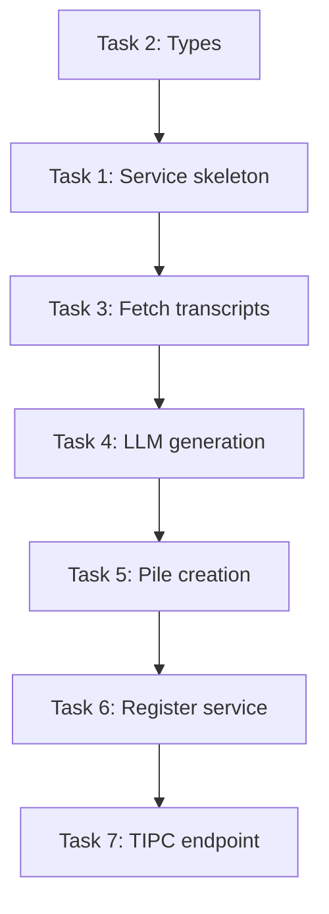

# Implementation Plan: Auto-Journal

## Tasks

- [ ] 1. Create AutoJournalService skeleton
  - Create `src/main/services/auto-journal-service.ts`
  - Implement basic class structure with start/stop methods
  - Add timer management
  - Files: `whispo/src/main/services/auto-journal-service.ts`
  - _Requirements: Basic service structure_

- [ ] 2. Add AutoJournalSummary type
  - Add type to `src/shared/types.ts`
  - Include startTime, endTime, title, content, recordingIds
  - Files: `whispo/src/shared/types.ts`
  - _Requirements: Type definitions_

- [ ] 3. Implement transcript fetching logic
  - Fetch recordings from historyStore
  - Filter by time window (lastProcessedTime to now)
  - Format transcripts with timestamps for LLM
  - Files: `whispo/src/main/services/auto-journal-service.ts`
  - _Requirements: Data retrieval_

- [ ] 4. Implement LLM summary generation
  - Create prompt for journal generation
  - Call enhancement provider (OpenAI/Groq)
  - Parse response into AutoJournalSummary
  - Files: `whispo/src/main/services/auto-journal-service.ts`
  - _Requirements: LLM integration_

- [ ] 5. Implement Pile post creation
  - Create markdown file in Pile folder structure
  - Use proper date-based path (YYYY/Mon/filename.md)
  - Format content with frontmatter
  - Files: `whispo/src/main/services/auto-journal-service.ts`
  - _Requirements: Pile integration_

- [ ] 6. Register service in main process
  - Import and initialize service in main/index.ts
  - Start service when autoJournalEnabled is true
  - Stop/start on config changes
  - Files: `whispo/src/main/index.ts`
  - _Requirements: Service lifecycle_

- [ ] 7. Add TIPC endpoint for manual trigger
  - Add `generateAutoJournalSummary` procedure to tipc.ts
  - Allow manual generation with custom window
  - Files: `whispo/src/main/tipc.ts`
  - _Requirements: API endpoint_

## Dependencies Graph

