# Requirements Document: AI-Powered Beautification/Enhancement Mode for Whispo

## Introduction

This document specifies the requirements for implementing an advanced AI-powered transcript beautification and enhancement system in Whispo, inspired by VoiceInk's sophisticated enhancement capabilities. The system will transform raw speech transcription into polished, professional text through context-aware AI processing, multiple enhancement modes, and intelligent customization options.

The enhancement system will build upon Whispo's existing `postProcessTranscript` functionality in `llm.ts` and extend it with advanced beautification capabilities that improve grammar, punctuation, clarity, style, and context-appropriateness while maintaining the user's original intent and voice.

## Requirements

### Requirement 1: Multi-Level Enhancement Modes

**User Story:** As a user, I want multiple enhancement modes with different levels of processing intensity, so that I can choose the appropriate level of beautification for different contexts and use cases.

#### Acceptance Criteria

1. WHEN user accesses enhancement settings THEN system SHALL provide four distinct enhancement modes: "Off", "Light", "Medium", and "Heavy"
2. WHEN "Light" mode is selected THEN system SHALL apply basic grammar and punctuation corrections while preserving original sentence structure and vocabulary
3. WHEN "Medium" mode is selected THEN system SHALL apply grammar corrections, improve word choice, fix punctuation, and enhance sentence flow while maintaining the original tone
4. WHEN "Heavy" mode is selected THEN system SHALL perform comprehensive beautification including grammar correction, vocabulary enhancement, sentence restructuring, professional tone adjustment, and style improvements
5. WHEN enhancement mode is changed THEN system SHALL save the preference and apply it to subsequent transcriptions
6. WHEN user switches between modes THEN system SHALL provide clear descriptions of what each mode does
7. WHEN enhancement is disabled ("Off" mode) THEN system SHALL return raw transcript without any AI processing

### Requirement 2: Context-Aware Enhancement Intelligence

**User Story:** As a user, I want the enhancement system to be context-aware and adapt to my current working environment, so that the enhanced text is appropriate for the application or document type I'm working with.

#### Acceptance Criteria

1. WHEN system detects the active application THEN system SHALL adapt enhancement style based on application context (email, code editor, document editor, chat application)
2. WHEN user is in email applications THEN system SHALL apply email-appropriate formatting and professional tone
3. WHEN user is in code editors THEN system SHALL preserve technical terminology and code-related language
4. WHEN user is in chat applications THEN system SHALL maintain conversational tone while improving clarity
5. WHEN user is in document editors THEN system SHALL apply formal writing standards and professional language
6. WHEN context cannot be determined THEN system SHALL apply default enhancement settings based on selected mode
7. WHEN user enables context-awareness THEN system SHALL monitor active window and clipboard content for context clues

### Requirement 3: Custom Enhancement Templates and Prompts

**User Story:** As a user, I want to create and manage custom enhancement templates and prompts, so that I can tailor the beautification process to my specific writing style, industry terminology, and personal preferences.

#### Acceptance Criteria

1. WHEN user accesses template management THEN system SHALL provide interface to create, edit, and delete custom enhancement templates
2. WHEN creating a custom template THEN system SHALL allow user to define template name, description, custom prompt, and target enhancement mode
3. WHEN custom template is created THEN system SHALL validate prompt structure and provide preview functionality
4. WHEN user selects a custom template THEN system SHALL override default enhancement behavior with template-specific processing
5. WHEN template contains variables THEN system SHALL support placeholders like {transcript}, {context}, {application}, and {user_preferences}
6. WHEN user creates industry-specific templates THEN system SHALL allow categorization (Legal, Medical, Technical, Creative, Business, Academic)
7. WHEN template is applied THEN system SHALL log usage for effectiveness tracking and improvement suggestions

### Requirement 4: Real-Time vs Batch Enhancement Processing

**User Story:** As a user, I want to choose between real-time enhancement during transcription and batch processing after transcription is complete, so that I can optimize for either speed or processing quality based on my immediate needs.

#### Acceptance Criteria

1. WHEN user configures enhancement timing THEN system SHALL provide options for "Real-time", "Post-transcription", and "Manual"
2. WHEN "Real-time" mode is enabled THEN system SHALL apply enhancement as transcription streams are received
3. WHEN "Post-transcription" mode is enabled THEN system SHALL enhance transcript after speech-to-text processing is complete
4. WHEN "Manual" mode is enabled THEN system SHALL provide user-triggered enhancement with manual approval step
5. WHEN real-time enhancement is active THEN system SHALL optimize for low latency while maintaining quality
6. WHEN batch processing is used THEN system SHALL optimize for maximum quality and allow longer processing time
7. WHEN enhancement processing fails THEN system SHALL fallback to original transcript and provide error notification
8. WHEN processing takes longer than expected THEN system SHALL show progress indicator and allow cancellation

### Requirement 5: Multi-Provider AI Integration

**User Story:** As a user, I want to use different AI providers for enhancement processing, so that I can choose the best provider for my specific use case, budget, and quality requirements.

#### Acceptance Criteria

1. WHEN configuring enhancement providers THEN system SHALL support OpenAI, Groq, and Gemini providers for enhancement processing
2. WHEN provider is selected THEN system SHALL allow separate provider configuration for STT and enhancement
3. WHEN provider API fails THEN system SHALL attempt fallback to secondary configured provider
4. WHEN provider-specific models are available THEN system SHALL allow model selection (GPT-4o-mini, Llama-3.1-70b-versatile, Gemini-1.5-flash-002)
5. WHEN provider costs vary THEN system SHALL provide cost estimation and usage tracking per provider
6. WHEN provider has specific capabilities THEN system SHALL optimize enhancement prompts for provider strengths
7. WHEN multiple providers are configured THEN system SHALL allow load balancing or provider selection per enhancement mode

### Requirement 6: Enhancement History and Rollback System

**User Story:** As a user, I want to view the history of transcript enhancements and rollback to previous versions, so that I can compare different enhancement results and recover from unwanted changes.

#### Acceptance Criteria

1. WHEN transcript is enhanced THEN system SHALL save both original and enhanced versions with timestamp
2. WHEN user requests enhancement history THEN system SHALL display chronological list of enhancement operations
3. WHEN viewing enhancement history THEN system SHALL show original text, enhanced text, enhancement mode used, and provider information
4. WHEN user selects rollback option THEN system SHALL restore previous version and update clipboard/active text
5. WHEN enhancement history exceeds storage limit THEN system SHALL implement retention policy with user-configurable settings
6. WHEN comparing versions THEN system SHALL highlight differences between original and enhanced text
7. WHEN exporting enhancement history THEN system SHALL provide export functionality for analysis and backup

### Requirement 7: Personal Dictionary and Custom Terminology

**User Story:** As a user, I want to train the enhancement system with my personal vocabulary, industry-specific terms, and preferred writing style, so that the AI preserves my unique terminology and adapts to my communication patterns.

#### Acceptance Criteria

1. WHEN user accesses personal dictionary THEN system SHALL provide interface to add, edit, and remove custom terms
2. WHEN adding custom terms THEN system SHALL support word definitions, preferred replacements, and context notes
3. WHEN custom terms are defined THEN system SHALL preserve these terms during enhancement processing
4. WHEN industry terminology is added THEN system SHALL categorize terms by domain (Medical, Legal, Technical, etc.)
5. WHEN enhancement encounters custom terms THEN system SHALL apply user-defined formatting and capitalization preferences
6. WHEN terms conflict with standard corrections THEN system SHALL prioritize user-defined preferences
7. WHEN dictionary grows large THEN system SHALL provide search, filtering, and bulk import/export capabilities
8. WHEN multiple users share device THEN system SHALL support user-specific dictionaries with isolation

### Requirement 8: Quality Metrics and Enhancement Effectiveness

**User Story:** As a user, I want to see metrics about enhancement quality and effectiveness, so that I can understand how the system is improving my transcripts and optimize my configuration for better results.

#### Acceptance Criteria

1. WHEN enhancement is completed THEN system SHALL calculate quality metrics including grammar improvements, readability scores, and processing confidence
2. WHEN user requests analytics THEN system SHALL provide enhancement statistics over time periods (daily, weekly, monthly)
3. WHEN analyzing effectiveness THEN system SHALL track metrics like enhancement speed, accuracy, user satisfaction, and rollback frequency
4. WHEN quality issues are detected THEN system SHALL provide suggestions for improvement and configuration adjustments
5. WHEN comparing enhancement modes THEN system SHALL show performance differences and recommend optimal settings
6. WHEN provider performance varies THEN system SHALL track provider-specific metrics and suggest provider optimization
7. WHEN user provides feedback THEN system SHALL incorporate feedback into quality assessment and improvement recommendations

### Requirement 9: Performance Optimization and Resource Management

**User Story:** As a user, I want the enhancement system to be performant and resource-efficient, so that it doesn't impact my device's performance or significantly delay transcript delivery.

#### Acceptance Criteria

1. WHEN enhancement processing begins THEN system SHALL monitor CPU, memory, and network usage to prevent system overload
2. WHEN device resources are limited THEN system SHALL automatically adjust enhancement complexity or defer processing
3. WHEN network connection is slow THEN system SHALL optimize API calls and provide offline fallback options
4. WHEN multiple enhancement requests queue THEN system SHALL implement intelligent queuing with priority management
5. WHEN enhancement takes longer than threshold THEN system SHALL provide progress indication and estimated completion time
6. WHEN system detects performance degradation THEN system SHALL automatically scale back enhancement intensity
7. WHEN background processing is enabled THEN system SHALL use available system resources efficiently without blocking foreground tasks
8. WHEN enhancement cache is available THEN system SHALL cache similar enhancements to improve response time

### Requirement 10: User Interface and Experience Design

**User Story:** As a user, I want an intuitive interface for configuring and controlling the enhancement system, so that I can easily access all features and customize the system to my preferences.

#### Acceptance Criteria

1. WHEN accessing enhancement settings THEN system SHALL provide organized settings interface integrated with existing Whispo settings
2. WHEN configuring enhancement THEN system SHALL offer guided setup wizard for first-time users
3. WHEN enhancement is processing THEN system SHALL provide visual feedback and progress indicators
4. WHEN viewing enhancement results THEN system SHALL offer side-by-side comparison of original and enhanced text
5. WHEN enhancement fails THEN system SHALL display clear error messages with suggested resolutions
6. WHEN managing templates THEN system SHALL provide drag-and-drop organization and template sharing capabilities
7. WHEN using mobile interfaces THEN system SHALL provide responsive design optimized for smaller screens
8. WHEN accessibility is required THEN system SHALL support screen readers, keyboard navigation, and high contrast modes

#### 10.1 Enhancement Toggle and Mode Selection UI

**Reference:** VoiceInk's MiniRecorder enhancement toggle and mode selection

The enhancement control interface SHALL provide:

1. **Enhancement Toggle Button**
   - Visual toggle switch in recording/panel interface
   - Keyboard shortcut: Cmd/Ctrl+E to toggle enhancement on/off
   - Clear visual indicator of current state (enabled/disabled)
   - Icon changes based on state (e.g., sparkles icon for enabled)
   - Tooltip showing current enhancement mode and shortcut

2. **Enhancement Mode Selector**
   - Dropdown or segmented control showing four modes: Off, Light, Medium, Heavy
   - Quick keyboard access: Option+1 through Option+4 for mode selection
   - Visual badge showing currently selected mode
   - Mode description tooltip on hover
   - Persist mode selection across sessions

3. **Status Indicator**
   - Real-time status badge during processing
   - States: "Ready", "Processing", "Enhanced", "Error"
   - Progress spinner during enhancement
   - Completion checkmark or error icon
   - Estimated time remaining for long enhancements

#### 10.2 Custom Prompt Management UI

**Reference:** VoiceInk's custom prompt editor and selection system

The prompt management interface SHALL provide:

1. **Prompt Selector Dropdown**
   - List of available prompts (predefined + custom)
   - Visual categorization (Default, Custom, Industry-specific)
   - Search/filter functionality for large prompt libraries
   - Keyboard shortcuts 1-9,0 for quick prompt selection
   - Recently used prompts section

2. **Custom Prompt Editor Dialog**
   - Modal or slide-over panel for creating/editing prompts
   - Fields:
     * Prompt name (required, max 50 characters)
     * Prompt description (optional, max 200 characters)
     * Category selector (dropdown)
     * Icon picker (from predefined set)
     * Prompt text editor (rich text or markdown)
     * Variables helper (insert {transcript}, {context}, etc.)
     * System instructions toggle
   - Preview pane showing formatted prompt
   - Save/Cancel/Delete actions
   - Duplicate prompt functionality

3. **Prompt Library Management**
   - Grid or list view of all custom prompts
   - Drag-and-drop reordering
   - Bulk actions (delete, export, duplicate)
   - Import/export functionality (JSON format)
   - Prompt templates gallery (pre-made industry templates)

#### 10.3 Enhancement Comparison and History UI

**Reference:** VoiceInk's enhancement history and comparison features

The comparison interface SHALL provide:

1. **Side-by-Side Comparison View**
   - Split panel layout: Original | Enhanced
   - Synchronized scrolling
   - Diff highlighting (additions in green, removals in red, changes in yellow)
   - Word count and character count for both versions
   - Copy buttons for each version
   - Toggle to show/hide differences only

2. **Enhancement History Panel**
   - Chronological list of recent enhancements
   - Each entry shows:
     * Timestamp
     * Original text preview (first 50 characters)
     * Enhancement mode used
     * AI provider used
     * Success/failure status
   - Click to view full comparison
   - Actions: Rollback, Re-enhance, Delete, Export

3. **Quick Comparison Toast**
   - Non-modal notification after enhancement
   - Shows brief summary: "Enhanced with [Mode] mode"
   - Quick actions: View Comparison, Copy Enhanced, Undo
   - Auto-dismiss after 5 seconds or user interaction

#### 10.4 Context Capture Configuration UI

**Reference:** VoiceInk's clipboard, screen capture, and selected text context features

The context configuration interface SHALL provide:

1. **Context Sources Toggle Section**
   - Checkbox: "Use clipboard content as context"
   - Checkbox: "Use selected text as context"
   - Checkbox: "Use screen capture as context"
   - Help tooltips explaining each context source
   - Visual preview of captured context (expandable)

2. **Screen Capture Settings**
   - Trigger options: Manual, Automatic on recording start
   - Capture area selector (full screen, active window, selection)
   - OCR quality settings (fast, balanced, accurate)
   - Privacy exclusions (exclude certain apps/windows)

3. **Context Preview Panel**
   - Live preview of currently captured context
   - Sections for clipboard, selected text, screen text
   - Character count for each section
   - Clear/refresh buttons
   - Privacy mode toggle (blur sensitive data)

#### 10.5 Personal Dictionary UI

**Reference:** VoiceInk's dictionary management system

The dictionary management interface SHALL provide:

1. **Dictionary Item List**
   - Searchable table/list view
   - Columns: Term, Replacement, Category, Usage Count
   - Sort by: alphabetical, most used, recently added
   - Filter by category
   - Bulk select for batch operations

2. **Add/Edit Dictionary Item Dialog**
   - Fields:
     * Original term (required)
     * Preferred replacement (optional, defaults to original)
     * Category/Tags (multi-select)
     * Context notes (optional)
     * Case sensitivity toggle
     * Usage examples (optional)
   - AI suggestions based on entered term
   - Save/Cancel actions

3. **Dictionary Categories**
   - Predefined categories: Technical, Medical, Legal, Names, Acronyms
   - Custom category creation
   - Category-based color coding
   - Category export/import
   - Usage statistics per category

#### 10.6 Power Mode Configuration UI

**Reference:** VoiceInk's Power Mode app/URL detection and auto-configuration

The Power Mode interface SHALL provide:

1. **Power Mode Configuration List**
   - List of configured app/URL-based profiles
   - Each entry shows:
     * App name or URL pattern
     * Icon (app icon or website favicon)
     * Assigned enhancement mode
     * Assigned custom prompt
     * Active status indicator
   - Quick enable/disable toggle
   - Keyboard shortcuts Option+1 through Option+0 for selection

2. **Add Power Mode Configuration Dialog**
   - App selector (dropdown of installed apps)
   - URL pattern field (supports wildcards)
   - Enhancement mode selector
   - Custom prompt selector
   - Context options (enable/disable specific contexts)
   - Auto-activate toggle
   - Test current app/URL button

3. **Active Power Mode Indicator**
   - Badge in panel UI showing active Power Mode
   - Auto-switch notification (toast)
   - Manual override option
   - Temporary disable for current session

#### 10.7 Settings Page Integration

**Reference:** VoiceInk's settings organization

The enhancement settings page SHALL provide:

1. **Settings Navigation Structure**
   ```
   Settings
   ├── General
   ├── Providers
   ├── Enhancement (NEW)
   │   ├── Modes
   │   ├── Custom Prompts
   │   ├── Context Capture
   │   ├── Personal Dictionary
   │   ├── Power Mode
   │   └── Advanced
   └── Data
   ```

2. **Enhancement Section Layout**
   - Clean, card-based design matching existing Whispo UI
   - Collapsible sections for better organization
   - Inline help and examples
   - Quick actions toolbar (Reset, Import, Export)

3. **Keyboard Shortcuts Reference**
   - Dedicated shortcuts panel
   - Visual key combinations
   - Customizable shortcuts
   - Conflict detection
   - Print/export shortcuts cheatsheet

#### 10.8 Recording Panel Enhancement Controls

**Reference:** VoiceInk's MiniRecorder UI integration

The recording panel SHALL integrate enhancement controls:

1. **Compact Enhancement Controls**
   - Enhancement toggle button (top bar)
   - Current mode/prompt badge (subtitle text)
   - Quick prompt selector (dropdown or popover)
   - Visual indicator during enhancement processing

2. **Real-Time Enhancement Feedback**
   - Processing spinner overlay
   - Progress bar for long enhancements
   - Character count: Original → Enhanced
   - Quality score indicator (if available)

3. **Post-Recording Actions**
   - "View Enhancement" button
   - "Copy Enhanced" button
   - "Redo Enhancement" button
   - "Send to..." integration menu

#### 10.9 Accessibility and Responsiveness

The UI SHALL support:

1. **Keyboard Navigation**
   - Tab order follows visual hierarchy
   - All actions accessible via keyboard
   - Custom shortcut support
   - Focus indicators clearly visible

2. **Screen Reader Support**
   - ARIA labels for all interactive elements
   - Status announcements for enhancement completion
   - Descriptive button labels
   - Semantic HTML structure

3. **Visual Accessibility**
   - High contrast mode support
   - Adjustable font sizes
   - Color-blind friendly indicators
   - Reduced motion option

4. **Responsive Design**
   - Settings panel adapts to window size
   - Mobile-friendly touch targets (44px minimum)
   - Collapsible sections on small screens
   - Horizontal scrolling where appropriate

### Requirement 11: Privacy and Security Considerations

**User Story:** As a user, I want my transcript data to be processed securely and privately, so that sensitive information in my transcripts is protected during enhancement processing.

#### Acceptance Criteria

1. WHEN enhancement processing occurs THEN system SHALL provide options for local processing vs cloud processing
2. WHEN sensitive data is detected THEN system SHALL offer privacy-focused enhancement modes that minimize data exposure
3. WHEN using cloud providers THEN system SHALL implement data encryption in transit and at rest
4. WHEN storing enhancement history THEN system SHALL provide local storage options and data retention controls
5. WHEN user requests data deletion THEN system SHALL completely remove all stored transcript and enhancement data
6. WHEN privacy mode is enabled THEN system SHALL disable cloud processing and use only local enhancement capabilities
7. WHEN data logging occurs THEN system SHALL provide transparent disclosure of what data is collected and how it's used
8. WHEN compliance is required THEN system SHALL support GDPR, CCPA, and other privacy regulation requirements

### Requirement 12: Integration and API Compatibility

**User Story:** As a developer/power user, I want the enhancement system to integrate well with Whispo's existing architecture and provide API access, so that I can extend functionality and integrate with other tools.

#### Acceptance Criteria

1. WHEN enhancement system initializes THEN system SHALL integrate seamlessly with existing `postProcessTranscript` function in `llm.ts`
2. WHEN new enhancement features are added THEN system SHALL maintain backward compatibility with existing configuration
3. WHEN API access is requested THEN system SHALL provide programmatic access to enhancement functions
4. WHEN third-party integrations are needed THEN system SHALL support webhook notifications for enhancement completion
5. WHEN custom providers are developed THEN system SHALL provide plugin architecture for third-party AI providers
6. WHEN configuration changes THEN system SHALL validate changes against existing schema and provide migration support
7. WHEN system updates occur THEN system SHALL preserve user settings and custom configurations across updates
8. WHEN error handling is needed THEN system SHALL provide comprehensive error reporting and debugging capabilities

## Technical Considerations

### Performance Requirements
- Enhancement processing should complete within 3 seconds for Medium mode and 5 seconds for Heavy mode
- Real-time enhancement should add no more than 500ms to transcription delivery
- Memory usage should not exceed 200MB for enhancement processing
- System should support concurrent processing of multiple transcripts

### Cross-Platform Compatibility
- All enhancement features must work on macOS, Windows, and Linux
- Mobile optimization considerations for potential future mobile versions
- Consistent behavior across different operating systems and hardware configurations

### Scalability and Maintenance
- Enhancement system should handle transcript lengths up to 10,000 characters
- Support for future AI provider additions without major architectural changes
- Modular design to allow selective feature enabling/disabling
- Comprehensive logging and monitoring for system maintenance and debugging

## Success Metrics

### User Experience Metrics
- User satisfaction score of 4.5/5 or higher for enhancement quality
- Less than 5% rollback rate for enhanced transcripts
- 90% of users enable enhancement features within first week of use
- Average enhancement processing time under target thresholds

### Technical Metrics
- 99.5% enhancement success rate (non-error completions)
- Less than 2% performance impact on overall system responsiveness
- Support for 10+ concurrent enhancement operations
- 99.9% uptime for enhancement services

### Quality Metrics
- Measurable improvement in grammar accuracy (90%+ correct)
- Readability score improvements (average increase of 20 points)
- Preservation of user intent and meaning (95%+ accuracy)
- Effective handling of technical/domain-specific terminology (85%+ preservation)

---

## UI Component Specifications

This section provides detailed technical specifications for implementing the enhancement UI components, inspired by VoiceInk's design patterns and adapted for Whispo's Electron + React + Radix UI + Tailwind CSS stack.

### Component Hierarchy

```
EnhancementSystem
├── RecordingPanel (pages/panel.tsx)
│   ├── EnhancementToggle (components/EnhancementToggle.tsx)
│   ├── ModeSelector (components/ModeSelector.tsx)
│   ├── PromptSelector (components/PromptSelector.tsx)
│   └── EnhancementStatus (components/EnhancementStatus.tsx)
├── SettingsEnhancementPage (pages/settings-enhancement.tsx)
│   ├── EnhancementModesSection
│   ├── CustomPromptsSection
│   │   ├── PromptList
│   │   ├── PromptEditor (components/PromptEditor.tsx)
│   │   └── PromptTemplateGallery
│   ├── ContextCaptureSection
│   │   ├── ContextToggle × 3 (Clipboard, Selected, Screen)
│   │   └── ContextPreview
│   ├── DictionarySection
│   │   ├── DictionaryList (components/DictionaryList.tsx)
│   │   └── DictionaryItemEditor (components/DictionaryItemEditor.tsx)
│   └── PowerModeSection
│       ├── PowerModeList
│       └── PowerModeConfigDialog (components/PowerModeConfigDialog.tsx)
├── EnhancementComparisonDialog (components/EnhancementComparisonDialog.tsx)
│   ├── SideBySideView
│   ├── DiffHighlighter
│   └── ComparisonActions
└── EnhancementHistoryPanel (components/EnhancementHistoryPanel.tsx)
    └── HistoryItem × N
```

### Enhancement Toggle Component

**File:** `src/renderer/src/components/EnhancementToggle.tsx`

**VoiceInk Reference:** MiniRecorder enhancement toggle with Cmd+E shortcut

**Props Interface:**
```typescript
interface EnhancementToggleProps {
  enabled: boolean
  onToggle: (enabled: boolean) => void
  processing?: boolean
  currentMode?: EnhancementMode
  currentPrompt?: CustomPrompt
}

type EnhancementMode = 'off' | 'light' | 'medium' | 'heavy'
```

**Structure:**
```tsx
<div className="flex items-center gap-2">
  <Switch
    checked={enabled}
    onCheckedChange={onToggle}
    disabled={processing}
    className={cn(
      "data-[state=checked]:bg-accent",
      processing && "opacity-50 cursor-not-allowed"
    )}
  />
  <div className="flex flex-col">
    <div className="flex items-center gap-2">
      <Sparkles className={cn(
        "w-4 h-4",
        enabled ? "text-accent" : "text-muted-foreground"
      )} />
      <span className="text-sm font-medium">
        Enhancement {enabled ? 'On' : 'Off'}
      </span>
    </div>
    {enabled && currentMode !== 'off' && (
      <span className="text-xs text-muted-foreground">
        {currentMode.charAt(0).toUpperCase() + currentMode.slice(1)} mode
        {currentPrompt && ` • ${currentPrompt.title}`}
      </span>
    )}
  </div>
  {processing && (
    <Loader2 className="w-4 h-4 animate-spin text-muted-foreground" />
  )}
</div>
```

**Keyboard Shortcut:**
```typescript
// Global keyboard shortcut registration
useEffect(() => {
  const handleKeyDown = (e: KeyboardEvent) => {
    if ((e.metaKey || e.ctrlKey) && e.key === 'e') {
      e.preventDefault()
      onToggle(!enabled)
    }
  }
  
  window.addEventListener('keydown', handleKeyDown)
  return () => window.removeEventListener('keydown', handleKeyDown)
}, [enabled, onToggle])
```

### Mode Selector Component

**File:** `src/renderer/src/components/ModeSelector.tsx`

```tsx
interface ModeSelectorProps {
  mode: EnhancementMode
  onChange: (mode: EnhancementMode) => void
  disabled?: boolean
}

const MODES: Array<{
  value: EnhancementMode
  label: string
  description: string
  icon: React.ComponentType
}> = [
  {
    value: 'off',
    label: 'Off',
    description: 'No enhancement',
    icon: XCircle
  },
  {
    value: 'light',
    label: 'Light',
    description: 'Basic grammar and punctuation',
    icon: Zap
  },
  {
    value: 'medium',
    label: 'Medium',
    description: 'Grammar, word choice, and flow',
    icon: Sparkles
  },
  {
    value: 'heavy',
    label: 'Heavy',
    description: 'Comprehensive beautification',
    icon: Stars
  }
]

export function ModeSelector({ mode, onChange, disabled }: ModeSelectorProps) {
  return (
    <Select value={mode} onValueChange={onChange} disabled={disabled}>
      <SelectTrigger className="w-[200px]">
        <SelectValue />
      </SelectTrigger>
      <SelectContent>
        {MODES.map(m => (
          <SelectItem key={m.value} value={m.value}>
            <div className="flex items-center gap-2">
              <m.icon className="w-4 h-4" />
              <div className="flex flex-col">
                <span className="font-medium">{m.label}</span>
                <span className="text-xs text-muted-foreground">
                  {m.description}
                </span>
              </div>
            </div>
          </SelectItem>
        ))}
      </SelectContent>
    </Select>
  )
}
```

### Custom Prompt Editor Dialog

**File:** `src/renderer/src/components/PromptEditor.tsx`

**VoiceInk Reference:** Custom prompt creation and editing UI

```tsx
interface PromptEditorProps {
  open: boolean
  onOpenChange: (open: boolean) => void
  prompt?: CustomPrompt
  onSave: (prompt: CustomPrompt) => void
}

export function PromptEditor({
  open,
  onOpenChange,
  prompt,
  onSave
}: PromptEditorProps) {
  const [title, setTitle] = useState(prompt?.title ?? '')
  const [description, setDescription] = useState(prompt?.description ?? '')
  const [category, setCategory] = useState(prompt?.category ?? 'custom')
  const [icon, setIcon] = useState(prompt?.icon ?? 'sparkles')
  const [promptText, setPromptText] = useState(prompt?.promptText ?? '')
  const [useSystemInstructions, setUseSystemInstructions] = useState(
    prompt?.useSystemInstructions ?? true
  )
  
  const handleSave = () => {
    onSave({
      id: prompt?.id ?? crypto.randomUUID(),
      title,
      description,
      category,
      icon,
      promptText,
      useSystemInstructions,
      createdAt: prompt?.createdAt ?? Date.now(),
      updatedAt: Date.now()
    })
    onOpenChange(false)
  }
  
  return (
    <Dialog open={open} onOpenChange={onOpenChange}>
      <DialogContent className="max-w-2xl max-h-[80vh] overflow-y-auto">
        <DialogHeader>
          <DialogTitle>
            {prompt ? 'Edit Custom Prompt' : 'Create Custom Prompt'}
          </DialogTitle>
        </DialogHeader>
        
        <div className="space-y-4">
          <div className="grid grid-cols-2 gap-4">
            <div>
              <Label htmlFor="title">Prompt Name *</Label>
              <Input
                id="title"
                value={title}
                onChange={(e) => setTitle(e.target.value)}
                placeholder="My Custom Prompt"
                maxLength={50}
              />
            </div>
            
            <div>
              <Label htmlFor="category">Category</Label>
              <Select value={category} onValueChange={setCategory}>
                <SelectTrigger>
                  <SelectValue />
                </SelectTrigger>
                <SelectContent>
                  <SelectItem value="custom">Custom</SelectItem>
                  <SelectItem value="business">Business</SelectItem>
                  <SelectItem value="technical">Technical</SelectItem>
                  <SelectItem value="creative">Creative</SelectItem>
                  <SelectItem value="academic">Academic</SelectItem>
                  <SelectItem value="legal">Legal</SelectItem>
                  <SelectItem value="medical">Medical</SelectItem>
                </SelectContent>
              </Select>
            </div>
          </div>
          
          <div>
            <Label htmlFor="description">Description</Label>
            <Textarea
              id="description"
              value={description}
              onChange={(e) => setDescription(e.target.value)}
              placeholder="Describe what this prompt does..."
              maxLength={200}
              rows={2}
            />
          </div>
          
          <div>
            <Label htmlFor="promptText">Prompt Text *</Label>
            <Textarea
              id="promptText"
              value={promptText}
              onChange={(e) => setPromptText(e.target.value)}
              placeholder="Enter your prompt instructions..."
              rows={8}
              className="font-mono text-sm"
            />
            <p className="text-xs text-muted-foreground mt-1">
              Available variables: {'{transcript}'}, {'{context}'}, {'{application}'}
            </p>
          </div>
          
          <div className="flex items-center space-x-2">
            <Switch
              id="systemInstructions"
              checked={useSystemInstructions}
              onCheckedChange={setUseSystemInstructions}
            />
            <Label htmlFor="systemInstructions">
              Wrap with system instructions template
            </Label>
          </div>
          
          <div className="p-3 bg-muted rounded-lg">
            <p className="text-xs font-medium mb-1">Preview:</p>
            <p className="text-xs text-muted-foreground whitespace-pre-wrap">
              {useSystemInstructions 
                ? `<SYSTEM_INSTRUCTIONS>\n${promptText}\n</SYSTEM_INSTRUCTIONS>`
                : promptText
              }
            </p>
          </div>
        </div>
        
        <DialogFooter>
          <Button variant="outline" onClick={() => onOpenChange(false)}>
            Cancel
          </Button>
          <Button onClick={handleSave} disabled={!title || !promptText}>
            {prompt ? 'Save Changes' : 'Create Prompt'}
          </Button>
        </DialogFooter>
      </DialogContent>
    </Dialog>
  )
}
```

### Enhancement Comparison Dialog

**File:** `src/renderer/src/components/EnhancementComparisonDialog.tsx`

```tsx
interface ComparisonDialogProps {
  open: boolean
  onOpenChange: (open: boolean) => void
  original: string
  enhanced: string
  mode: EnhancementMode
  provider: string
  onCopyOriginal: () => void
  onCopyEnhanced: () => void
  onRollback: () => void
}

export function EnhancementComparisonDialog({
  open,
  onOpenChange,
  original,
  enhanced,
  mode,
  provider,
  onCopyOriginal,
  onCopyEnhanced,
  onRollback
}: ComparisonDialogProps) {
  const [showDiffOnly, setShowDiffOnly] = useState(false)
  
  return (
    <Dialog open={open} onOpenChange={onOpenChange}>
      <DialogContent className="max-w-6xl max-h-[90vh]">
        <DialogHeader>
          <DialogTitle>Enhancement Comparison</DialogTitle>
          <div className="flex items-center gap-4 text-sm text-muted-foreground">
            <span>Mode: {mode}</span>
            <span>•</span>
            <span>Provider: {provider}</span>
            <span>•</span>
            <span>{original.length} → {enhanced.length} characters</span>
          </div>
        </DialogHeader>
        
        <div className="flex items-center gap-2 mb-4">
          <Switch
            checked={showDiffOnly}
            onCheckedChange={setShowDiffOnly}
          />
          <Label>Show differences only</Label>
        </div>
        
        <div className="grid grid-cols-2 gap-4 h-[60vh]">
          <div className="space-y-2">
            <div className="flex items-center justify-between">
              <h3 className="text-sm font-semibold">Original</h3>
              <Button size="sm" variant="outline" onClick={onCopyOriginal}>
                <Copy className="w-3 h-3 mr-1" />
                Copy
              </Button>
            </div>
            <ScrollArea className="h-full border rounded-lg p-4">
              <pre className="text-sm whitespace-pre-wrap">{original}</pre>
            </ScrollArea>
          </div>
          
          <div className="space-y-2">
            <div className="flex items-center justify-between">
              <h3 className="text-sm font-semibold">Enhanced</h3>
              <Button size="sm" variant="outline" onClick={onCopyEnhanced}>
                <Copy className="w-3 h-3 mr-1" />
                Copy
              </Button>
            </div>
            <ScrollArea className="h-full border rounded-lg p-4">
              <DiffView
                original={original}
                enhanced={enhanced}
                showDiffOnly={showDiffOnly}
              />
            </ScrollArea>
          </div>
        </div>
        
        <DialogFooter>
          <Button variant="outline" onClick={onRollback}>
            <Undo className="w-4 h-4 mr-2" />
            Rollback to Original
          </Button>
          <Button onClick={() => onOpenChange(false)}>
            Close
          </Button>
        </DialogFooter>
      </DialogContent>
    </Dialog>
  )
}
```

---

## UI Wireframes and Layouts

### Recording Panel with Enhancement Controls

```
┌─────────────────────────────────────────────────────────┐
│ Whispo - Recording                                 [×] │
├─────────────────────────────────────────────────────────┤
│                                                         │
│  ┌───────────────────────────────────────────────────┐ │
│  │  ●  Recording...                         00:12    │ │
│  └───────────────────────────────────────────────────┘ │
│                                                         │
│  ┌─ Enhancement ─────────────────────────────────────┐ │
│  │ ✨ [ON]  Medium mode • Technical Writing         │ │
│  │ Cmd+E to toggle                                   │ │
│  └───────────────────────────────────────────────────┘ │
│                                                         │
│  [Stop Recording]          [View Enhancement]         │
│                                                         │
└─────────────────────────────────────────────────────────┘
```

### Enhancement Settings Page

```
┌─────────────────────────────────────────────────────────────┐
│ Settings > Enhancement                                      │
├─────────────────────────────────────────────────────────────┤
│                                                             │
│ ┌─ Enhancement Modes ──────────────────────────────────┐   │
│ │                                                       │   │
│ │ Select enhancement intensity:                        │   │
│ │                                                       │   │
│ │ ○ Off      No enhancement applied                    │   │
│ │ ◉ Light    Basic grammar and punctuation            │   │
│ │ ○ Medium   Grammar, word choice, and flow           │   │
│ │ ○ Heavy    Comprehensive beautification             │   │
│ │                                                       │   │
│ └───────────────────────────────────────────────────────┘   │
│                                                             │
│ ┌─ Custom Prompts ─────────────────────────────────────┐   │
│ │                                                       │   │
│ │ [+ New Prompt]                        [Import]       │   │
│ │                                                       │   │
│ │ ┌─ Default ──────────────────────── ● ───── [⋮] ┐   │   │
│ │ │ Standard enhancement for general use           │   │   │
│ │ └────────────────────────────────────────────────┘   │   │
│ │                                                       │   │
│ │ ┌─ Technical Writing ────────────── ○ ───── [⋮] ┐   │   │
│ │ │ Optimized for technical documentation          │   │   │
│ │ └────────────────────────────────────────────────┘   │   │
│ │                                                       │   │
│ │ ┌─ Email Professional ──────────── ○ ───── [⋮] ┐   │   │
│ │ │ Formal business email tone                     │   │   │
│ │ └────────────────────────────────────────────────┘   │   │
│ │                                                       │   │
│ └───────────────────────────────────────────────────────┘   │
│                                                             │
│ ┌─ Context Capture ────────────────────────────────────┐   │
│ │                                                       │   │
│ │ ☑ Use clipboard content as context                  │   │
│ │ ☑ Use selected text as context                      │   │
│ │ ☐ Use screen capture as context                     │   │
│ │                                                       │   │
│ │ ┌─ Captured Context Preview ────────────────────┐   │   │
│ │ │ Clipboard: "const enhanceText = async..."     │   │   │
│ │ │ Selected: "function processTranscript()..."   │   │   │
│ │ │                                [Clear] [Refresh]   │   │
│ │ └───────────────────────────────────────────────┘   │   │
│ └───────────────────────────────────────────────────────┘   │
│                                                             │
│ ┌─ Personal Dictionary ────────────────────────────────┐   │
│ │                                                       │   │
│ │ [+ Add Term]  [Search...]            [Import/Export] │   │
│ │                                                       │   │
│ │ ┌─────────────────────────────────────────────────┐ │   │
│ │ │ Term          Replacement    Category   Used   │ │   │
│ │ ├─────────────────────────────────────────────────┤ │   │
│ │ │ whisper.cpp   whisper.cpp    Tech       42×    │ │   │
│ │ │ GGML          GGML            Tech       18×    │ │   │
│ │ │ Dr. Smith     Dr. Smith       Names      5×    │ │   │
│ │ └─────────────────────────────────────────────────┘ │   │
│ └───────────────────────────────────────────────────────┘   │
│                                                             │
└─────────────────────────────────────────────────────────────┘
```

### Enhancement Comparison Dialog

```
┌──────────────────────────────────────────────────────────────┐
│ Enhancement Comparison                                  [×] │
│ Mode: Medium • Provider: OpenAI • 234 → 256 characters      │
├──────────────────────────────────────────────────────────────┤
│ ☑ Show differences only                                     │
├────────────────────────────┬─────────────────────────────────┤
│ Original              [Copy]│ Enhanced              [Copy]  │
├────────────────────────────┼─────────────────────────────────┤
│                            │                                 │
│ lets get this done quick   │ Let's complete this quickly.    │
│ we need to fix the bug     │ We need to address the bug in   │
│ in the code before release │ the code before the release.    │
│                            │                                 │
│ the whisper cpp model is   │ The whisper.cpp model is        │
│ working good but slow      │ performing well, but the        │
│                            │ processing speed could be       │
│                            │ improved.                       │
│                            │                                 │
│ Characters: 234            │ Characters: 256                 │
│ Words: 42                  │ Words: 45                       │
│                            │                                 │
├────────────────────────────┴─────────────────────────────────┤
│                [Rollback to Original]           [Close]      │
└──────────────────────────────────────────────────────────────┘
```

---

## VoiceInk to Whispo Component Mapping

### Core Components

| VoiceInk (SwiftUI) | Whispo (React + Radix UI) | File Location |
|---|---|---|
| `AIEnhancementService` | `EnhancementService` | `lib/enhancement-service.ts` |
| `MiniRecorder` enhancement toggle | `EnhancementToggle` | `components/EnhancementToggle.tsx` |
| `CustomPrompt` struct | `CustomPrompt` interface | `types/enhancement.ts` |
| `CustomPromptEditor` | `PromptEditor` | `components/PromptEditor.tsx` |
| `DictionaryItem` | `DictionaryItem` interface | `types/dictionary.ts` |
| `DictionaryContextService` | `DictionaryService` | `lib/dictionary-service.ts` |
| `PowerModeConfiguration` | `PowerModeConfig` interface | `types/power-mode.ts` |
| `PowerModeManager` | `PowerModeManager` | `lib/power-mode-manager.ts` |
| `ScreenCaptureService` | `ScreenCaptureService` | `lib/screen-capture.ts` |
| `SelectedTextService` | `SelectedTextService` | `lib/selected-text.ts` |

### UI Patterns

| VoiceInk Pattern | Whispo Equivalent | Notes |
|---|---|---|
| Toggle enhancement (Cmd+E) | `EnhancementToggle` + global shortcut | Same keyboard shortcut |
| Prompt selection (1-9,0) | Number key shortcuts in settings | Global shortcuts when panel visible |
| Power Mode selection (Opt+1-9,0) | Option key shortcuts | Context-based auto-switching |
| Enhancement history | `EnhancementHistoryPanel` | Local storage + IPC |
| Side-by-side comparison | `EnhancementComparisonDialog` | Diff highlighting |
| Context preview | `ContextPreview` component | Real-time context display |
| Dictionary management | `DictionaryList` + `DictionaryItemEditor` | CRUD operations |

### State Management

| VoiceInk State | Whispo State | Storage |
|---|---|---|
| `isEnhancementEnabled` | `useEnhancementStore().enabled` | Zustand + Config |
| `selectedPromptId` | `useEnhancementStore().selectedPrompt` | Zustand + Config |
| `customPrompts` | `useEnhancementStore().prompts` | Zustand + localStorage |
| `useClipboardContext` | `useEnhancementStore().contextSettings.clipboard` | Config |
| `useScreenCaptureContext` | `useEnhancementStore().contextSettings.screen` | Config |
| `lastCapturedClipboard` | `useEnhancementStore().capturedContext.clipboard` | Ephemeral |
| Dictionary items | `useDictionaryStore().items` | Zustand + localStorage |
| Power Mode configs | `usePowerModeStore().configs` | Zustand + Config |

---

## Interaction Flows

### Flow 1: Toggle Enhancement On/Off


### Flow 2: Enhance Transcript with Context

```mermaid
sequenceDiagram
    actor User
    participant Panel as Recording Panel
    participant Service as Enhancement Service
    participant Context as Context Capture
    participant LLM as LLM Provider
    participant Clipboard as System Clipboard

    User->>Panel: Complete recording
    Panel->>Service: enhanceTranscript(rawText)
    
    alt Enhancement enabled
        Service->>Context: captureAllContexts()
        
        par Capture contexts
            Context->>Clipboard: Read clipboard
            Clipboard-->>Context: Clipboard text
            Context->>Context: Get selected text
            Context->>Context: Capture screen (if enabled)
        end
        
        Context-->>Service: All contexts captured
        
        Service->>Service: buildPrompt(rawText, contexts, activePrompt)
        Service->>Service: Apply dictionary terms
        Service->>LLM: sendEnhancementRequest(prompt)
        
        LLM-->>Service: Enhanced text
        
        Service->>Service: filterOutput(enhanced)
        Service->>Service: saveToHistory(original, enhanced)
        Service-->>Panel: Enhanced text
        
        Panel->>Panel: Display enhanced text
        Panel->>User: Show comparison option
    else Enhancement disabled
        Service-->>Panel: Return original text
    end
```



### Flow 3: Create Custom Prompt


### Flow 4: Add Dictionary Term


### Flow 5: Power Mode Auto-Switch


---

## Data Models and Types

### TypeScript Interfaces

```typescript
// src/shared/types/enhancement.ts

export type EnhancementMode = 'off' | 'light' | 'medium' | 'heavy'

export type PromptCategory = 
  | 'default'
  | 'custom'
  | 'business'
  | 'technical'
  | 'creative'
  | 'academic'
  | 'legal'
  | 'medical'

export interface CustomPrompt {
  id: string
  title: string
  description?: string
  category: PromptCategory
  icon: string // Icon identifier
  promptText: string
  useSystemInstructions: boolean
  createdAt: number
  updatedAt: number
}

export interface EnhancementResult {
  id: string
  originalText: string
  enhancedText: string
  mode: EnhancementMode
  promptId: string
  provider: string
  timestamp: number
  processingTime: number
  contextUsed: {
    clipboard?: string
    selectedText?: string
    screenCapture?: string
  }
}

export interface EnhancementConfig {
  enabled: boolean
  mode: EnhancementMode
  selectedPromptId?: string
  customPrompts: CustomPrompt[]
  contextSettings: {
    useClipboard: boolean
    useSelectedText: boolean
    useScreenCapture: boolean
  }
  provider: 'openai' | 'groq' | 'gemini'
  model?: string
  timeout: number
  maxRetries: number
}

export interface DictionaryItem {
  id: string
  term: string
  replacement?: string
  category: string
  tags: string[]
  contextNotes?: string
  caseSensitive: boolean
  usageCount: number
  createdAt: number
  updatedAt: number
}

export interface PowerModeConfig {
  id: string
  name: string
  appPattern?: string // App name or bundle ID
  urlPattern?: string // URL pattern with wildcards
  enhancementMode: EnhancementMode
  promptId?: string
  contextSettings?: {
    useClipboard?: boolean
    useSelectedText?: boolean
    useScreenCapture?: boolean
  }
  enabled: boolean
  priority: number
  createdAt: number
}

export interface ContextCapture {
  clipboard?: string
  selectedText?: string
  screenCapture?: string
  timestamp: number
}

export interface EnhancementMetrics {
  totalEnhancements: number
  successRate: number
  averageProcessingTime: number
  charactersSaved: number
  grammarImprovements: number
  rollbackRate: number
  providerUsage: Record<string, number>
  modeUsage: Record<EnhancementMode, number>
}
```

### Predefined Prompts

```typescript
// src/shared/data/predefined-prompts.ts

export const PREDEFINED_PROMPTS: CustomPrompt[] = [
  {
    id: 'default',
    title: 'Default',
    description: 'Standard enhancement for general use',
    category: 'default',
    icon: 'sparkles',
    promptText: `You are a TRANSCRIPTION ENHANCER. Your job is to improve the transcript while preserving the original meaning and intent.

Rules:
1. Fix grammar, punctuation, and spelling errors
2. Improve word choice where appropriate
3. Maintain the original tone and voice
4. Preserve technical terms and proper nouns
5. Do not add new information or remove important details
6. Return ONLY the enhanced transcript, no explanations`,
    useSystemInstructions: true,
    createdAt: Date.now(),
    updatedAt: Date.now()
  },
  {
    id: 'technical-writing',
    title: 'Technical Writing',
    description: 'Optimized for technical documentation and code discussions',
    category: 'technical',
    icon: 'code',
    promptText: `You are enhancing technical transcription. 

Focus on:
1. Preserving all technical terms, code snippets, and syntax
2. Using precise technical vocabulary
3. Maintaining logical flow for technical explanations
4. Keeping code-related terminology unchanged
5. Using appropriate formatting for technical concepts`,
    useSystemInstructions: true,
    createdAt: Date.now(),
    updatedAt: Date.now()
  },
  {
    id: 'email-professional',
    title: 'Email Professional',
    description: 'Formal business email tone',
    category: 'business',
    icon: 'mail',
    promptText: `You are enhancing transcription for professional email.

Apply:
1. Formal, professional tone
2. Clear subject-appropriate greeting and closing
3. Proper email etiquette
4. Concise, direct language
5. Professional vocabulary
6. Proper business formatting`,
    useSystemInstructions: true,
    createdAt: Date.now(),
    updatedAt: Date.now()
  }
]
```

---

## Configuration and Code Examples

### Config Type Extension

```typescript
// src/shared/types.ts

export type Config = {
  // ... existing fields
  
  // Enhancement Configuration
  enhancementEnabled?: boolean
  enhancementMode?: EnhancementMode
  enhancementProvider?: 'openai' | 'groq' | 'gemini'
  selectedPromptId?: string
  customPrompts?: CustomPrompt[]
  
  // Context Capture
  useClipboardContext?: boolean
  useSelectedTextContext?: boolean
  useScreenCaptureContext?: boolean
  
  // Dictionary
  dictionaryItems?: DictionaryItem[]
  
  // Power Mode
  powerModeConfigs?: PowerModeConfig[]
  powerModeEnabled?: boolean
  
  // Advanced
  enhancementTimeout?: number
  enhancementMaxRetries?: number
  saveEnhancementHistory?: boolean
  enhancementHistoryLimit?: number
}
```

### Enhancement Service Implementation

```typescript
// src/main/services/enhancement-service.ts

import { ChatCompletionRequestMessage } from 'openai'

export class EnhancementService {
  private config: EnhancementConfig
  private contextCapture: ContextCaptureService
  private dictionary: DictionaryService
  private history: EnhancementResult[] = []
  
  async enhanceTranscript(
    rawText: string,
    options?: {
      mode?: EnhancementMode
      promptId?: string
      skipContext?: boolean
    }
  ): Promise<EnhancementResult> {
    const startTime = Date.now()
    
    // Get configuration
    const mode = options?.mode ?? this.config.mode
    const promptId = options?.promptId ?? this.config.selectedPromptId
    
    if (mode === 'off' || !this.config.enabled) {
      return this.createPassthroughResult(rawText)
    }
    
    // Capture contexts
    const context = options?.skipContext 
      ? undefined
      : await this.contextCapture.captureAll({
          clipboard: this.config.contextSettings.useClipboard,
          selectedText: this.config.contextSettings.useSelectedText,
          screenCapture: this.config.contextSettings.useScreenCapture
        })
    
    // Build prompt
    const prompt = await this.buildPrompt(rawText, mode, promptId, context)
    
    // Apply dictionary terms to prompt
    const enhancedPrompt = this.dictionary.applyTermsToPrompt(prompt)
    
    // Call LLM
    const enhancedText = await this.callLLM(enhancedPrompt, mode)
    
    // Filter output
    const filteredText = this.filterOutput(enhancedText)
    
    // Create result
    const result: EnhancementResult = {
      id: crypto.randomUUID(),
      originalText: rawText,
      enhancedText: filteredText,
      mode,
      promptId: promptId ?? 'default',
      provider: this.config.provider,
      timestamp: Date.now(),
      processingTime: Date.now() - startTime,
      contextUsed: context
    }
    
    // Save to history
    this.history.push(result)
    this.trimHistory()
    
    return result
  }
  
  private async buildPrompt(
    text: string,
    mode: EnhancementMode,
    promptId: string | undefined,
    context?: ContextCapture
  ): Promise<string> {
    // Get prompt template
    const prompt = this.getPrompt(promptId)
    
    // Build context sections
    let contextSections = ''
    
    if (context?.clipboard) {
      contextSections += `\n\n<CLIPBOARD_CONTEXT>\n${context.clipboard}\n</CLIPBOARD_CONTEXT>`
    }
    
    if (context?.selectedText) {
      contextSections += `\n\n<CURRENTLY_SELECTED_TEXT>\n${context.selectedText}\n</CURRENTLY_SELECTED_TEXT>`
    }
    
    if (context?.screenCapture) {
      contextSections += `\n\n<CURRENT_WINDOW_CONTEXT>\n${context.screenCapture}\n</CURRENT_WINDOW_CONTEXT>`
    }
    
    // Add dictionary context
    const dictionaryContext = this.dictionary.getContextString()
    if (dictionaryContext) {
      contextSections += `\n\n<DICTIONARY_CONTEXT>${dictionaryContext}\n</DICTIONARY_CONTEXT>`
    }
    
    // Build final prompt
    const systemPrompt = prompt.useSystemInstructions
      ? `<SYSTEM_INSTRUCTIONS>\n${prompt.promptText}\n</SYSTEM_INSTRUCTIONS>${contextSections}`
      : `${prompt.promptText}${contextSections}`
    
    const userMessage = `\n<TRANSCRIPT>\n${text}\n</TRANSCRIPT>`
    
    return systemPrompt + userMessage
  }
  
  private async callLLM(prompt: string, mode: EnhancementMode): Promise<string> {
    const config = configStore.get()
    const provider = config.enhancementProvider ?? 'openai'
    
    const messages: ChatCompletionRequestMessage[] = [
      {
        role: 'system',
        content: prompt
      }
    ]
    
    const apiKey = provider === 'groq' 
      ? config.groqApiKey 
      : provider === 'gemini'
      ? config.geminiApiKey
      : config.openaiApiKey
    
    const baseUrl = provider === 'groq'
      ? config.groqBaseUrl || 'https://api.groq.com/openai/v1'
      : provider === 'gemini'
      ? config.geminiBaseUrl
      : config.openaiBaseUrl || 'https://api.openai.com/v1'
    
    const model = this.getModelForProvider(provider, mode)
    
    const response = await fetch(`${baseUrl}/chat/completions`, {
      method: 'POST',
      headers: {
        'Authorization': `Bearer ${apiKey}`,
        'Content-Type': 'application/json'
      },
      body: JSON.stringify({
        model,
        messages,
        temperature: 0.3,
        max_tokens: 2000
      })
    })
    
    if (!response.ok) {
      throw new Error(`Enhancement failed: ${response.statusText}`)
    }
    
    const data = await response.json()
    return data.choices[0].message.content
  }
  
  private getModelForProvider(
    provider: string,
    mode: EnhancementMode
  ): string {
    const models = {
      openai: {
        light: 'gpt-4o-mini',
        medium: 'gpt-4o-mini',
        heavy: 'gpt-4o'
      },
      groq: {
        light: 'llama-3.1-8b-instant',
        medium: 'llama-3.1-70b-versatile',
        heavy: 'llama-3.1-70b-versatile'
      },
      gemini: {
        light: 'gemini-1.5-flash-002',
        medium: 'gemini-1.5-flash-002',
        heavy: 'gemini-1.5-pro-002'
      }
    }
    
    return models[provider][mode] ?? models[provider].medium
  }
  
  private filterOutput(text: string): string {
    // Remove common AI wrapper phrases
    let filtered = text
      .replace(/^Here is the enhanced .*?:/i, '')
      .replace(/^Here's the .*?:/i, '')
      .replace(/^Enhanced version:/i, '')
      .trim()
    
    return filtered
  }
}
```

---

## Implementation Checklist

### Phase 1: Core Enhancement Infrastructure (Week 1-2)

- [ ] **Backend Setup**
  - [ ] Create `EnhancementService` class
  - [ ] Implement basic enhancement with LLM integration
  - [ ] Add enhancement config types
  - [ ] Create IPC procedures for enhancement operations
  - [ ] Implement enhancement history storage

- [ ] **Mode System**
  - [ ] Implement Off/Light/Medium/Heavy mode logic
  - [ ] Configure provider-specific models for each mode
  - [ ] Add mode selection persistence
  - [ ] Create mode description system

- [ ] **Testing**
  - [ ] Unit tests for EnhancementService
  - [ ] Integration tests with mock LLM responses
  - [ ] Test mode switching behavior

### Phase 2: Custom Prompts System (Week 3)

- [ ] **Prompt Management**
  - [ ] Create CustomPrompt data model
  - [ ] Implement prompt CRUD operations
  - [ ] Add predefined prompts library
  - [ ] Create prompt template system
  - [ ] Implement prompt variable substitution

- [ ] **UI Components**
  - [ ] Build PromptEditor dialog
  - [ ] Create PromptSelector dropdown
  - [ ] Implement prompt library grid view
  - [ ] Add prompt import/export

- [ ] **Testing**
  - [ ] Test prompt creation and editing
  - [ ] Test variable substitution
  - [ ] Test prompt persistence

### Phase 3: Context Capture (Week 4)

- [ ] **Context Services**
  - [ ] Implement clipboard capture
  - [ ] Create selected text service
  - [ ] Build screen capture service (OCR)
  - [ ] Add context preview functionality

- [ ] **UI Integration**
  - [ ] Create context toggle switches
  - [ ] Build context preview panel
  - [ ] Add context capture controls

- [ ] **Testing**
  - [ ] Test clipboard capture
  - [ ] Test screen capture accuracy
  - [ ] Test context integration with prompts

### Phase 4: Personal Dictionary (Week 5)

- [ ] **Dictionary System**
  - [ ] Create DictionaryService class
  - [ ] Implement dictionary item CRUD
  - [ ] Add term matching and replacement logic
  - [ ] Create category system
  - [ ] Add usage tracking

- [ ] **UI Components**
  - [ ] Build DictionaryList component
  - [ ] Create DictionaryItemEditor dialog
  - [ ] Implement bulk operations
  - [ ] Add import/export functionality

- [ ] **Testing**
  - [ ] Test term matching accuracy
  - [ ] Test case sensitivity handling
  - [ ] Test category filtering

### Phase 5: UI Integration (Week 6)

- [ ] **Recording Panel**
  - [ ] Add EnhancementToggle component
  - [ ] Integrate ModeSelector
  - [ ] Add visual status indicators
  - [ ] Implement keyboard shortcuts

- [ ] **Comparison View**
  - [ ] Build EnhancementComparisonDialog
  - [ ] Implement diff highlighting
  - [ ] Add side-by-side layout
  - [ ] Create rollback functionality

- [ ] **Settings Page**
  - [ ] Create Enhancement settings section
  - [ ] Integrate all enhancement UI components
  - [ ] Add help documentation
  - [ ] Implement settings persistence

- [ ] **Testing**
  - [ ] Component unit tests
  - [ ] Visual regression tests
  - [ ] Accessibility tests

### Phase 6: Power Mode (Week 7)

- [ ] **Power Mode System**
  - [ ] Create PowerModeManager
  - [ ] Implement app/URL detection
  - [ ] Add auto-switching logic
  - [ ] Create configuration matching system

- [ ] **UI Components**
  - [ ] Build PowerModeConfigDialog
  - [ ] Create PowerModeList
  - [ ] Add active mode indicator
  - [ ] Implement quick shortcuts

- [ ] **Testing**
  - [ ] Test app detection accuracy
  - [ ] Test auto-switching behavior
  - [ ] Test configuration priority

### Phase 7: Advanced Features (Week 8)

- [ ] **Enhancement History**
  - [ ] Implement history storage
  - [ ] Create history panel UI
  - [ ] Add rollback functionality
  - [ ] Implement history limits

- [ ] **Analytics**
  - [ ] Track enhancement metrics
  - [ ] Calculate success rates
  - [ ] Add quality scoring
  - [ ] Create analytics dashboard

- [ ] **Performance**
  - [ ] Optimize LLM calls
  - [ ] Implement caching
  - [ ] Add request batching
  - [ ] Optimize context capture

- [ ] **Testing**
  - [ ] Performance benchmarks
  - [ ] Load testing
  - [ ] Edge case testing

### Phase 8: Polish and Documentation (Week 9)

- [ ] **Polish**
  - [ ] Improve error messages
  - [ ] Add loading states
  - [ ] Enhance animations
  - [ ] Add tooltips and help text

- [ ] **Documentation**
  - [ ] Update README with enhancement guide
  - [ ] Create user documentation
  - [ ] Add troubleshooting guide
  - [ ] Document keyboard shortcuts

- [ ] **Release**
  - [ ] Final QA testing
  - [ ] Create migration guide
  - [ ] Prepare release notes
  - [ ] Update changelog

---

## References and Resources

### VoiceInk Source Code References

**Key Files Analyzed:**
- `VoiceInk/Services/AIEnhancement/AIEnhancementService.swift` - Core enhancement logic
- `VoiceInk/Models/CustomPrompt.swift` - Prompt data structure
- `VoiceInk/Models/PredefinedPrompts.swift` - Default prompts
- `VoiceInk/Models/AIPrompts.swift` - System instructions template
- `VoiceInk/MiniRecorderShortcutManager.swift` - Keyboard shortcuts
- `VoiceInk/Services/DictionaryContextService.swift` - Dictionary integration
- `VoiceInk/Services/ScreenCaptureService.swift` - Screen capture logic
- `VoiceInk/PowerMode/PowerModeManager.swift` - Power Mode system

### External Resources

**AI Provider APIs:**
- [OpenAI Chat Completions](https://platform.openai.com/docs/api-reference/chat)
- [Groq API](https://console.groq.com/docs/api-reference)
- [Google Gemini API](https://ai.google.dev/docs)

**UI Libraries:**
- [Radix UI Dialog](https://www.radix-ui.com/primitives/docs/components/dialog)
- [Radix UI Switch](https://www.radix-ui.com/primitives/docs/components/switch)
- [Radix UI Select](https://www.radix-ui.com/primitives/docs/components/select)
- [Radix UI Textarea](https://www.radix-ui.com/primitives/docs/components/textarea)

**Text Processing:**
- [diff-match-patch](https://github.com/google/diff-match-patch) - Text diff library
- [compromise](https://github.com/spencermountain/compromise) - NLP text processing

---

## Conclusion

This comprehensive requirements specification provides a complete blueprint for implementing AI-powered beautification and enhancement in Whispo, directly inspired by VoiceInk's sophisticated enhancement system. The specification covers:

1. **12 detailed functional requirements** addressing all enhancement aspects
2. **9 detailed UI/UX subsections** with complete component specifications
3. **Comprehensive wireframes** showing exact visual structure
4. **VoiceInk → Whispo component mapping** for direct implementation reference
5. **5 interaction flows** with Mermaid diagrams
6. **Complete data models** with TypeScript interfaces
7. **Implementation code examples** with production-ready logic
8. **8-phase implementation checklist** with 60+ tasks
9. **Complete reference documentation** for all dependencies

The specification emphasizes:
- **Context-aware intelligence** using clipboard, selected text, and screen capture
- **Customizable enhancement** with modes, custom prompts, and Power Mode
- **Personal dictionary** integration for term preservation
- **Professional UI/UX** matching VoiceInk's polished experience
- **Privacy and security** with configurable context capture

By following this specification, the development team can implement a sophisticated enhancement system that provides users with:
- Professional-grade text beautification
- Context-aware intelligence
- Highly customizable prompts and modes
- Personal dictionary for terminology preservation
- Seamless integration with existing Whispo workflows

This feature will position Whispo as a comprehensive voice-to-text solution with industry-leading AI enhancement capabilities.