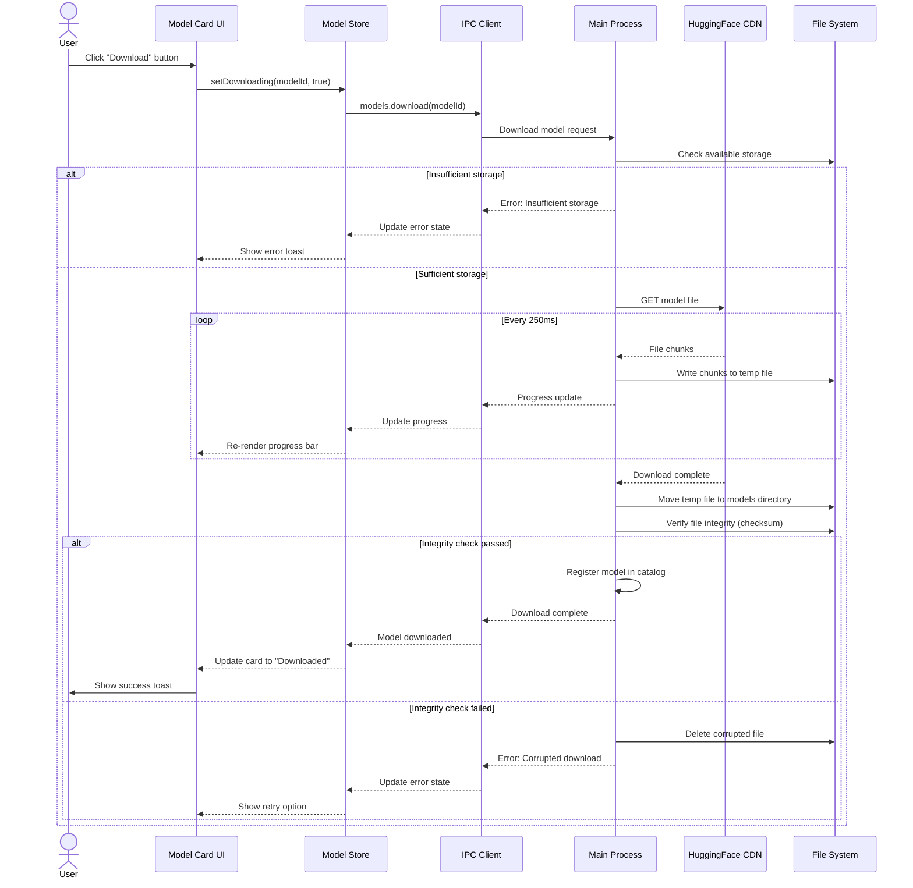
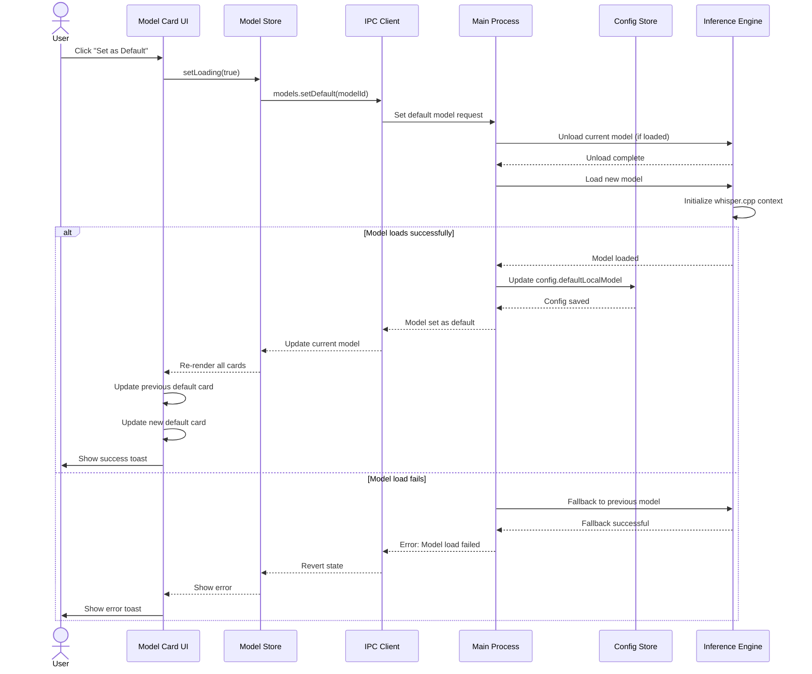
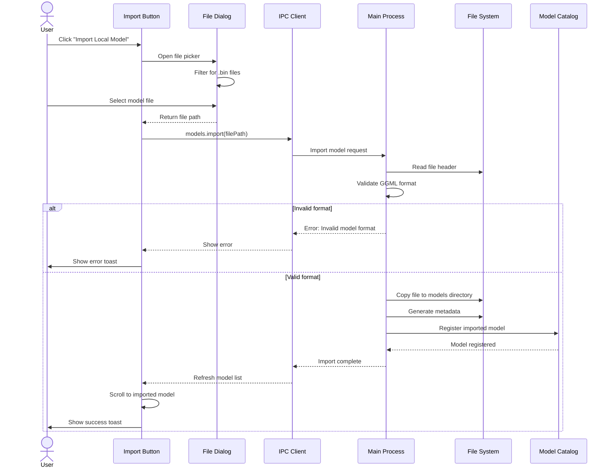
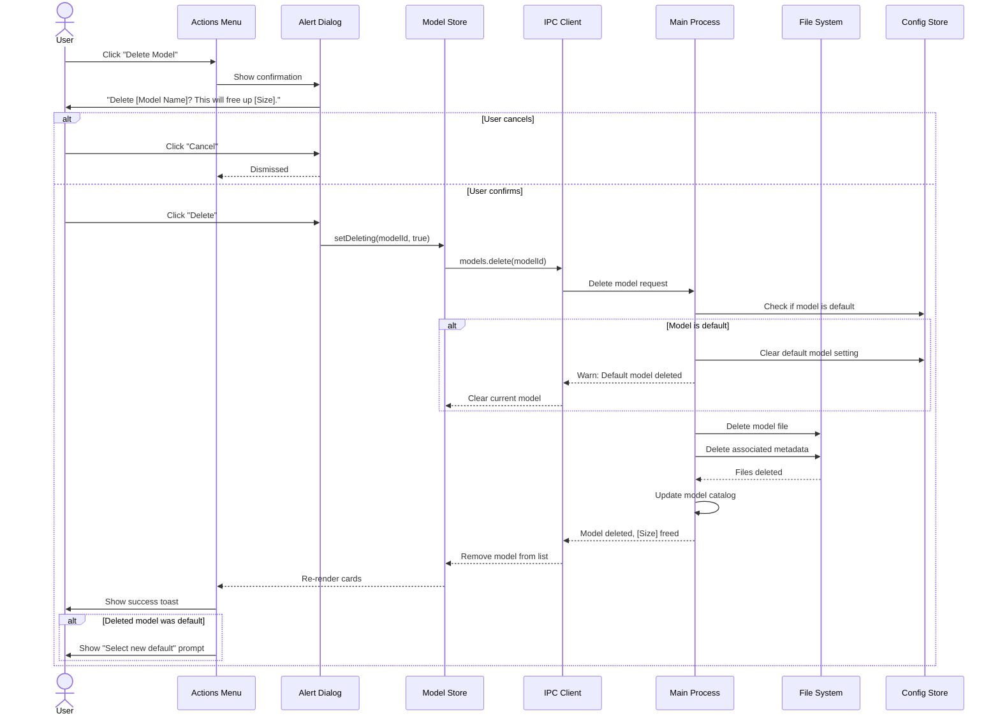
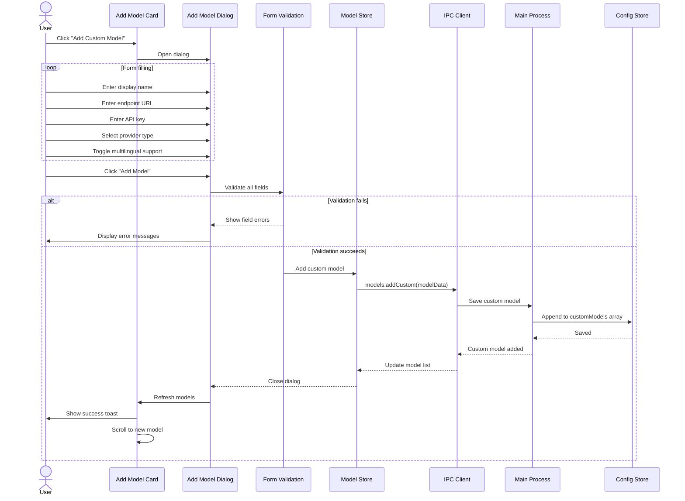

# Local Models Management Requirements Specification

## Introduction

This document specifies the requirements for implementing a comprehensive local models management system in Whispo, inspired by VoiceInk's local model capabilities. The system will enable users to download, install, manage, and use local GGML-format models for speech-to-text transcription, reducing dependency on cloud-based providers while providing enhanced privacy, offline functionality, and cost efficiency.

The local models system will integrate seamlessly with Whispo's existing provider architecture (OpenAI, Groq) and Electron-based framework, providing a unified interface for both local and cloud-based transcription services.

## Requirements

### Requirement 1: Model Discovery and Catalog Management

**User Story:** As a user, I want to browse and discover available local speech-to-text models through a comprehensive catalog, so that I can choose the most suitable model for my needs based on size, performance, and language support.

#### Acceptance Criteria

1. WHEN the user opens the local models section THEN the system SHALL display a categorized catalog of available GGML models
2. WHEN browsing the catalog THEN the system SHALL show model metadata including size, language support, quality rating, and performance benchmarks
3. WHEN filtering models THEN the system SHALL allow filtering by language, model size, quality level, and compatibility
4. IF a model is already downloaded THEN the system SHALL indicate its local availability and installation status
5. WHEN viewing model details THEN the system SHALL display comprehensive information including description, requirements, changelog, and user ratings
6. WHILE connected to the internet THEN the system SHALL periodically refresh the model catalog from configured repositories
7. WHERE models have multiple versions THEN the system SHALL display version history and allow selection of specific versions

### Requirement 2: Model Download and Installation Management

**User Story:** As a user, I want to download and install local models with progress tracking and error handling, so that I can obtain the models I need efficiently and reliably.

#### Acceptance Criteria

1. WHEN initiating a model download THEN the system SHALL validate available storage space and system requirements
2. WHEN downloading a model THEN the system SHALL display real-time progress with download speed, ETA, and completion percentage
3. WHEN a download is interrupted THEN the system SHALL support resume functionality from the last checkpoint
4. IF insufficient storage space exists THEN the system SHALL warn the user and suggest cleanup options
5. WHEN installation begins THEN the system SHALL verify model integrity using checksums before installation
6. WHEN installation completes THEN the system SHALL automatically register the model in the local registry
7. WHILE downloading THEN the system SHALL allow background downloads with notification upon completion
8. WHERE download fails THEN the system SHALL provide detailed error messages and retry options

### Requirement 3: Model File Organization and Storage Management

**User Story:** As a user, I want the system to organize downloaded models efficiently and provide storage management tools, so that I can manage disk space usage and maintain an organized model library.

#### Acceptance Criteria

1. WHEN models are downloaded THEN the system SHALL store them in a structured directory hierarchy organized by provider, model type, and version
2. WHEN viewing storage usage THEN the system SHALL display total space used, space available, and per-model storage breakdown
3. WHEN storage is low THEN the system SHALL provide automated cleanup suggestions based on usage patterns
4. IF models become corrupted THEN the system SHALL detect corruption and offer repair or re-download options
5. WHEN managing storage THEN the system SHALL allow bulk operations for model removal and cleanup
6. WHILE organizing files THEN the system SHALL maintain symbolic links and metadata for efficient access
7. WHERE models are relocated THEN the system SHALL update all references and registry entries automatically

### Requirement 4: Local Inference Engine Integration

**User Story:** As a developer, I want the system to integrate with high-performance local inference engines, so that transcription processing can run efficiently on user devices with optimal resource utilization.

#### Acceptance Criteria

1. WHEN loading a model THEN the system SHALL initialize the appropriate inference engine (whisper.cpp, OpenAI Whisper, or custom engines)
2. WHEN processing audio THEN the system SHALL route audio data to the selected local model using the most efficient pathway
3. WHEN multiple models are available THEN the system SHALL provide model switching without application restart
4. IF hardware acceleration is available THEN the system SHALL automatically detect and utilize GPU/Metal/CUDA acceleration
5. WHEN inference begins THEN the system SHALL optimize memory usage and processing threads based on system capabilities
6. WHILE processing THEN the system SHALL provide progress indicators and allow cancellation of long-running operations
7. WHERE inference fails THEN the system SHALL gracefully fallback to alternative models or cloud providers

### Requirement 5: Model Performance Benchmarking and Analytics

**User Story:** As a user, I want to benchmark and compare model performance on my specific hardware, so that I can select the optimal model for my use case and system configuration.

#### Acceptance Criteria

1. WHEN benchmarking models THEN the system SHALL measure transcription accuracy, processing speed, and resource usage
2. WHEN running benchmarks THEN the system SHALL use standardized test audio samples for consistent comparison
3. WHEN benchmarks complete THEN the system SHALL store results and display comparative analytics across models
4. IF performance degrades THEN the system SHALL alert users and suggest optimization or model updates
5. WHEN analyzing performance THEN the system SHALL track metrics over time and identify performance trends
6. WHILE benchmarking THEN the system SHALL monitor CPU, memory, and GPU usage for comprehensive performance profiling
7. WHERE multiple models exist THEN the system SHALL provide side-by-side performance comparisons with recommendations

### Requirement 6: Cross-Platform Compatibility and Deployment

**User Story:** As a user on any platform, I want local models to work consistently across macOS, Windows, and Linux, so that I can use the same models regardless of my operating system.

#### Acceptance Criteria

1. WHEN deploying models THEN the system SHALL ensure binary compatibility across all supported platforms (macOS, Windows, Linux)
2. WHEN detecting system architecture THEN the system SHALL automatically select appropriate model binaries for ARM64 and x86_64
3. WHEN installing on different platforms THEN the system SHALL handle platform-specific file permissions and security restrictions
4. IF platform limitations exist THEN the system SHALL clearly communicate compatibility constraints and alternatives
5. WHEN synchronizing between devices THEN the system SHALL support model configuration export/import across platforms
6. WHILE running cross-platform THEN the system SHALL maintain consistent API interfaces regardless of underlying implementation
7. WHERE native optimizations exist THEN the system SHALL utilize platform-specific accelerations (Metal on macOS, DirectML on Windows)

### Requirement 7: Model Configuration and Parameter Management

**User Story:** As an advanced user, I want to configure model parameters and inference settings, so that I can optimize performance and accuracy for my specific use cases.

#### Acceptance Criteria

1. WHEN configuring models THEN the system SHALL provide adjustable parameters for temperature, beam size, and language detection
2. WHEN saving configurations THEN the system SHALL store per-model settings and allow configuration profiles
3. WHEN using different models THEN the system SHALL automatically apply appropriate default configurations
4. IF invalid parameters are set THEN the system SHALL validate settings and provide helpful error messages
5. WHEN switching models THEN the system SHALL preserve user preferences where applicable across different model types
6. WHILE processing audio THEN the system SHALL apply real-time parameter adjustments without interrupting inference
7. WHERE optimal settings exist THEN the system SHALL suggest recommended configurations based on content type and quality requirements

### Requirement 8: Integration with Existing Provider System

**User Story:** As a user, I want local models to integrate seamlessly with the existing provider selection system, so that I can choose between local and cloud providers from the same interface.

#### Acceptance Criteria

1. WHEN viewing provider options THEN the system SHALL list local models alongside cloud providers (OpenAI, Groq) in the STT provider dropdown
2. WHEN selecting a local model THEN the system SHALL update the configuration system to use local inference instead of API calls
3. WHEN switching providers THEN the system SHALL maintain consistent transcription API interfaces for both local and cloud providers
4. IF no local models are available THEN the system SHALL gracefully fall back to cloud providers with appropriate user notification
5. WHEN using local models THEN the system SHALL bypass API key requirements and network connectivity checks
6. WHILE transcribing THEN the system SHALL route audio processing through the unified transcription pipeline regardless of provider type
7. WHERE provider switching occurs THEN the system SHALL preserve user settings and preferences across provider changes

### Requirement 9: Offline Functionality and Local-First Architecture

**User Story:** As a user, I want complete offline functionality when using local models, so that I can transcribe audio without internet connectivity or concerns about data privacy.

#### Acceptance Criteria

1. WHEN internet is unavailable THEN the system SHALL continue functioning normally with locally installed models
2. WHEN processing audio offline THEN the system SHALL handle all transcription processing locally without external dependencies
3. WHEN starting the application offline THEN the system SHALL detect and enable only locally available models
4. IF connectivity is restored THEN the system SHALL optionally sync usage statistics and check for model updates
5. WHEN working offline THEN the system SHALL maintain full feature parity with online operation for core transcription features
6. WHILE offline THEN the system SHALL cache all necessary resources and provide appropriate status indicators
7. WHERE network becomes available THEN the system SHALL seamlessly transition between offline and online modes

### Requirement 10: Model Update and Versioning System

**User Story:** As a user, I want to receive notifications about model updates and manage different versions, so that I can keep my models current while maintaining stability.

#### Acceptance Criteria

1. WHEN model updates are available THEN the system SHALL notify users with changelog information and update benefits
2. WHEN updating models THEN the system SHALL allow users to keep previous versions until the new version is verified
3. WHEN managing versions THEN the system SHALL provide rollback functionality to previous model versions
4. IF automatic updates are enabled THEN the system SHALL download updates in the background and prompt for installation
5. WHEN multiple versions exist THEN the system SHALL allow users to select specific versions for different use cases
6. WHILE updating THEN the system SHALL ensure continuity of service by maintaining the current model until replacement is ready
7. WHERE breaking changes occur THEN the system SHALL provide clear migration paths and compatibility warnings

### Requirement 11: Resource Usage Monitoring and Optimization

**User Story:** As a user, I want to monitor how local models use system resources, so that I can optimize performance and ensure my system remains responsive during transcription.

#### Acceptance Criteria

1. WHEN models are running THEN the system SHALL display real-time CPU, memory, and GPU usage statistics
2. WHEN resource usage is high THEN the system SHALL provide optimization suggestions and allow resource limiting
3. WHEN multiple models are loaded THEN the system SHALL show per-model resource consumption breakdown
4. IF system resources are constrained THEN the system SHALL automatically adjust model parameters to maintain responsiveness
5. WHEN monitoring resources THEN the system SHALL track usage over time and identify patterns for optimization
6. WHILE processing large files THEN the system SHALL implement throttling mechanisms to prevent system overload
7. WHERE resource conflicts occur THEN the system SHALL prioritize tasks and provide user control over resource allocation

### Requirement 12: Model Import/Export and Backup Management

**User Story:** As a user, I want to import custom models and export my model configurations, so that I can share models between devices and backup my setup.

#### Acceptance Criteria

1. WHEN importing models THEN the system SHALL validate model format compatibility and integrity
2. WHEN exporting configurations THEN the system SHALL create portable packages including model settings and metadata
3. WHEN backing up models THEN the system SHALL provide options for full model backup or configuration-only backup
4. IF custom models are imported THEN the system SHALL integrate them seamlessly with the existing model management interface
5. WHEN sharing configurations THEN the system SHALL allow selective export of specific models and settings
6. WHILE importing large models THEN the system SHALL provide progress tracking and verification steps
7. WHERE format conversion is needed THEN the system SHALL provide automated conversion tools for compatible formats

### Requirement 13: Security and Privacy Compliance

**User Story:** As a privacy-conscious user, I want local model processing to ensure complete data privacy, so that my audio and transcriptions never leave my device.

#### Acceptance Criteria

1. WHEN using local models THEN the system SHALL ensure all audio processing occurs entirely on the local device
2. WHEN storing transcriptions THEN the system SHALL implement local encryption for sensitive data at rest
3. WHEN models are downloaded THEN the system SHALL verify cryptographic signatures to ensure model integrity
4. IF telemetry is collected THEN the system SHALL be limited to non-sensitive usage statistics with explicit user consent
5. WHEN processing audio THEN the system SHALL provide clear indicators that processing is happening locally
6. WHILE handling sensitive content THEN the system SHALL offer secure deletion options for temporary processing files
7. WHERE audit trails are needed THEN the system SHALL maintain local logs of model usage and data handling practices

### Requirement 14: User Experience and Interface Integration

**User Story:** As a user, I want an intuitive interface for managing local models that integrates seamlessly with the existing Whispo interface, so that model management feels natural and accessible.

#### Acceptance Criteria

1. WHEN accessing model management THEN the system SHALL provide a dedicated settings section with clear navigation
2. WHEN performing model operations THEN the system SHALL use consistent visual design patterns matching the existing Whispo interface
3. WHEN models are processing THEN the system SHALL show status indicators in the main transcription interface
4. IF errors occur THEN the system SHALL display user-friendly error messages with clear resolution steps
5. WHEN configuring models THEN the system SHALL provide contextual help and tooltips for technical settings
6. WHILE downloading models THEN the system SHALL show non-intrusive progress indicators that don't block other functionality
7. WHERE model selection occurs THEN the system SHALL integrate smoothly with the existing provider selection dropdown

#### 14.1 Main Model Management View Structure

**Reference:** VoiceInk's `ModelManagementView.swift`

The model management interface SHALL consist of the following sections in order:

1. **Default Model Display Section**
   - Display current default model name prominently
   - Show key metadata: size, language, speed rating, accuracy rating
   - Provide quick access to change default model
   - Use card-style container with subtle background

2. **Language Selection Section**
   - Integrate existing language selection dropdown
   - Position above model list for easy access
   - Support "Detect automatically" and manual language selection
   - Apply to all local model transcriptions

3. **Model Filter Tabs**
   - Provide four filter options: Recommended, Local, Cloud, Custom
   - Use pill/tab switcher design for compact navigation
   - Apply active state styling to current filter
   - Position settings gear icon on the right side

4. **Model Cards List**
   - Display filtered models in scrollable grid/list
   - Show one model card per available model
   - Maintain consistent card height for visual harmony
   - Provide empty state messaging when no models match filter

5. **Context-Specific Actions**
   - Show "Import Local Model" button when Local filter is active
   - Show "Add Custom Model" card when Custom filter is active
   - Hide action elements when not relevant to current filter

#### 14.2 Model Card Component Specification

**Reference:** VoiceInk's `LocalModelCardView.swift`

Each model card SHALL display the following information and controls:

**Header Section:**
- Model display name (prominent, 13pt semibold font)
- Status badge indicating current state:
  - "Default" badge (accent color) when model is currently active
  - "Downloaded" badge (neutral color) when model is locally available
  - No badge when model is not downloaded

**Metadata Row:**
- Language indicator with globe icon (e.g., "English", "Multilingual")
- Model size with storage icon (e.g., "142 MB", "1.5 GB")
- Speed rating: 5-dot visual indicator + numeric value (0-10 scale)
- Accuracy rating: 5-dot visual indicator + numeric value (0-10 scale)
- RAM usage indicator (e.g., "0.5 GB RAM")
- All metadata items displayed inline with consistent spacing

**Description Section:**
- Brief model description (2 lines maximum, truncated with ellipsis)
- Font size 11pt, secondary text color
- Provide context about model purpose and use case

**Progress Section (when downloading):**
- Horizontal progress bar showing percentage complete
- Download speed in MB/s
- Estimated time remaining
- Pause/Resume/Cancel controls

**Action Section:**
- **When not downloaded:** Primary "Download" button with download icon
- **When downloaded but not default:** "Set as Default" button
- **When default:** "Default Model" text indicator
- **When downloaded:** Menu button (⋮) with options:
  - Delete Model (with confirmation dialog)
  - Show in File Explorer/Finder
  - Model properties/details

**Visual States:**
- Use card background with subtle border
- Apply accent gradient when model is default
- Show disabled state when model is downloading
- Highlight on hover for interactive elements

#### 14.3 Download Progress Visualization

**Reference:** VoiceInk's `DownloadProgressView` and progress tracking system

The download progress component SHALL provide:

**Progress Bar:**
- Horizontal bar filling from 0% to 100%
- Use accent color for completed portion
- Neutral background for remaining portion
- Smooth animation for progress updates
- Height: 8-10px for visibility

**Status Information:**
- Current percentage (e.g., "75%")
- Download speed (e.g., "2.5 MB/s")
- Time remaining (e.g., "45 seconds")
- Current downloaded size / Total size (e.g., "750 MB / 1.5 GB")

**Controls:**
- Pause button: temporarily halt download
- Resume button: continue paused download
- Cancel button: abort download and cleanup partial files

**Behavior:**
- Update progress every 100-250ms for smooth animation
- Support background downloads (continue when window minimized)
- Persist progress across app restarts for resume capability
- Show notification when download completes

#### 14.4 Filter and Navigation UI

**Reference:** VoiceInk's `ModelFilter` enum and tab switcher

The filter system SHALL implement:

**Filter Options:**
1. **Recommended:** Show curated list of best models for general use
   - Pre-selected models: ggml-base.en, ggml-large-v3-turbo-q5_0, ggml-large-v3-turbo
   - Display in recommended order (fastest to most accurate)
   - Include both downloaded and not-downloaded models

2. **Local:** Show all local/offline models
   - Include GGML whisper.cpp models
   - Include native Apple models (if on macOS)
   - Include imported custom models
   - Show "Import Local Model" action button at bottom

3. **Cloud:** Show all cloud-based API providers
   - OpenAI Whisper
   - Groq
   - Gemini
   - Other configured cloud providers
   - Display API key requirement status

4. **Custom:** Show user-added custom models
   - Cloud models with custom endpoints
   - Custom local models
   - Show "Add Custom Model" card at bottom

**Tab Switcher Design:**
- Use compact pill-style buttons
- Highlight active tab with background color
- Smooth transition animation between tabs
- Keyboard navigation support (Tab key, Arrow keys)

**Settings Gear Icon:**
- Position on far right of tab bar
- Open model-specific settings panel
- Toggle button state (active when settings shown)
- Provide access to advanced configuration

#### 14.5 Model Actions and Workflows

**Reference:** VoiceInk's model management workflows

**Download Model Flow:**
1. User clicks "Download" button on model card
2. System validates available storage space
3. System shows confirmation if model is large (>500 MB)
4. Download begins with progress indicator
5. User can minimize window (background download continues)
6. Notification shown on completion
7. Card updates to "Downloaded" state
8. Model becomes available in provider dropdown

**Set Default Model Flow:**
1. User clicks "Set as Default" button
2. System unloads current model (if different)
3. System loads selected model
4. Default model section updates to show new model
5. Previous default card updates to "Downloaded" state
6. New default card shows "Default" badge
7. Success toast notification appears

**Delete Model Flow:**
1. User selects "Delete Model" from menu
2. System shows confirmation dialog:
   - Dialog title: "Delete Model"
   - Message: "Are you sure you want to delete [Model Name]? This will free up [Size]."
   - Buttons: "Delete" (destructive), "Cancel"
3. User confirms deletion
4. System removes model files from disk
5. Card transitions to "Not Downloaded" state
6. If deleted model was default, system prompts to select new default
7. Success toast notification appears

**Import Local Model Flow:**
1. User clicks "Import Local Model" button
2. System opens file picker dialog
3. File picker filters for .bin files (GGML format)
4. User selects model file
5. System validates file format and integrity
6. System copies file to models directory
7. System registers model in local registry
8. New model card appears in Local filter
9. Success notification with model name

**Add Custom Model Flow:**
1. User clicks "Add Custom Model" card
2. System opens modal dialog with form fields:
   - Display Name (required)
   - API Endpoint URL (required for cloud models)
   - API Key (required for cloud models)
   - Provider Type dropdown
   - Language support toggle (Multilingual / English-only)
3. System validates form inputs
4. User clicks "Save"
5. System adds model to custom models list
6. New model card appears in Custom filter
7. Success notification appears

#### 14.6 Visual Feedback and States

**Reference:** VoiceInk's state management and visual indicators

**Loading States:**
- Model card skeleton/shimmer while catalog loads
- Spinner in "Set as Default" button while model loads
- "Loading..." text during model initialization
- Disabled state for all controls while loading

**Empty States:**
- **No models downloaded:** 
  - Icon: Download cloud illustration
  - Message: "No local models installed"
  - Action: "Browse Recommended Models" button
  
- **No search/filter results:**
  - Icon: Magnifying glass
  - Message: "No models match your filter"
  - Action: "Clear filter" or "Try different filter" suggestion
  
- **No custom models:**
  - Icon: Plus sign
  - Message: "No custom models added yet"
  - Action: "Add Custom Model" prominent button

**Error States:**
- **Download failed:**
  - Show error icon in card
  - Message: "Download failed: [error reason]"
  - Actions: "Retry" button, "Dismiss" button
  
- **Model load failed:**
  - Show error icon in default model section
  - Message: "Failed to load model. [error details]"
  - Actions: "Try again", "Select different model"
  
- **Insufficient storage:**
  - Dialog before download starts
  - Message: "Not enough storage space. Need [X] GB, have [Y] GB available."
  - Actions: "Free up space", "Cancel"

**Success Notifications (Toasts):**
- Download complete: "Model [name] downloaded successfully"
- Model set as default: "[Name] is now your default model"
- Model deleted: "Model deleted. [X] GB freed."
- Model imported: "[Name] imported successfully"
- Custom model added: "Custom model [name] added"

**Model Warmup/Optimization Indicator:**
- Show when model is being optimized for hardware
- Display: Progress spinner + "Optimizing model for your device..."
- Position: Replace action buttons temporarily
- Duration: Variable (30 seconds to 2 minutes)
- Completion: Automatic transition to normal state

#### 14.7 Integration with Existing Whispo UI

**Settings Page Placement:**
- Add new "Models" tab/section to settings navigation
- Position after "Providers" section for logical flow
- Use existing settings page layout and styling
- Maintain consistent header, navigation, and footer

**Provider Dropdown Extension:**
Current STT_PROVIDERS array:
```typescript
STT_PROVIDERS = [
  { label: "OpenAI", value: "openai" },
  { label: "Groq", value: "groq" }
]
```

Extended to include local models:
```typescript
STT_PROVIDERS = [
  // Cloud providers
  { label: "OpenAI", value: "openai" },
  { label: "Groq", value: "groq" },
  
  // Divider
  { label: "--- Local Models ---", value: "divider", disabled: true },
  
  // Dynamically populated local models
  { label: "Tiny (English)", value: "local:ggml-tiny.en" },
  { label: "Base (English)", value: "local:ggml-base.en" },
  { label: "Large v3 Turbo", value: "local:ggml-large-v3-turbo" },
  // ... other downloaded models
]
```

**Design System Consistency (Radix UI + Tailwind):**

Radix UI Components to use:
- `Card` - Base container for model cards and sections
- `Badge` - Status indicators (Default, Downloaded)
- `Progress` - Download progress bars
- `DropdownMenu` - Model action menus (Delete, Show in Finder)
- `Button` - Primary actions (Download, Set as Default)
- `Tabs` - Filter navigation (Recommended, Local, Cloud, Custom)
- `Dialog` - Confirmation dialogs (Delete, Add Custom Model)
- `Select` - Dropdowns (Language selection, Provider type)
- `Toast` - Success/error notifications
- `Skeleton` - Loading state placeholders

Tailwind CSS Pattern Consistency:
- Card padding: `p-4` (16px)
- Card borders: `border border-border`
- Card hover: `hover:border-accent`
- Rounded corners: `rounded-lg` (8px)
- Text sizes: `text-sm` (body), `text-xs` (metadata)
- Font weights: `font-semibold` (headers), `font-medium` (buttons)
- Spacing: `space-y-3` (between cards), `gap-4` (within cards)
- Colors: Use existing CSS variables (--accent, --border, --muted, etc.)

**Keyboard Shortcuts:**
- `Cmd/Ctrl + D` - Download focused model
- `Cmd/Ctrl + Enter` - Set focused model as default
- `Delete` - Delete focused model (with confirmation)
- `Tab` - Navigate between models
- `Arrow keys` - Navigate filter tabs
- `Escape` - Close dialogs/cancel operations

### Requirement 15: Performance Optimization and Hardware Acceleration

**User Story:** As a user with capable hardware, I want the system to automatically detect and utilize available acceleration technologies, so that I can achieve the fastest possible transcription speeds.

#### Acceptance Criteria

1. WHEN detecting hardware THEN the system SHALL automatically identify available acceleration options (Metal, CUDA, OpenCL, CPU SIMD)
2. WHEN configuring acceleration THEN the system SHALL provide manual override options for advanced users
3. WHEN using acceleration THEN the system SHALL monitor performance and fallback to CPU processing if acceleration fails
4. IF multiple acceleration options exist THEN the system SHALL benchmark and select the optimal configuration
5. WHEN processing different audio types THEN the system SHALL dynamically adjust optimization strategies
6. WHILE running accelerated inference THEN the system SHALL manage thermal throttling and power consumption
7. WHERE acceleration is unavailable THEN the system SHALL optimize CPU-only processing with multi-threading and vectorization

## Non-Functional Requirements

### Performance Requirements
- Model loading time SHALL NOT exceed 30 seconds for models under 1GB
- Transcription processing SHALL maintain real-time performance (1x speed) for standard quality audio
- Memory usage SHALL NOT exceed 4GB for the largest supported models
- CPU utilization SHALL be optimizable to user-defined limits (25%, 50%, 75%, 100%)

### Reliability Requirements
- The system SHALL provide 99.9% uptime for local model functionality
- Model downloads SHALL support automatic retry with exponential backoff
- Corrupted models SHALL be automatically detected and handled gracefully
- System SHALL maintain functionality even when individual models fail

### Scalability Requirements
- The system SHALL support management of up to 50 concurrent local models
- Storage system SHALL efficiently handle model libraries up to 100GB
- Interface SHALL remain responsive with large model catalogs (1000+ models)

### Compatibility Requirements
- Models SHALL work on macOS 12+, Windows 10+, and Ubuntu 20.04+
- System SHALL support both ARM64 and x86_64 architectures
- Models SHALL be compatible with Electron 31+ and Node.js 18+

### Security Requirements
- All model downloads SHALL be verified with cryptographic signatures
- Local data processing SHALL never transmit audio or transcriptions externally
- Stored models and configurations SHALL support encryption at rest
- User SHALL have complete control over telemetry and data collection

## Technical Considerations

### Architecture Integration
- **Provider System Extension**: Extend the existing STT_PROVIDERS array to include local model options
- **Configuration Management**: Enhance the Config type to support local model settings and preferences
- **Processing Pipeline**: Modify the createRecording procedure to route to local inference engines
- **Cross-Platform Support**: Utilize the existing Rust component (whispo-rs) for native performance optimization

### Implementation Phases
1. **Phase 1**: Basic model download and storage management
2. **Phase 2**: Local inference engine integration and provider system extension
3. **Phase 3**: Advanced features (benchmarking, optimization, analytics)
4. **Phase 4**: Enhanced UX features and cloud sync capabilities

### Risk Mitigation
- **Storage Management**: Implement proactive storage monitoring to prevent disk space issues

---

## UI Component Specifications

This section provides detailed technical specifications for implementing the user interface components, inspired by VoiceInk's design patterns and adapted for Whispo's Electron + React + Radix UI + Tailwind CSS stack.

### Component Hierarchy

```
SettingsModelsPage (pages/settings-models.tsx)
├── DefaultModelSection (components/DefaultModelSection.tsx)
│   └── ModelMetadataDisplay
├── LanguageSelectionSection (existing component, reused)
├── ModelFilterTabs (components/ModelFilterTabs.tsx)
│   ├── TabButton × 4 (Recommended, Local, Cloud, Custom)
│   └── SettingsButton
├── ModelCardsList (components/ModelCardsList.tsx)
│   ├── ModelCard (components/ModelCard.tsx) × N
│   │   ├── ModelCardHeader
│   │   ├── ModelCardMetadata
│   │   │   ├── LanguageIndicator
│   │   │   ├── SizeIndicator
│   │   │   ├── RatingIndicator (Speed)
│   │   │   ├── RatingIndicator (Accuracy)
│   │   │   └── RAMIndicator
│   │   ├── ModelCardDescription
│   │   ├── DownloadProgress (when downloading)
│   │   └── ModelCardActions
│   │       ├── DownloadButton
│   │       ├── SetDefaultButton
│   │       └── ModelActionsMenu
│   ├── ImportModelButton (Local filter only)
│   └── AddCustomModelCard (Custom filter only)
└── ModelSettingsPanel (toggleable via settings gear)
```

### Model Card Component

**File:** `src/renderer/src/components/ModelCard.tsx`

**VoiceInk Reference:** `VoiceInk/Views/AI Models/LocalModelCardRowView.swift`

**Props Interface:**
```typescript
interface ModelCardProps {
  model: LocalModel | CloudModel | CustomModel
  isDownloaded: boolean
  isCurrent: boolean
  isDownloading: boolean
  downloadProgress?: number
  downloadSpeed?: string
  downloadETA?: string
  isWarming?: boolean
  onDownload: () => void
  onSetDefault: () => void
  onDelete: () => void
  onShowInExplorer: () => void
}
```

**Structure:**
```tsx
<Card className={cn(
  "p-4 border transition-all",
  isCurrent && "border-accent bg-accent/5"
)}>
  {/* Header */}
  <div className="flex items-start justify-between mb-2">
    <div className="flex items-center gap-2">
      <h3 className="text-sm font-semibold">{model.displayName}</h3>
      {isCurrent && <Badge variant="default">Default</Badge>}
      {isDownloaded && !isCurrent && <Badge variant="secondary">Downloaded</Badge>}
    </div>
  </div>
  
  {/* Metadata Row */}
  <div className="flex items-center gap-3 mb-2 text-xs text-muted-foreground">
    <div className="flex items-center gap-1">
      <Globe className="w-3 h-3" />
      <span>{model.language}</span>
    </div>
    <div className="flex items-center gap-1">
      <HardDrive className="w-3 h-3" />
      <span>{model.size}</span>
    </div>
    <RatingDots label="Speed" value={model.speed} />
    <RatingDots label="Accuracy" value={model.accuracy} />
    {model.ramUsage && (
      <div className="flex items-center gap-1">
        <Cpu className="w-3 h-3" />
        <span>{model.ramUsage} GB</span>
      </div>
    )}
  </div>
  
  {/* Description */}
  <p className="text-xs text-muted-foreground line-clamp-2 mb-3">
    {model.description}
  </p>
  
  {/* Download Progress (conditional) */}
  {isDownloading && (
    <DownloadProgress
      progress={downloadProgress}
      speed={downloadSpeed}
      eta={downloadETA}
    />
  )}
  
  {/* Actions */}
  <div className="flex items-center justify-end gap-2">
    {isCurrent ? (
      <span className="text-xs text-muted-foreground">Default Model</span>
    ) : isWarming ? (
      <div className="flex items-center gap-2 text-xs text-muted-foreground">
        <Loader2 className="w-3 h-3 animate-spin" />
        <span>Optimizing model for your device...</span>
      </div>
    ) : isDownloaded ? (
      <>
        <Button size="sm" onClick={onSetDefault}>
          Set as Default
        </Button>
        <ModelActionsMenu
          onDelete={onDelete}
          onShowInExplorer={onShowInExplorer}
        />
      </>
    ) : (
      <Button 
        size="sm" 
        onClick={onDownload}
        disabled={isDownloading}
        className="gap-1"
      >
        <Download className="w-3 h-3" />
        {isDownloading ? 'Downloading...' : 'Download'}
      </Button>
    )}
  </div>
</Card>
```

**Radix Components Used:**
- `Card` from `@radix-ui/react-card` (or custom Card component)
- `Badge` from `@/components/ui/badge`
- `Button` from `@/components/ui/button`
- `DropdownMenu` for ModelActionsMenu

**Tailwind Classes:**
- Container: `p-4 border rounded-lg transition-all`
- Current state: `border-accent bg-accent/5`
- Text sizes: `text-sm` (title), `text-xs` (metadata)
- Spacing: `gap-2`, `gap-3`, `mb-2`, `mb-3`

### Rating Dots Component

**File:** `src/renderer/src/components/RatingDots.tsx`

**VoiceInk Reference:** `progressDotsWithNumber()` helper in `LocalModelCardRowView.swift`

**Purpose:** Visual 5-dot rating system for Speed and Accuracy metrics

```tsx
interface RatingDotsProps {
  label: string
  value: number // 0-10 scale
}

export function RatingDots({ label, value }: RatingDotsProps) {
  const filledDots = Math.floor(value / 2) // Convert 0-10 to 0-5
  const color = getPerformanceColor(value / 10) // Convert to 0-1 scale
  
  return (
    <div className="flex items-center gap-1.5">
      <span className="text-xs font-medium text-muted-foreground">
        {label}
      </span>
      <div className="flex items-center gap-1">
        {Array.from({ length: 5 }).map((_, i) => (
          <div
            key={i}
            className={cn(
              "w-1.5 h-1.5 rounded-full",
              i < filledDots ? color : "bg-muted"
            )}
          />
        ))}
      </div>
      <span className="text-xs font-mono text-muted-foreground">
        {value.toFixed(1)}
      </span>
    </div>
  )
}

function getPerformanceColor(value: number): string {
  if (value >= 0.8) return "bg-green-500"
  if (value >= 0.6) return "bg-yellow-500"
  if (value >= 0.4) return "bg-orange-500"
  return "bg-red-500"
}
```

### Download Progress Component

**File:** `src/renderer/src/components/DownloadProgress.tsx`

**VoiceInk Reference:** `DownloadProgressView` in VoiceInk

```tsx
interface DownloadProgressProps {
  progress: number // 0-100
  speed?: string // "2.5 MB/s"
  eta?: string // "45 seconds"
}

export function DownloadProgress({ progress, speed, eta }: DownloadProgressProps) {
  return (
    <div className="space-y-2 py-2">
      <Progress value={progress} className="h-2" />
      <div className="flex items-center justify-between text-xs text-muted-foreground">
        <span>{progress.toFixed(0)}%</span>
        {speed && <span>{speed}</span>}
        {eta && <span>{eta} remaining</span>}
      </div>
    </div>
  )
}
```

**Radix Component:** `Progress` from `@/components/ui/progress`

### Filter Tabs Component

**File:** `src/renderer/src/components/ModelFilterTabs.tsx`

**VoiceInk Reference:** `ModelFilter` enum and tab switcher in `ModelManagementView.swift`

```tsx
type ModelFilter = 'recommended' | 'local' | 'cloud' | 'custom'

interface ModelFilterTabsProps {
  activeFilter: ModelFilter
  onFilterChange: (filter: ModelFilter) => void
  onSettingsClick: () => void
  settingsOpen: boolean
}

export function ModelFilterTabs({
  activeFilter,
  onFilterChange,
  onSettingsClick,
  settingsOpen
}: ModelFilterTabsProps) {
  const filters: { value: ModelFilter; label: string }[] = [
    { value: 'recommended', label: 'Recommended' },
    { value: 'local', label: 'Local' },
    { value: 'cloud', label: 'Cloud' },
    { value: 'custom', label: 'Custom' },
  ]
  
  return (
    <div className="flex items-center justify-between mb-4">
      <div className="flex items-center gap-2">
        {filters.map(filter => (
          <Button
            key={filter.value}
            variant={activeFilter === filter.value ? 'default' : 'ghost'}
            size="sm"
            onClick={() => onFilterChange(filter.value)}
            className="rounded-full"
          >
            {filter.label}
          </Button>
        ))}
      </div>
      
      <Button
        variant={settingsOpen ? 'default' : 'ghost'}
        size="sm"
        onClick={onSettingsClick}
        className="rounded-full"
      >
        <Settings className="w-4 h-4" />
      </Button>
    </div>
  )
}
```

**Design Notes:**
- Pill-style buttons with `rounded-full`
- Active state uses `variant="default"`
- Inactive state uses `variant="ghost"`
- Settings button positioned on right

### Default Model Section Component

**File:** `src/renderer/src/components/DefaultModelSection.tsx`

```tsx
interface DefaultModelSectionProps {
  model: LocalModel | null
}

export function DefaultModelSection({ model }: DefaultModelSectionProps) {
  if (!model) {
    return (
      <Card className="p-4 mb-6">
        <p className="text-sm text-muted-foreground">
          No default model selected. Choose a model below.
        </p>
      </Card>
    )
  }
  
  return (
    <Card className="p-4 mb-6">
      <div className="space-y-2">
        <h3 className="text-xs font-medium text-muted-foreground">
          Default Model
        </h3>
        <p className="text-lg font-bold">{model.displayName}</p>
        <div className="flex items-center gap-3 text-xs text-muted-foreground">
          <span>{model.size}</span>
          <span>•</span>
          <span>{model.language}</span>
          <span>•</span>
          <span>Speed: {model.speed.toFixed(1)}</span>
          <span>•</span>
          <span>Accuracy: {model.accuracy.toFixed(1)}</span>
        </div>
      </div>
    </Card>
  )
}
```

### Add Custom Model Dialog Component

**File:** `src/renderer/src/components/AddCustomModelDialog.tsx`

**VoiceInk Reference:** `AddCustomModelCardView.swift`

```tsx
interface AddCustomModelDialogProps {
  open: boolean
  onOpenChange: (open: boolean) => void
  onSave: (model: CustomModelInput) => void
  editingModel?: CustomModel
}

export function AddCustomModelDialog({
  open,
  onOpenChange,
  onSave,
  editingModel
}: AddCustomModelDialogProps) {
  const [displayName, setDisplayName] = useState(editingModel?.displayName ?? '')
  const [endpoint, setEndpoint] = useState(editingModel?.endpoint ?? '')
  const [apiKey, setApiKey] = useState(editingModel?.apiKey ?? '')
  const [provider, setProvider] = useState(editingModel?.provider ?? 'openai')
  const [isMultilingual, setIsMultilingual] = useState(editingModel?.isMultilingual ?? true)
  
  return (
    <Dialog open={open} onOpenChange={onOpenChange}>
      <DialogContent>
        <DialogHeader>
          <DialogTitle>
            {editingModel ? 'Edit Custom Model' : 'Add Custom Model'}
          </DialogTitle>
        </DialogHeader>
        
        <div className="space-y-4">
          <div>
            <Label htmlFor="displayName">Display Name</Label>
            <Input
              id="displayName"
              value={displayName}
              onChange={(e) => setDisplayName(e.target.value)}
              placeholder="My Custom Model"
            />
          </div>
          
          <div>
            <Label htmlFor="endpoint">API Endpoint URL</Label>
            <Input
              id="endpoint"
              value={endpoint}
              onChange={(e) => setEndpoint(e.target.value)}
              placeholder="https://api.example.com/v1/audio/transcriptions"
            />
          </div>
          
          <div>
            <Label htmlFor="apiKey">API Key</Label>
            <Input
              id="apiKey"
              type="password"
              value={apiKey}
              onChange={(e) => setApiKey(e.target.value)}
              placeholder="sk-..."
            />
          </div>
          
          <div>
            <Label htmlFor="provider">Provider Type</Label>
            <Select value={provider} onValueChange={setProvider}>
              <SelectTrigger>
                <SelectValue />
              </SelectTrigger>
              <SelectContent>
                <SelectItem value="openai">OpenAI Compatible</SelectItem>
                <SelectItem value="groq">Groq Compatible</SelectItem>
                <SelectItem value="custom">Custom</SelectItem>
              </SelectContent>
            </Select>
          </div>
          
          <div className="flex items-center space-x-2">
            <Switch
              id="multilingual"
              checked={isMultilingual}
              onCheckedChange={setIsMultilingual}
            />
            <Label htmlFor="multilingual">Multilingual Support</Label>
          </div>
        </div>
        
        <DialogFooter>
          <Button variant="outline" onClick={() => onOpenChange(false)}>
            Cancel
          </Button>
          <Button onClick={() => {
            onSave({
              displayName,
              endpoint,
              apiKey,
              provider,
              isMultilingual
            })
            onOpenChange(false)
          }}>
            {editingModel ? 'Save Changes' : 'Add Model'}
          </Button>
        </DialogFooter>
      </DialogContent>
    </Dialog>
  )
}
```

**Radix Components Used:**
- `Dialog`, `DialogContent`, `DialogHeader`, `DialogTitle`, `DialogFooter`
- `Label`, `Input`, `Select`, `Switch`
- `Button`

---

## UI Wireframes and Layouts

### Main Model Management View

```
┌─────────────────────────────────────────────────────────────────────┐
│ Settings > Models                                                   │
├─────────────────────────────────────────────────────────────────────┤
│                                                                     │
│ ┌─ Default Model ──────────────────────────────────────────────┐   │
│ │ Large v3 Turbo (Quantized)                                   │   │
│ │ 547 MB • English • Speed: 9.2 • Accuracy: 8.8               │   │
│ └─────────────────────────────────────────────────────────────┘   │
│                                                                     │
│ ┌─ Language ────────────────────────────────────────────────────┐  │
│ │ [Detect automatically ▼]                                      │  │
│ └───────────────────────────────────────────────────────────────┘  │
│                                                                     │
│ ┌───────────────────────────────────────────────┬──────────────┐   │
│ │ [Recommended] [Local] [Cloud] [Custom]        │ ⚙️ Settings  │   │
│ └───────────────────────────────────────────────┴──────────────┘   │
│                                                                     │
│ ┌─ Base (English) ──────────────────────────────────────────────┐  │
│ │ 🌍 English  💾 142 MB  ⚡●●●○○ 7.5  🎯●●●●○ 8.2  💻 0.5 GB   │  │
│ │ Fast and accurate for English transcription                   │  │
│ │                                              [Download ↓]     │  │
│ └──────────────────────────────────────────────────────────────┘  │
│                                                                     │
│ ┌─ Large v3 Turbo ───────────────────────────────── [Default] ──┐  │
│ │ 🌍 Multilingual  💾 1.5 GB  ⚡●●●●● 9.2  🎯●●●●○ 8.8  💻 1.8 GB│  │
│ │ Best balance of speed and accuracy for most use cases        │  │
│ │                                                      [⋮ Menu] │  │
│ └──────────────────────────────────────────────────────────────┘  │
│                                                                     │
│ ┌─ Large v3 Turbo (Quantized) ────────────────── [Downloaded] ──┐  │
│ │ 🌍 Multilingual  💾 547 MB  ⚡●●●●● 9.0  🎯●●●●○ 8.6  💻 0.8 GB│  │
│ │ Downloading...                                                │  │
│ │ ┌────────────────────────────────────────────────────────┐   │  │
│ │ │ ████████████████░░░░░░ 75% • 2.5 MB/s • 45s remaining  │   │  │
│ │ └────────────────────────────────────────────────────────┘   │  │
│ └──────────────────────────────────────────────────────────────┘  │
│                                                                     │
│ ┌─────────────────────────────────────────────────────────────┐   │
│ │              [+ Import Local Model...]                      │   │
│ └─────────────────────────────────────────────────────────────┘   │
│                                                                     │
└─────────────────────────────────────────────────────────────────────┘
```

### Model Card States

**State 1: Not Downloaded**
```
┌─────────────────────────────────────────────────────────┐
│ Tiny (English)                                          │
│ 🌍 English  💾 75 MB  ⚡●●○○○ 6.0  🎯●●○○○ 5.5         │
│ Fastest model for simple transcription tasks            │
│                                        [Download ↓]     │
└─────────────────────────────────────────────────────────┘
```

**State 2: Downloading**
```
┌─────────────────────────────────────────────────────────┐
│ Base (English)                                          │
│ 🌍 English  💾 142 MB  ⚡●●●○○ 7.5  🎯●●●●○ 8.2        │
│ Downloading...                                          │
│ ┌──────────────────────────────────────────────────┐   │
│ │ ██████░░░░░ 45% • 1.2 MB/s • 1m 20s remaining    │   │
│ └──────────────────────────────────────────────────┘   │
└─────────────────────────────────────────────────────────┘
```

**State 3: Downloaded (Not Default)**
```
┌─────────────────────────────────────────────────────────┐
│ Large v2                    [Downloaded]                │
│ 🌍 Multilingual  💾 2.9 GB  ⚡●●●●○ 8.5  🎯●●●●● 9.0   │
│ High accuracy for all languages                         │
│                            [Set as Default]  [⋮ Menu]   │
└─────────────────────────────────────────────────────────┘
```

**State 4: Default Model**
```
┌─────────────────────────────────────────────────────────┐
│ Large v3 Turbo              [Default]                   │
│ 🌍 Multilingual  💾 1.5 GB  ⚡●●●●● 9.2  🎯●●●●○ 8.8   │
│ Best balance of speed and accuracy                      │
│                             Default Model    [⋮ Menu]   │
└─────────────────────────────────────────────────────────┘
```

**State 5: Model Warming Up**
```
┌─────────────────────────────────────────────────────────┐
│ Large v3                    [Downloaded]                │
│ 🌍 Multilingual  💾 2.9 GB  ⚡●●●●○ 8.8  🎯●●●●● 9.2   │
│ ⏳ Optimizing model for your device...                 │
└─────────────────────────────────────────────────────────┘
```

### Add Custom Model Dialog

```
┌─────────────────────────────────────────────────┐
│ Add Custom Model                           [×]  │
├─────────────────────────────────────────────────┤
│                                                 │
│ Display Name                                    │
│ ┌───────────────────────────────────────────┐  │
│ │ My Custom Whisper Model                   │  │
│ └───────────────────────────────────────────┘  │
│                                                 │
│ API Endpoint URL                                │
│ ┌───────────────────────────────────────────┐  │
│ │ https://api.example.com/v1/audio/trans... │  │
│ └───────────────────────────────────────────┘  │
│                                                 │
│ API Key                                         │
│ ┌───────────────────────────────────────────┐  │
│ │ ••••••••••••••••••••••••••••••••••••••   │  │
│ └───────────────────────────────────────────┘  │
│                                                 │
│ Provider Type                                   │
│ ┌───────────────────────────────────────────┐  │
│ │ OpenAI Compatible                      ▼  │  │
│ └───────────────────────────────────────────┘  │
│                                                 │
│ ☑️ Multilingual Support                        │
│                                                 │
├─────────────────────────────────────────────────┤
│                        [Cancel]  [Add Model]    │
└─────────────────────────────────────────────────┘
```

### Empty States

**No Models Downloaded**
```
┌─────────────────────────────────────────────────────────┐
│                                                         │
│                      ☁️                                │
│                                                         │
│          No local models installed yet                  │
│                                                         │
│       Download a model to start transcribing offline    │
│                                                         │
│              [Browse Recommended Models]                │
│                                                         │
└─────────────────────────────────────────────────────────┘
```

**No Filter Results**
```
┌─────────────────────────────────────────────────────────┐
│                                                         │
│                      🔍                                │
│                                                         │
│           No models match your filter                   │
│                                                         │
│              [Try a different filter]                   │
│                                                         │
└─────────────────────────────────────────────────────────┘
```

---

## VoiceInk to Whispo Component Mapping

### Core Components

| VoiceInk (SwiftUI) | Whispo (React + Radix UI) | File Location |
|---|---|---|
| `ModelManagementView` | `SettingsModelsPage` | `pages/settings-models.tsx` |
| `LocalModelCardView` | `ModelCard` | `components/ModelCard.tsx` |
| `ImportedLocalModelCardView` | `ImportedModelCard` | `components/ImportedModelCard.tsx` |
| `CloudModelCardView` | `CloudModelCard` | `components/CloudModelCard.tsx` |
| `CustomModelCardView` | `CustomModelCard` | `components/CustomModelCard.tsx` |
| `DownloadProgressView` | `DownloadProgress` | `components/DownloadProgress.tsx` |
| `AddCustomModelCardView` | `AddCustomModelDialog` | `components/AddCustomModelDialog.tsx` |
| `ModelFilter` enum | `MODEL_FILTERS` const | `types/models.ts` |
| `progressDots()` helper | `RatingDots` component | `components/RatingDots.tsx` |
| `CardBackground` | Radix `Card` + Tailwind | `components/ui/card.tsx` |
| `NSOpenPanel` | HTML `<input type="file">` + IPC | Native file dialog via Electron |
| `WhisperState` | Model state management | `lib/model-state.ts` |
| `WhisperModel` struct | `LocalModel` interface | `types/models.ts` |

### UI Patterns

| VoiceInk Pattern | Whispo Equivalent | Notes |
|---|---|---|
| `.alert()` modifier | Radix `AlertDialog` | Confirmation dialogs |
| `Menu { }` | Radix `DropdownMenu` | Context menus |
| `@State` | `useState()` | Local component state |
| `@ObservedObject` | `useQuery()` (TanStack Query) | Observable data |
| `@Published` | `zustand` store | Global state management |
| `Task { }` | `async/await` with `useEffect` | Async operations |
| `.background(CardBackground())` | `<Card className="...">` | Styled containers |
| `HStack` / `VStack` | `flex` / `flex-col` | Layout containers |
| `.padding()` | Tailwind `p-*` classes | Spacing |
| `.font()` | Tailwind `text-*` classes | Typography |
| `.foregroundColor()` | Tailwind `text-*` classes | Color |
| `ProgressView()` | Radix `Progress` | Progress indicators |
| `Button { }` | Radix `Button` | Buttons |
| `Toggle { }` | Radix `Switch` | Toggle switches |
| `Picker { }` | Radix `Select` | Dropdowns |

### Design Tokens

| Metric | VoiceInk Value | Whispo Equivalent | Tailwind Class |
|---|---|---|---|
| Card padding | 16px | 16px | `p-4` |
| Card corner radius | 10px | 8px | `rounded-lg` |
| Card border | 1px solid | 1px solid | `border` |
| Font size (title) | 13pt semibold | 14px semibold | `text-sm font-semibold` |
| Font size (metadata) | 11pt | 12px | `text-xs` |
| Font size (description) | 11pt | 12px | `text-xs` |
| Spacing between cards | 12px | 12px | `space-y-3` |
| Badge padding | 6px h, 2px v | 6px h, 2px v | `px-1.5 py-0.5` |
| Button height (small) | 28px | 32px | `h-8` |
| Progress bar height | 8px | 8px | `h-2` |
| Icon size (small) | 14px | 16px | `w-4 h-4` |
| Icon size (metadata) | 12px | 12px | `w-3 h-3` |

### State Management

| VoiceInk State | Whispo State | Storage |
|---|---|---|
| `WhisperState.availableModels` | `useModelStore().models` | Zustand + localStorage |
| `WhisperState.currentTranscriptionModel` | `useModelStore().currentModel` | Zustand + Config |
| `WhisperState.downloadProgress` | `useDownloadStore().progress` | Zustand (ephemeral) |
| `WhisperState.isModelLoading` | `useModelStore().isLoading` | Zustand (ephemeral) |
| `UserDefaults` (Swift) | `localStorage` | Browser storage |
| Model files on disk | Model files in app data | Electron app.getPath('userData') |

### API/IPC Methods

| VoiceInk Method | Whispo IPC Method | Description |
|---|---|---|
| `downloadModel(_:)` | `tipcClient.models.download()` | Start model download |
| `deleteModel(_:)` | `tipcClient.models.delete()` | Delete model from disk |
| `loadModel(_:)` | `tipcClient.models.load()` | Load model into memory |
| `setDefaultTranscriptionModel(_:)` | `tipcClient.models.setDefault()` | Set default model |
| `importLocalModel(from:)` | `tipcClient.models.import()` | Import custom .bin file |
| `refreshAllAvailableModels()` | `tipcClient.models.list()` | Refresh model catalog |

---

## Interaction Flows

### Flow 1: Download a Local Model



### Flow 2: Set Model as Default



### Flow 3: Import Custom Model



### Flow 4: Delete Model with Confirmation



### Flow 5: Add Custom Cloud Model



---

## Data Models and Types

### TypeScript Interfaces

```typescript
// src/shared/types/models.ts

export interface BaseModel {
  id: string
  name: string // Internal identifier (e.g., "ggml-base.en")
  displayName: string // User-facing name (e.g., "Base (English)")
  description: string
  language: 'english' | 'multilingual'
  provider: ModelProvider
}

export interface LocalModel extends BaseModel {
  provider: 'local'
  size: string // Human-readable size (e.g., "142 MB")
  sizeBytes: number // Actual file size in bytes
  speed: number // 0-10 rating
  accuracy: number // 0-10 rating
  ramUsage: number // GB of RAM required
  downloadURL: string // HuggingFace CDN URL
  filename: string // e.g., "ggml-base.en.bin"
  isDownloaded: boolean
  localPath?: string // Path on disk if downloaded
  checksum?: string // SHA256 for integrity verification
}

export interface CloudModel extends BaseModel {
  provider: 'openai' | 'groq' | 'gemini' | 'deepgram' | 'custom'
  requiresApiKey: boolean
  endpoint: string
  modelIdentifier: string // e.g., "whisper-1" for OpenAI
}

export interface CustomModel extends CloudModel {
  provider: 'custom'
  isMultilingual: boolean
  userCreated: boolean
  createdAt: number
}

export interface ImportedLocalModel extends BaseModel {
  provider: 'local-imported'
  localPath: string
  importedAt: number
  originalFilename: string
}

export type AnyModel = LocalModel | CloudModel | CustomModel | ImportedLocalModel

export type ModelProvider = 
  | 'local' 
  | 'local-imported'
  | 'openai' 
  | 'groq' 
  | 'gemini'
  | 'deepgram'
  | 'custom'

export interface DownloadProgress {
  modelId: string
  progress: number // 0-100
  downloadedBytes: number
  totalBytes: number
  speed: number // bytes per second
  eta: number // seconds remaining
  status: 'downloading' | 'paused' | 'verifying' | 'complete' | 'error'
  error?: string
}

export interface ModelCatalog {
  models: AnyModel[]
  lastUpdated: number
  version: string
}
```

### Predefined Models Catalog

```typescript
// src/shared/data/predefined-models.ts

export const PREDEFINED_LOCAL_MODELS: LocalModel[] = [
  {
    id: 'local-tiny-en',
    name: 'ggml-tiny.en',
    displayName: 'Tiny (English)',
    description: 'Fastest model for simple English transcription tasks',
    language: 'english',
    provider: 'local',
    size: '75 MB',
    sizeBytes: 75 * 1024 * 1024,
    speed: 6.0,
    accuracy: 5.5,
    ramUsage: 0.3,
    downloadURL: 'https://huggingface.co/ggerganov/whisper.cpp/resolve/main/ggml-tiny.en.bin',
    filename: 'ggml-tiny.en.bin',
    isDownloaded: false,
  },
  {
    id: 'local-base-en',
    name: 'ggml-base.en',
    displayName: 'Base (English)',
    description: 'Fast and accurate for English transcription',
    language: 'english',
    provider: 'local',
    size: '142 MB',
    sizeBytes: 142 * 1024 * 1024,
    speed: 7.5,
    accuracy: 8.2,
    ramUsage: 0.5,
    downloadURL: 'https://huggingface.co/ggerganov/whisper.cpp/resolve/main/ggml-base.en.bin',
    filename: 'ggml-base.en.bin',
    isDownloaded: false,
  },
  {
    id: 'local-large-v3-turbo',
    name: 'ggml-large-v3-turbo',
    displayName: 'Large v3 Turbo',
    description: 'Best balance of speed and accuracy for most use cases',
    language: 'multilingual',
    provider: 'local',
    size: '1.5 GB',
    sizeBytes: 1.5 * 1024 * 1024 * 1024,
    speed: 9.2,
    accuracy: 8.8,
    ramUsage: 1.8,
    downloadURL: 'https://huggingface.co/ggerganov/whisper.cpp/resolve/main/ggml-large-v3-turbo.bin',
    filename: 'ggml-large-v3-turbo.bin',
    isDownloaded: false,
  },
  {
    id: 'local-large-v3-turbo-q5',
    name: 'ggml-large-v3-turbo-q5_0',
    displayName: 'Large v3 Turbo (Quantized)',
    description: 'Compressed version with minimal quality loss, faster inference',
    language: 'multilingual',
    provider: 'local',
    size: '547 MB',
    sizeBytes: 547 * 1024 * 1024,
    speed: 9.0,
    accuracy: 8.6,
    ramUsage: 0.8,
    downloadURL: 'https://huggingface.co/ggerganov/whisper.cpp/resolve/main/ggml-large-v3-turbo-q5_0.bin',
    filename: 'ggml-large-v3-turbo-q5_0.bin',
    isDownloaded: false,
  },
  // ... more models
]

export const RECOMMENDED_MODEL_IDS = [
  'local-base-en',
  'local-large-v3-turbo-q5',
  'local-large-v3-turbo',
]
```
- **Performance Impact**: Provide granular resource controls to prevent system degradation
- **Model Compatibility**: Establish clear compatibility matrices and validation procedures
- **User Experience**: Maintain feature parity between local and cloud providers

---

## Configuration and Code Examples

### Config Type Extension

```typescript
// src/shared/types.ts

export type Config = {
  // ... existing fields
  
  // Local Models Configuration
  defaultLocalModel?: string // Model ID (e.g., "local:ggml-base.en")
  localModelsDirectory?: string // Custom models directory path
  autoDownloadRecommended?: boolean // Auto-download on first run
  enableModelWarmup?: boolean // Pre-optimize models for hardware
  maxConcurrentDownloads?: number // Limit simultaneous downloads
  downloadBandwidthLimit?: number // MB/s limit (0 = unlimited)
  localInferenceThreads?: number // CPU threads for inference
  enableGPUAcceleration?: boolean // Use GPU if available
  preferLocalModels?: boolean // Prefer local over cloud when available
}
```

### IPC Router Extension

```typescript
// src/main/tipc.ts

export const router = {
  // ... existing procedures
  
  models: {
    // List all available models (downloaded + catalog)
    list: publicProcedure
      .output(z.array(modelSchema))
      .query(async () => {
        return await modelManager.listAllModels()
      }),
    
    // Get downloaded models only
    listDownloaded: publicProcedure
      .output(z.array(modelSchema))
      .query(async () => {
        return await modelManager.listDownloadedModels()
      }),
    
    // Download a model
    download: publicProcedure
      .input(z.object({ modelId: z.string() }))
      .mutation(async ({ input }) => {
        await modelManager.downloadModel(input.modelId)
      }),
    
    // Delete a model
    delete: publicProcedure
      .input(z.object({ modelId: z.string() }))
      .mutation(async ({ input }) => {
        await modelManager.deleteModel(input.modelId)
      }),
    
    // Set default model
    setDefault: publicProcedure
      .input(z.object({ modelId: z.string() }))
      .mutation(async ({ input }) => {
        const config = configStore.get()
        config.defaultLocalModel = input.modelId
        configStore.save(config)
        await modelManager.loadModel(input.modelId)
      }),
    
    // Import custom model
    import: publicProcedure
      .input(z.object({ filePath: z.string() }))
      .mutation(async ({ input }) => {
        return await modelManager.importModel(input.filePath)
      }),
    
    // Add custom cloud model
    addCustom: publicProcedure
      .input(customModelSchema)
      .mutation(async ({ input }) => {
        return await modelManager.addCustomModel(input)
      }),
    
    // Get download progress
    getDownloadProgress: publicProcedure
      .input(z.object({ modelId: z.string() }))
      .query(async ({ input }) => {
        return modelManager.getDownloadProgress(input.modelId)
      }),
  }
}
```

### Model Manager Service

```typescript
// src/main/services/model-manager.ts

import { app } from 'electron'
import path from 'path'
import fs from 'fs'
import { createHash } from 'crypto'

export class ModelManager {
  private modelsDirectory: string
  private downloadProgressMap: Map<string, DownloadProgress>
  private loadedModel: WhisperContext | null = null
  
  constructor() {
    this.modelsDirectory = path.join(
      app.getPath('userData'),
      'models'
    )
    this.downloadProgressMap = new Map()
    this.ensureModelsDirectory()
  }
  
  private ensureModelsDirectory() {
    if (!fs.existsSync(this.modelsDirectory)) {
      fs.mkdirSync(this.modelsDirectory, { recursive: true })
    }
  }
  
  async listAllModels(): Promise<AnyModel[]> {
    const downloadedModels = await this.listDownloadedModels()
    const catalogModels = PREDEFINED_LOCAL_MODELS
    
    // Merge catalog with downloaded status
    return catalogModels.map(model => ({
      ...model,
      isDownloaded: downloadedModels.some(d => d.name === model.name),
      localPath: downloadedModels.find(d => d.name === model.name)?.localPath
    }))
  }
  
  async listDownloadedModels(): Promise<LocalModel[]> {
    const files = fs.readdirSync(this.modelsDirectory)
    const binFiles = files.filter(f => f.endsWith('.bin'))
    
    return binFiles.map(filename => {
      const modelPath = path.join(this.modelsDirectory, filename)
      const stats = fs.statSync(modelPath)
      const modelName = filename.replace('.bin', '')
      const catalogModel = PREDEFINED_LOCAL_MODELS.find(m => m.name === modelName)
      
      return {
        ...(catalogModel || this.createImportedModelFromFile(filename)),
        isDownloaded: true,
        localPath: modelPath,
        sizeBytes: stats.size
      }
    })
  }
  
  async downloadModel(modelId: string): Promise<void> {
    const model = PREDEFINED_LOCAL_MODELS.find(m => m.id === modelId)
    if (!model) throw new Error('Model not found in catalog')
    
    const destinationPath = path.join(this.modelsDirectory, model.filename)
    
    // Check storage space
    const requiredSpace = model.sizeBytes
    const availableSpace = await this.getAvailableStorageSpace()
    if (availableSpace < requiredSpace) {
      throw new Error(`Insufficient storage: need ${this.formatBytes(requiredSpace)}, have ${this.formatBytes(availableSpace)}`)
    }
    
    // Initialize progress
    const progress: DownloadProgress = {
      modelId,
      progress: 0,
      downloadedBytes: 0,
      totalBytes: model.sizeBytes,
      speed: 0,
      eta: 0,
      status: 'downloading'
    }
    this.downloadProgressMap.set(modelId, progress)
    
    try {
      // Download with progress tracking
      await this.downloadFile(model.downloadURL, destinationPath, (downloaded, total, speed) => {
        progress.downloadedBytes = downloaded
        progress.totalBytes = total
        progress.progress = (downloaded / total) * 100
        progress.speed = speed
        progress.eta = speed > 0 ? (total - downloaded) / speed : 0
        this.downloadProgressMap.set(modelId, { ...progress })
      })
      
      // Verify checksum if available
      if (model.checksum) {
        progress.status = 'verifying'
        this.downloadProgressMap.set(modelId, { ...progress })
        
        const fileChecksum = await this.calculateChecksum(destinationPath)
        if (fileChecksum !== model.checksum) {
          fs.unlinkSync(destinationPath)
          throw new Error('Checksum verification failed')
        }
      }
      
      progress.status = 'complete'
      progress.progress = 100
      this.downloadProgressMap.set(modelId, { ...progress })
      
    } catch (error) {
      progress.status = 'error'
      progress.error = error.message
      this.downloadProgressMap.set(modelId, { ...progress })
      throw error
    }
  }
  
  async deleteModel(modelId: string): Promise<void> {
    const models = await this.listDownloadedModels()
    const model = models.find(m => m.id === modelId)
    if (!model || !model.localPath) {
      throw new Error('Model not found or not downloaded')
    }
    
    // Unload if currently loaded
    if (this.loadedModel && this.loadedModel.modelPath === model.localPath) {
      await this.loadedModel.unload()
      this.loadedModel = null
    }
    
    // Delete file
    fs.unlinkSync(model.localPath)
  }
  
  async loadModel(modelId: string): Promise<void> {
    const models = await this.listDownloadedModels()
    const model = models.find(m => m.id === modelId)
    if (!model || !model.localPath) {
      throw new Error('Model not downloaded')
    }
    
    // Unload current model
    if (this.loadedModel) {
      await this.loadedModel.unload()
    }
    
    // Load new model (implementation depends on whisper.cpp bindings)
    this.loadedModel = await WhisperContext.create(model.localPath)
  }
  
  async importModel(filePath: string): Promise<ImportedLocalModel> {
    // Validate file
    if (!fs.existsSync(filePath)) {
      throw new Error('File not found')
    }
    
    if (!filePath.endsWith('.bin')) {
      throw new Error('Invalid file format. Expected .bin file')
    }
    
    // TODO: Validate GGML format
    
    // Copy to models directory
    const filename = path.basename(filePath)
    const destinationPath = path.join(this.modelsDirectory, filename)
    fs.copyFileSync(filePath, destinationPath)
    
    // Create model entry
    const importedModel: ImportedLocalModel = {
      id: `imported-${Date.now()}`,
      name: filename.replace('.bin', ''),
      displayName: filename.replace('.bin', '').replace(/-/g, ' '),
      description: 'Imported local model',
      language: 'multilingual',
      provider: 'local-imported',
      localPath: destinationPath,
      importedAt: Date.now(),
      originalFilename: filename
    }
    
    return importedModel
  }
  
  getDownloadProgress(modelId: string): DownloadProgress | null {
    return this.downloadProgressMap.get(modelId) || null
  }
  
  private async downloadFile(
    url: string,
    destination: string,
    onProgress: (downloaded: number, total: number, speed: number) => void
  ): Promise<void> {
    // Implementation with fetch or node-fetch
    // Track progress and call onProgress callback
  }
  
  private async calculateChecksum(filePath: string): Promise<string> {
    return new Promise((resolve, reject) => {
      const hash = createHash('sha256')
      const stream = fs.createReadStream(filePath)
      stream.on('data', data => hash.update(data))
      stream.on('end', () => resolve(hash.digest('hex')))
      stream.on('error', reject)
    })
  }
  
  private async getAvailableStorageSpace(): Promise<number> {
    // Platform-specific implementation
    // Use node-disk-info or similar library
    return 10 * 1024 * 1024 * 1024 // Placeholder: 10 GB
  }
  
  private formatBytes(bytes: number): string {
    if (bytes < 1024) return bytes + ' B'
    if (bytes < 1024 * 1024) return (bytes / 1024).toFixed(1) + ' KB'
    if (bytes < 1024 * 1024 * 1024) return (bytes / (1024 * 1024)).toFixed(1) + ' MB'
    return (bytes / (1024 * 1024 * 1024)).toFixed(1) + ' GB'
  }
  
  private createImportedModelFromFile(filename: string): ImportedLocalModel {
    // Create minimal model entry for unknown imported models
    return {
      id: `imported-${filename}`,
      name: filename.replace('.bin', ''),
      displayName: filename.replace('.bin', '').replace(/-/g, ' '),
      description: 'Imported local model',
      language: 'multilingual',
      provider: 'local-imported',
      localPath: path.join(this.modelsDirectory, filename),
      importedAt: Date.now(),
      originalFilename: filename
    }
  }
}

export const modelManager = new ModelManager()
```

---

## Implementation Checklist

### Phase 1: Core Infrastructure (Week 1-2)

- [ ] **Backend Setup**
  - [ ] Create `ModelManager` service class
  - [ ] Implement models directory management
  - [ ] Add model catalog data structure
  - [ ] Create model types and interfaces
  - [ ] Set up IPC procedures for model operations
  - [ ] Implement config extension for local models

- [ ] **Download System**
  - [ ] Implement download manager with progress tracking
  - [ ] Add checksum verification
  - [ ] Implement resume/pause functionality
  - [ ] Add storage space validation
  - [ ] Create download queue system
  - [ ] Add error handling and retry logic

- [ ] **Testing**
  - [ ] Unit tests for ModelManager
  - [ ] Integration tests for download system
  - [ ] Test cross-platform file operations

### Phase 2: UI Components (Week 3-4)

- [ ] **Core Components**
  - [ ] Create `ModelCard` component
  - [ ] Implement `RatingDots` component
  - [ ] Build `DownloadProgress` component
  - [ ] Create `ModelFilterTabs` component
  - [ ] Implement `DefaultModelSection` component
  - [ ] Build `ModelActionsMenu` component

- [ ] **Dialogs and Forms**
  - [ ] Create `AddCustomModelDialog`
  - [ ] Implement delete confirmation dialog
  - [ ] Add import file picker integration
  - [ ] Create error/success toast notifications

- [ ] **Main View**
  - [ ] Build `SettingsModelsPage` layout
  - [ ] Integrate filter tabs
  - [ ] Add empty states for each filter
  - [ ] Implement scrolling and virtualization (if needed)

- [ ] **Testing**
  - [ ] Component unit tests
  - [ ] Visual regression tests
  - [ ] Accessibility tests

### Phase 3: Integration (Week 5)

- [ ] **State Management**
  - [ ] Create model store with Zustand
  - [ ] Implement download progress state
  - [ ] Add model catalog state
  - [ ] Sync state with IPC

- [ ] **Provider System Integration**
  - [ ] Extend STT_PROVIDERS array
  - [ ] Update provider dropdown to show local models
  - [ ] Modify createRecording to support local inference
  - [ ] Add provider switching logic

- [ ] **Settings Integration**
  - [ ] Add "Models" tab to settings navigation
  - [ ] Integrate with existing settings layout
  - [ ] Ensure consistent styling

- [ ] **Testing**
  - [ ] End-to-end tests for download flow
  - [ ] End-to-end tests for set default flow
  - [ ] End-to-end tests for delete flow

### Phase 4: Inference Engine (Week 6-7)

- [ ] **Whisper.cpp Integration**
  - [ ] Research Node.js bindings (whisper-node, node-whisper, etc.)
  - [ ] Create WhisperContext wrapper class
  - [ ] Implement model loading
  - [ ] Add transcription method
  - [ ] Handle memory management

- [ ] **Optimization**
  - [ ] Detect and utilize GPU acceleration
  - [ ] Implement multi-threading
  - [ ] Add model warmup/optimization
  - [ ] Optimize memory usage

- [ ] **Testing**
  - [ ] Test transcription accuracy
  - [ ] Benchmark performance
  - [ ] Memory leak tests

### Phase 5: Advanced Features (Week 8)

- [ ] **Model Import/Export**
  - [ ] Implement custom model import
  - [ ] Add model export functionality
  - [ ] Support configuration backup

- [ ] **Analytics and Monitoring**
  - [ ] Add performance benchmarking
  - [ ] Track resource usage
  - [ ] Implement usage statistics

- [ ] **Polish**
  - [ ] Add keyboard shortcuts
  - [ ] Improve loading states
  - [ ] Enhance error messages
  - [ ] Add help tooltips

- [ ] **Testing**
  - [ ] Performance testing
  - [ ] Cross-platform compatibility testing
  - [ ] User acceptance testing

### Phase 6: Documentation and Release (Week 9)

- [ ] **Documentation**
  - [ ] Update README with local models guide
  - [ ] Create user documentation
  - [ ] Add troubleshooting guide
  - [ ] Document API for developers

- [ ] **Release Preparation**
  - [ ] Final QA testing
  - [ ] Create migration guide for existing users
  - [ ] Prepare release notes
  - [ ] Update changelog

---

## References and Resources

### VoiceInk Source Code References

**Key Files Analyzed:**
- `VoiceInk/Views/AI Models/ModelManagementView.swift` - Main UI structure
- `VoiceInk/Views/AI Models/LocalModelCardRowView.swift` - Model card design
- `VoiceInk/Whisper/WhisperState+LocalModelManager.swift` - Download and management logic
- `VoiceInk/Models/PredefinedModels.swift` - Model catalog
- `VoiceInk/Models/TranscriptionModel.swift` - Model data structures
- `VoiceInk/Services/CustomModelManager.swift` - Custom model handling

### External Libraries and Tools

**Whisper.cpp Ecosystem:**
- [ggerganov/whisper.cpp](https://github.com/ggerganov/whisper.cpp) - Core inference engine
- [whisper-node](https://github.com/ariym/whisper-node) - Node.js bindings
- [node-whisper](https://github.com/ggerganov/whisper.cpp/tree/master/examples/node) - Official Node.js example

**Model Sources:**
- [HuggingFace - whisper.cpp models](https://huggingface.co/ggerganov/whisper.cpp) - Pre-converted GGML models
- [OpenAI Whisper](https://github.com/openai/whisper) - Original model repository

**Radix UI Components:**
- [Card](https://www.radix-ui.com/primitives/docs/components/card)
- [Progress](https://www.radix-ui.com/primitives/docs/components/progress)
- [Dialog](https://www.radix-ui.com/primitives/docs/components/dialog)
- [DropdownMenu](https://www.radix-ui.com/primitives/docs/components/dropdown-menu)
- [Tabs](https://www.radix-ui.com/primitives/docs/components/tabs)
- [Select](https://www.radix-ui.com/primitives/docs/components/select)
- [Toast](https://www.radix-ui.com/primitives/docs/components/toast)

### Design Inspiration

**UI/UX Patterns:**
- VoiceInk's compact card-based layout
- Progress indicators with real-time updates
- Filter-based navigation
- Visual rating system (5-dot display)

**Interaction Patterns:**
- Background downloads
- Confirmation dialogs for destructive actions
- Contextual action menus
- Keyboard navigation support

### Performance Benchmarks

**Target Metrics (based on VoiceInk performance):**
- Model download speed: Limited by network (typically 2-5 MB/s)
- Model loading time: < 30 seconds for models under 1GB
- Transcription speed: Real-time (1x) or better for standard quality
- Memory usage: < 4GB for largest models
- UI responsiveness: 60fps during downloads and processing

---

## Conclusion

This requirements specification provides a comprehensive blueprint for implementing local models management in Whispo, directly inspired by VoiceInk's proven implementation. The specification covers:

1. **15 detailed functional requirements** addressing all aspects of local model management
2. **Complete UI component specifications** with Radix UI + Tailwind CSS mapping
3. **Detailed wireframes and layouts** showing exact visual structure
4. **VoiceInk → Whispo component mapping** for direct reference during implementation
5. **Interaction flows** with Mermaid diagrams showing exact behavior
6. **Data models and type definitions** ready for implementation
7. **Configuration examples** with actual code snippets
8. **Implementation checklist** with phased approach
9. **References and resources** for all external dependencies

The specification emphasizes:
- **Privacy-first architecture** with complete offline functionality
- **Seamless integration** with existing Whispo provider system
- **Intuitive UI/UX** matching VoiceInk's polished experience
- **Cross-platform compatibility** (macOS, Windows, Linux)
- **Performance optimization** with hardware acceleration support

By following this specification, the development team can implement a robust local models management system that provides users with:
- Complete offline transcription capability
- No dependency on cloud API keys or internet connectivity
- Enhanced privacy and data security
- Cost-effective solution for high-volume usage
- Professional-grade user experience

This feature will position Whispo as a comprehensive voice-to-text solution that offers users the choice between fast cloud-based processing and private local inference, all within a unified, polished interface.

This specification provides a comprehensive foundation for implementing local models management in Whispo while maintaining the application's core values of simplicity, reliability, and user privacy.