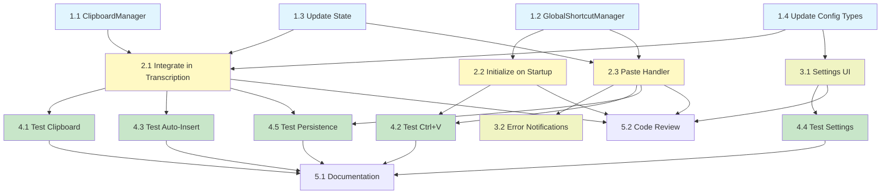

# Implementation Tasks: Clipboard Preservation

## Phase 1: Core Infrastructure

### Task 1.1: Create ClipboardManager Module

- **Priority:** High
- **Dependencies:** None
- **Files:** `whispo/src/main/clipboard-manager.ts`
- **Acceptance:**
  - File created with ClipboardManager class
  - saveClipboard method saves current clipboard text
  - restoreClipboard method restores saved text
  - scheduleRestore method sets timeout for restore
  - cancelRestore method clears pending timeout
  - Singleton instance exported
- **Requirements:** FR-1

### Task 1.2: Create GlobalShortcutManager Module

- **Priority:** High
- **Dependencies:** None
- **Files:** `whispo/src/main/global-shortcut.ts`
- **Acceptance:**
  - File created with GlobalShortcutManager class
  - registerPasteLastTranscription method registers Ctrl+V
  - handlePasteLastTranscription method pastes last transcription
  - unregisterAll method cleans up shortcuts
  - Singleton instance exported
- **Requirements:** FR-3

### Task 1.3: Update State with Last Transcription

- **Priority:** High
- **Dependencies:** None
- **Files:** `whispo/src/main/state.ts`
- **Acceptance:**
  - Add lastTranscription field (string | null)
  - Initialize to null
  - Export state object with new field
- **Requirements:** FR-4

### Task 1.4: Update Config Types

- **Priority:** High
- **Dependencies:** None
- **Files:** `whispo/src/shared/types.ts`
- **Acceptance:**
  - Add preserveClipboard optional boolean field to Config type
  - Field documented with comment
  - Default value (true) specified in comment
- **Requirements:** FR-1, AC-4

## Phase 2: Integration with Transcription Flow

### Task 2.1: Integrate ClipboardManager in Transcription

- **Priority:** High
- **Dependencies:** Task 1.1, Task 1.3, Task 1.4
- **Files:** `whispo/src/main/tipc.ts`
- **Acceptance:**
  - Import clipboardManager at top of file
  - In createRecording procedure, before clipboard.writeText:
    - Check if config.preserveClipboard is not false
    - Call clipboardManager.saveClipboard()
  - After writeText completes:
    - Check if config.preserveClipboard is not false
    - Call clipboardManager.scheduleRestore(600)
  - Update state.lastTranscription with transcript value
  - Existing functionality unchanged (auto-insert still works)
- **Requirements:** FR-1, FR-2, FR-4, AC-1, AC-2

### Task 2.2: Initialize GlobalShortcutManager on App Startup

- **Priority:** High
- **Dependencies:** Task 1.2
- **Files:** `whispo/src/main/index.ts`
- **Acceptance:**
  - Import globalShortcutManager at top
  - In app.whenReady(), after existing initialization:
    - Call globalShortcutManager.registerPasteLastTranscription()
    - Log success or failure
  - In app.on('will-quit'):
    - Call globalShortcutManager.unregisterAll()
- **Requirements:** FR-3, AC-3

### Task 2.3: Implement Paste Last Transcription Handler

- **Priority:** High
- **Dependencies:** Task 1.2, Task 1.3
- **Files:** `whispo/src/main/global-shortcut.ts`
- **Acceptance:**
  - handlePasteLastTranscription checks state.lastTranscription
  - If null or empty, show dialog "No transcription available"
  - If exists, call writeText from keyboard module
  - Does not modify clipboard
  - Works when called from Ctrl+V hotkey
- **Requirements:** FR-3, AC-3, AC-5

## Phase 3: UI and Configuration

### Task 3.1: Add Preserve Clipboard Toggle to Settings

- **Priority:** Medium
- **Dependencies:** Task 1.4
- **Files:** `whispo/src/renderer/src/pages/settings-general.tsx`
- **Acceptance:**
  - Add new ControlGroup titled "Clipboard"
  - Add Switch control labeled "Preserve Clipboard"
  - Default checked state is configQuery.data.preserveClipboard ?? true
  - onCheckedChange calls saveConfig with preserveClipboard value
  - Add help text explaining feature: "When enabled, your clipboard (Cmd+V) will be preserved after transcription. Use Ctrl+V to paste the last transcription."
  - Visual styling consistent with existing settings
- **Requirements:** AC-4

### Task 3.2: Add Error Notifications

- **Priority:** Medium
- **Dependencies:** Task 2.3
- **Files:** `whispo/src/main/global-shortcut.ts`
- **Acceptance:**
  - When registerPasteLastTranscription fails, log error
  - When Ctrl+V pressed with no transcription, show user-friendly dialog
  - Error messages clear and actionable
- **Requirements:** AC-3

## Phase 4: Testing and Validation

### Task 4.1: Manual Testing - Clipboard Preservation

- **Priority:** High
- **Dependencies:** Task 2.1
- **Files:** N/A (manual testing)
- **Acceptance:**
  - Copy text with Cmd+C
  - Record voice and wait for auto-insertion
  - Wait 1 second after transcription
  - Press Cmd+V
  - Verify original copied text is pasted (not transcription)
  - Test with preserveClipboard enabled and disabled
- **Requirements:** AC-1

### Task 4.2: Manual Testing - Ctrl+V Hotkey

- **Priority:** High
- **Dependencies:** Task 2.2, Task 2.3
- **Files:** N/A (manual testing)
- **Acceptance:**
  - Complete at least one transcription
  - Open different application (browser, notes, etc)
  - Press Ctrl+V
  - Verify last transcription is pasted
  - Verify clipboard (Cmd+V) is unchanged
  - Test multiple transcriptions (Ctrl+V pastes most recent)
- **Requirements:** AC-3

### Task 4.3: Manual Testing - Auto-Insertion Still Works

- **Priority:** High
- **Dependencies:** Task 2.1
- **Files:** N/A (manual testing)
- **Acceptance:**
  - Record voice in text editor
  - Verify text automatically appears without manual paste
  - Test in multiple applications
  - Verify no regression in existing functionality
- **Requirements:** AC-2

### Task 4.4: Manual Testing - Settings UI

- **Priority:** Medium
- **Dependencies:** Task 3.1
- **Files:** N/A (manual testing)
- **Acceptance:**
  - Open Settings > General
  - Locate "Clipboard" section
  - Toggle "Preserve Clipboard" on/off
  - Verify toggle saves immediately
  - Test that disabling preserveClipboard allows transcription to stay in clipboard
- **Requirements:** AC-4

### Task 4.5: Manual Testing - Persistence

- **Priority:** Medium
- **Dependencies:** Task 2.1, Task 2.3
- **Files:** N/A (manual testing)
- **Acceptance:**
  - Complete a transcription
  - Close Whispo application
  - Reopen Whispo
  - Press Ctrl+V in any app
  - Verify last transcription from previous session is pasted
- **Requirements:** AC-5

## Phase 5: Documentation and Cleanup

### Task 5.1: Update README or Documentation

- **Priority:** Low
- **Dependencies:** All previous tasks
- **Files:** `whispo/README.md` or create `docs/clipboard-preservation.md`
- **Acceptance:**
  - Document new clipboard preservation feature
  - Explain Ctrl+V hotkey functionality
  - Document settings option
  - Include troubleshooting for hotkey conflicts
- **Requirements:** All

### Task 5.2: Code Review and Cleanup

- **Priority:** Low
- **Dependencies:** All implementation tasks
- **Files:** All modified files
- **Acceptance:**
  - Remove any console.log debug statements
  - Ensure consistent code style
  - Add JSDoc comments to public methods
  - Verify no unused imports
- **Requirements:** All

## Task Dependencies Diagram

## Execution Order

**Sequential (must follow order):**
1. Phase 1 (all tasks can run in parallel)
2. Phase 2 (depends on Phase 1)
3. Phase 3 (depends on Phase 1)
4. Phase 4 (depends on Phase 2 and 3)
5. Phase 5 (depends on Phase 4)

**Within each phase:**
- Phase 1: All tasks independent, can be done in any order
- Phase 2: Task 2.1 → Task 2.2 → Task 2.3 (sequential)
- Phase 3: Both tasks independent
- Phase 4: All tasks independent (parallel testing)
- Phase 5: Task 5.2 after Task 5.1

## Total Tasks: 14
**Estimated Time:** 6-8 hours
**Success Metrics:** All acceptance criteria met, all tests passing
<!-- ORCHESTRATOR-TASKS-SYNC START -->
## Orchestrator Task Status

- [x] **1.1** — Create ClipboardManager Module
  - Status: completed
  - Atualizado: 2025-11-13T20:14:05.353395+00:00
  - Assistente: não atribuído
- [x] **1.2** — Create GlobalShortcutManager Module
  - Status: completed
  - Atualizado: 2025-11-13T20:14:10.313214+00:00
  - Assistente: não atribuído
- [x] **1.3** — Update State with Last Transcription
  - Status: completed
  - Atualizado: 2025-11-13T20:14:16.335799+00:00
  - Assistente: não atribuído
- [x] **1.4** — Update Config Types
  - Status: completed
  - Atualizado: 2025-11-13T20:14:22.200899+00:00
  - Assistente: não atribuído
- [x] **2.1** — Integrate ClipboardManager in Transcription
  - Status: completed
  - Atualizado: 2025-11-13T20:14:30.388324+00:00
  - Assistente: não atribuído
- [x] **2.2** — Initialize GlobalShortcutManager on App Startup
  - Status: completed
  - Atualizado: 2025-11-13T20:14:37.384138+00:00
  - Assistente: não atribuído
- [x] **2.3** — Implement Paste Last Transcription Handler
  - Status: completed
  - Atualizado: 2025-11-13T20:14:43.026938+00:00
  - Assistente: não atribuído
- [x] **3.1** — Add Preserve Clipboard Toggle to Settings
  - Status: completed
  - Atualizado: 2025-11-13T20:14:50.833134+00:00
  - Assistente: não atribuído
- [x] **3.2** — Add Error Notifications
  - Status: completed
  - Atualizado: 2025-11-13T20:14:57.442361+00:00
  - Assistente: não atribuído
- [ ] **batch-phase-1-2-3** — Task batch-phase-1-2-3
  - Status: running
  - Atualizado: 2025-11-13T18:15:59.053724+00:00
  - Assistente: Claude Code (terminal 6bcf647a-8265-4bba-ac14-ee88a9464c7f) — comando: claude --dangerously-skip-permissions "Execute all 9 implementation tasks for clipboard preservation feature PHASE 1: Co...
<!-- ORCHESTRATOR-TASKS-SYNC END -->
