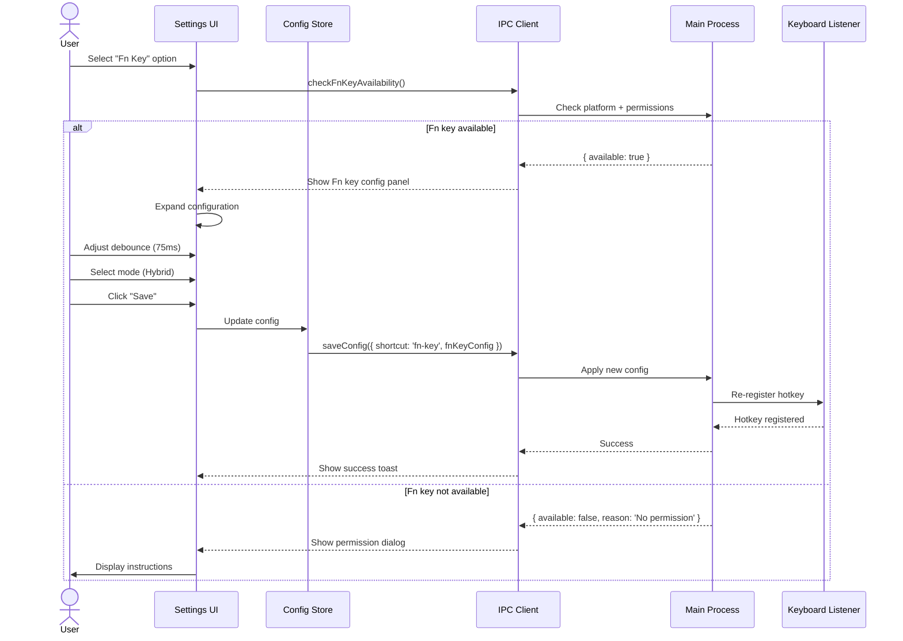
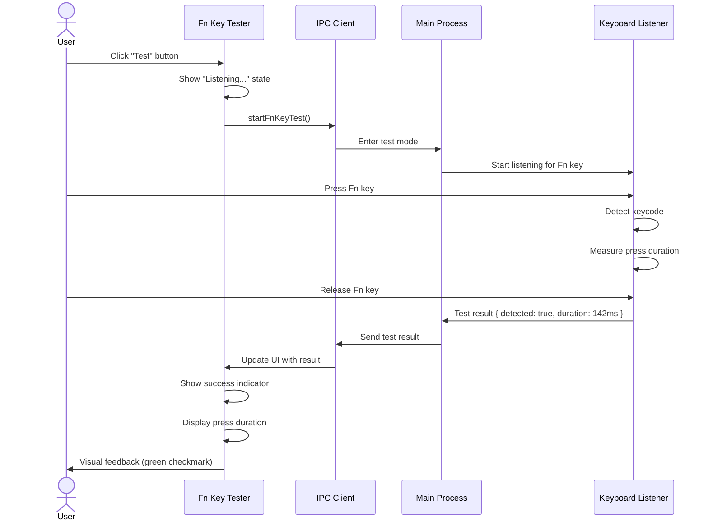
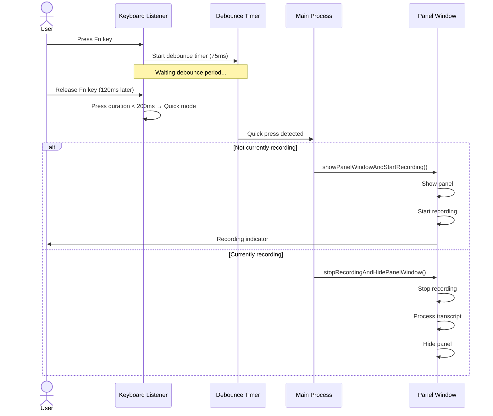
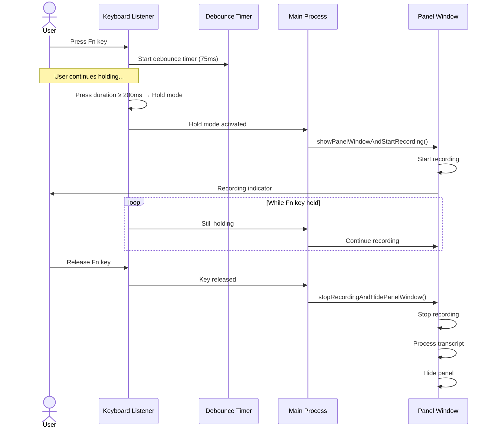
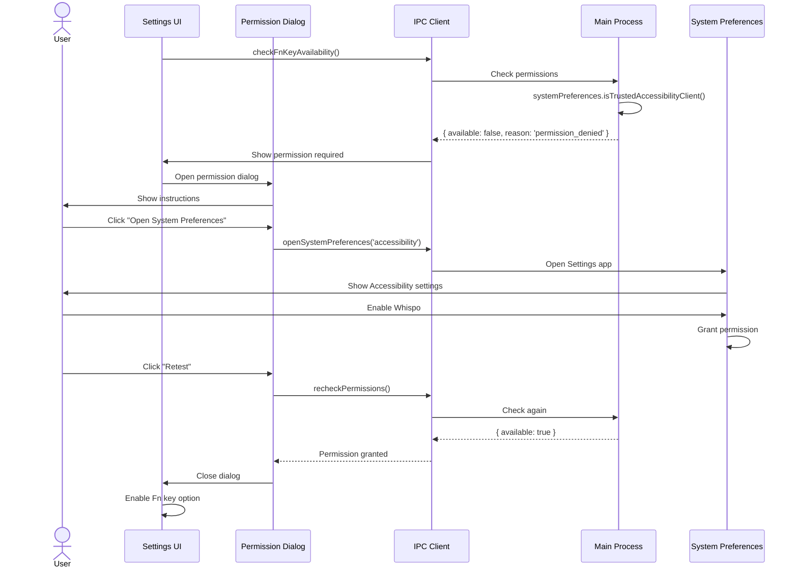

# Fn Key Hotkey System Requirements Specification for Whispo

## 1. Executive Summary

This document specifies the requirements for implementing a comprehensive Fn key hotkey system in Whispo, based on VoiceInk's implementation patterns and adapted for Whispo's Electron-based cross-platform architecture.

## 2. Current State Analysis

### 2.1 Existing Whispo Hotkey System
- **Current Implementation**: Uses Rust-based `rdev` library for low-level keyboard event capture
- **Supported Shortcuts**:
  - `hold-ctrl` (800ms delay for recording start)
  - `ctrl-slash` (immediate recording toggle)
- **Architecture**: Main process keyboard listener with IPC to renderer for UI updates
- **Platform Support**: Cross-platform via `whispo-rs` binary

### 2.2 VoiceInk Reference Implementation
- **Fn Key Support**: Keycode `0x3F` with 75ms debouncing
- **Dual-Mode Operation**: Single press vs hold detection
- **Advanced Features**: Multiple modifier key support, customizable delays
- **macOS-Specific**: Native Swift implementation with Accessibility API integration

## 3. Functional Requirements

### 3.1 Fn Key Detection and Registration

**REQ-FN-001**: WHEN the application starts THEN the system SHALL detect Fn key availability across all supported platforms (Windows, macOS, Linux)

**REQ-FN-002**: WHEN Fn key is detected as available THEN the system SHALL register it as a valid hotkey option in the configuration interface

**REQ-FN-003**: IF the Fn key is not available on the current hardware THEN the system SHALL display an informative message and disable the Fn key option

**REQ-FN-004**: WHEN the user selects Fn key as the primary hotkey THEN the system SHALL register the appropriate keycode for the current platform:
- Windows: Virtual Key Code `VK_F13` through `VK_F24` range detection
- macOS: Keycode `0x3F` (63 decimal)
- Linux: Keycode detection via XKB symbol mapping

### 3.2 Debouncing Mechanisms

**REQ-DEB-001**: WHEN Fn key press events are detected THEN the system SHALL implement a configurable debouncing delay (default: 75ms) to prevent accidental triggers

**REQ-DEB-002**: WHEN multiple Fn key events occur within the debouncing window THEN the system SHALL ignore subsequent events until the debouncing period expires

**REQ-DEB-003**: WHEN the debouncing delay is configurable THEN the system SHALL allow values between 25ms and 500ms with 25ms increments

### 3.3 Dual-Mode Operation

**REQ-MODE-001**: WHEN Fn key is pressed and released quickly (< 200ms) THEN the system SHALL trigger "quick mode" functionality:
- Toggle recording on/off
- Show recording panel if not visible
- Hide recording panel if visible and not recording

**REQ-MODE-002**: WHEN Fn key is held for longer duration (≥ 200ms) THEN the system SHALL enter "push-to-talk mode":
- Start recording immediately
- Continue recording while key is held
- Stop recording when key is released

**REQ-MODE-003**: WHEN other keys are pressed while Fn key is held THEN the system SHALL cancel the recording operation to prevent interference

### 3.4 Integration with Existing Recording Functionality

**REQ-INT-001**: WHEN Fn key triggers recording THEN the system SHALL use the same recording pipeline as existing shortcuts (showPanelWindowAndStartRecording)

**REQ-INT-002**: WHEN Fn key stops recording THEN the system SHALL trigger the same completion flow as existing shortcuts (stopRecordingAndHidePanelWindow)

**REQ-INT-003**: WHEN Fn key is used during active recording THEN the system SHALL respect the current recording state and apply appropriate actions

**REQ-INT-004**: WHEN Escape key is pressed during Fn key recording THEN the system SHALL cancel recording and return to idle state

### 3.5 Cross-Platform Considerations

**REQ-PLAT-001**: WHEN implementing Fn key support THEN the system SHALL maintain compatibility with all currently supported platforms (Windows 10+, macOS 10.15+, Ubuntu 20.04+)

**REQ-PLAT-002**: WHEN platform-specific key codes differ THEN the system SHALL implement appropriate mapping and translation layers

**REQ-PLAT-003**: WHEN accessibility permissions are required THEN the system SHALL request and validate permissions before enabling Fn key functionality

**REQ-PLAT-004**: WHEN running on virtual machines or remote desktop environments THEN the system SHALL detect limitations and provide appropriate fallback options

### 3.6 Configuration and Settings UI

**REQ-UI-001**: WHEN user accesses hotkey settings THEN the system SHALL display all available hotkey options including:
- Hold Ctrl (current)
- Ctrl+Slash (current)
- Fn Key (new)
- Custom combinations (future)

**REQ-UI-002**: WHEN Fn key is selected THEN the system SHALL show additional configuration options:
- Debouncing delay slider (25ms - 500ms)
- Mode selection (Quick Toggle / Push-to-Talk / Hybrid)
- Test button for validation

**REQ-UI-003**: WHEN testing Fn key functionality THEN the system SHALL provide visual feedback indicating successful key detection and timing

**REQ-UI-004**: WHEN configuration is saved THEN the system SHALL persist settings and apply them immediately without requiring restart

#### 3.6.1 Detailed Settings UI Specifications

**REQ-UI-005**: WHEN user opens hotkey settings THEN the interface SHALL display:
- Radio button group for hotkey selection with visual indicators
- Current hotkey status badge (Active, Testing, Error)
- Platform compatibility indicator for each option
- Keyboard shortcut visualization (e.g., visual key representation)

**REQ-UI-006**: WHEN Fn key configuration is expanded THEN the panel SHALL show:
- Debounce delay slider with real-time value display (25ms - 500ms)
- Mode selection cards with descriptions:
  * Quick Toggle: "Press and release to start/stop recording"
  * Push-to-Talk: "Hold to record, release to stop"
  * Hybrid: "Quick press toggles, hold for push-to-talk"
- Test Fn key button with visual feedback
- Troubleshooting accordion for common issues

**REQ-UI-007**: WHEN testing Fn key THEN the system SHALL provide:
- Live key press visualization (green pulse on detection)
- Timing display showing press duration in milliseconds
- Success/failure indicator with specific error messages
- Recommendation text if test fails

**REQ-UI-008**: WHEN permission issues are detected THEN the UI SHALL display:
- Platform-specific permission request dialog
- Step-by-step instructions with screenshots
- "Open System Preferences" button (auto-navigates)
- Retest button after permission grant

### 3.7 Error Handling and Fallbacks

**REQ-ERR-001**: WHEN Fn key registration fails THEN the system SHALL:
- Log detailed error information for debugging
- Display user-friendly error message
- Automatically fall back to previously configured hotkey
- Offer alternative hotkey suggestions

**REQ-ERR-002**: WHEN permission errors occur THEN the system SHALL:
- Detect the specific permission issue (accessibility, input monitoring)
- Provide platform-specific instructions for granting permissions
- Offer to open system permission settings automatically
- Disable Fn key option until permissions are resolved

**REQ-ERR-003**: WHEN hardware conflicts are detected THEN the system SHALL:
- Identify conflicting applications or system features
- Provide conflict resolution guidance
- Suggest alternative key combinations
- Allow manual override with warning

### 3.8 Accessibility Permissions Requirements

**REQ-ACC-001**: WHEN running on macOS THEN the system SHALL:
- Check for Accessibility API permissions using `systemPreferences.isTrustedAccessibilityClient()`
- Request permissions if not granted
- Provide clear instructions for manual permission granting
- Validate permissions before enabling Fn key functionality

**REQ-ACC-002**: WHEN running on Windows THEN the system SHALL:
- Check for low-level keyboard hook permissions
- Handle UAC elevation if required
- Validate input capture capabilities
- Gracefully degrade if permissions are insufficient

**REQ-ACC-003**: WHEN running on Linux THEN the system SHALL:
- Check for X11/Wayland input capture permissions
- Validate udev/input group membership
- Handle different desktop environment requirements
- Provide distribution-specific guidance

## 4. Non-Functional Requirements

### 4.1 Performance Requirements

**REQ-PERF-001**: WHEN Fn key events are processed THEN the system SHALL maintain < 10ms latency from key press to action initiation

**REQ-PERF-002**: WHEN system is idle THEN the Fn key listener SHALL consume < 0.1% CPU usage

**REQ-PERF-003**: WHEN multiple rapid key events occur THEN the system SHALL handle event bursts without blocking the UI thread

### 4.2 Reliability Requirements

**REQ-REL-001**: WHEN Fn key functionality is enabled THEN the system SHALL maintain 99.9% uptime without requiring restart

**REQ-REL-002**: WHEN system errors occur THEN the hotkey system SHALL recover gracefully without affecting other application functionality

### 4.3 Security Requirements

**REQ-SEC-001**: WHEN capturing keyboard events THEN the system SHALL only process the configured hotkey combinations and ignore all other keyboard activity

**REQ-SEC-002**: WHEN storing hotkey configurations THEN the system SHALL use the same secure storage mechanisms as other application settings

## 5. Technical Implementation Specifications

### 5.1 Architecture Integration

**Current Architecture Enhancement:**
```typescript
// Extend existing keyboard.ts functionality
export interface HotkeyConfig {
  type: 'hold-ctrl' | 'ctrl-slash' | 'fn-key' | 'custom'
  debounceMs?: number
  mode?: 'quick-toggle' | 'push-to-talk' | 'hybrid'
  customKey?: string
  modifiers?: string[]
}

// Extend RdevEvent type for Fn key support
type RdevEvent = {
  event_type: "KeyPress" | "KeyRelease"
  data: {
    key: "ControlLeft" | "BackSlash" | "Fn" | string
    modifiers?: string[]
  }
  time: {
    secs_since_epoch: number
  }
}
```

### 5.2 Platform-Specific Implementation

**Windows (whispo-rs enhancement):**
- Use `GetAsyncKeyState(VK_LWIN)` for Windows key detection as Fn substitute
- Implement proper key mapping for laptop-specific Fn keys
- Handle OEM-specific key codes

**macOS (whispo-rs enhancement):**
- Use CGEventTap for Fn key detection (keycode 63)
- Implement proper Accessibility API integration
- Handle modifier key state properly

**Linux (whispo-rs enhancement):**
- Use X11 XGrabKey or Wayland input protocols
- Implement proper keycode mapping via xkb
- Handle different desktop environment variations

### 5.3 Configuration Schema Extension

**Extend existing Config type:**
```typescript
export type Config = {
  shortcut?: "hold-ctrl" | "ctrl-slash" | "fn-key"
  fnKeyConfig?: {
    debounceMs: number
    mode: 'quick-toggle' | 'push-to-talk' | 'hybrid'
    testMode?: boolean
  }
  // ... existing properties
}
```

### 5.4 UI Component Specifications

**New Components Required:**
1. `FnKeyConfigPanel.tsx` - Main configuration interface
2. `HotkeyTester.tsx` - Test functionality component
3. `PermissionChecker.tsx` - Permission validation component
4. `PlatformInstructions.tsx` - Platform-specific guidance

### 5.5 IPC Interface Extensions

**New IPC Channels:**
```typescript
// Main -> Renderer
'fn-key-status-changed': (status: 'enabled' | 'disabled' | 'error', reason?: string) => void
'fn-key-permission-required': (platform: string, instructions: string) => void

// Renderer -> Main
'test-fn-key': () => Promise<boolean>
'request-fn-key-permissions': () => Promise<void>
'configure-fn-key': (config: FnKeyConfig) => Promise<boolean>
```

## 6. Testing Requirements

### 6.1 Functional Testing

**REQ-TEST-001**: WHEN Fn key functionality is implemented THEN automated tests SHALL verify:
- Key detection on all supported platforms
- Debouncing behavior with various timing scenarios
- Dual-mode operation (quick vs hold)
- Integration with existing recording workflow
- Error handling and recovery scenarios

**REQ-TEST-002**: WHEN manual testing is performed THEN test cases SHALL include:
- Hardware compatibility across different laptop models
- Conflict detection with system hotkeys
- Permission granting/revoking scenarios
- Performance under sustained key press scenarios

### 6.2 Platform Testing

**REQ-TEST-003**: WHEN platform-specific testing is performed THEN validation SHALL cover:
- Different Windows laptop manufacturers (Dell, HP, Lenovo, etc.)
- Various macOS hardware (Intel, Apple Silicon)
- Multiple Linux distributions and desktop environments
- Virtual machine and remote desktop scenarios

## 7. Documentation Requirements

### 7.1 User Documentation

**REQ-DOC-001**: WHEN Fn key feature is released THEN documentation SHALL include:
- Platform-specific setup instructions
- Troubleshooting guide for common issues
- Permission granting procedures
- Hardware compatibility list

### 7.2 Developer Documentation

**REQ-DOC-002**: WHEN implementation is complete THEN technical documentation SHALL include:
- API reference for hotkey system
- Platform-specific implementation details
- Debugging guide for key detection issues
- Extension points for future hotkey additions

## 8. Migration and Deployment

### 8.1 Migration Strategy

**REQ-MIG-001**: WHEN upgrading existing Whispo installations THEN the system SHALL:
- Preserve existing hotkey configurations
- Offer optional migration to Fn key if available
- Maintain backward compatibility with current shortcuts
- Provide clear upgrade instructions

### 8.2 Feature Rollout

**REQ-ROLL-001**: WHEN deploying Fn key functionality THEN the rollout SHALL be:
- Initially disabled by default (opt-in)
- Gradually enabled as stability is proven
- Accompanied by user education materials
- Monitored for adoption and issue rates

## 9. Success Criteria

### 9.1 Acceptance Criteria

**REQ-ACCEPT-001**: The implementation is considered successful WHEN:
- Fn key functions correctly on ≥95% of supported hardware configurations
- User satisfaction scores show ≥80% positive feedback for the feature
- System performance impact remains below defined thresholds
- Zero critical security issues are identified in production

### 9.2 Performance Benchmarks

**REQ-BENCH-001**: The following benchmarks must be achieved:
- Key press to recording start: < 50ms (including debouncing)
- CPU usage impact: < 0.1% during idle monitoring
- Memory overhead: < 5MB for hotkey monitoring system
- Battery impact on laptops: Negligible (< 1% additional drain)

## 10. Future Considerations

### 10.1 Enhanced Features

**Future enhancements may include:**
- Custom key combination support beyond single Fn key
- Gesture-based hotkey alternatives for accessibility
- Voice activation as hotkey alternative
- Integration with external hardware (foot pedals, wireless buttons)

### 10.2 Platform Evolution

**Adaptation for future platforms:**
- Preparation for new Windows input methods
- Support for emerging Linux desktop environments
- Compatibility with future macOS security changes
- Mobile platform considerations for future expansion

---

---

## 11. UI Component Specifications

This section provides detailed specifications for implementing Fn key configuration UI components.

### 11.1 Component Hierarchy

```
SettingsGeneralPage
├── HotkeySection
│   ├── HotkeySelector (RadioGroup)
│   │   ├── HoldCtrlOption
│   │   ├── CtrlSlashOption
│   │   └── FnKeyOption (NEW)
│   └── FnKeyConfigPanel (Collapsible, NEW)
│       ├── DebounceSlider
│       ├── ModeSelector
│       ├── FnKeyTester
│       └── TroubleshootingAccordion
└── PermissionCheckerDialog (Modal, NEW)
```

### 11.2 Fn Key Config Panel Component

**File:** `src/renderer/src/components/FnKeyConfigPanel.tsx`

**Props Interface:**
```typescript
interface FnKeyConfigPanelProps {
  config: FnKeyConfig
  onConfigChange: (config: FnKeyConfig) => void
  available: boolean
  testResult?: FnKeyTestResult
}

interface FnKeyConfig {
  debounceMs: number
  mode: 'quick-toggle' | 'push-to-talk' | 'hybrid'
}

interface FnKeyTestResult {
  success: boolean
  keyDetected: boolean
  pressDuration?: number
  error?: string
}
```

**Structure:**
```tsx
<Collapsible open={expanded}>
  <CollapsibleContent className="space-y-4 pt-4">
    {/* Debounce Slider */}
    <div className="space-y-2">
      <div className="flex items-center justify-between">
        <Label>Debounce Delay</Label>
        <span className="text-sm text-muted-foreground">{debounceMs}ms</span>
      </div>
      <Slider
        value={[debounceMs]}
        min={25}
        max={500}
        step={25}
        onValueChange={([value]) => handleDebounceChange(value)}
      />
      <p className="text-xs text-muted-foreground">
        Lower values = more responsive, higher values = fewer accidental triggers
      </p>
    </div>

    {/* Mode Selector */}
    <div className="space-y-2">
      <Label>Recording Mode</Label>
      <div className="grid grid-cols-3 gap-2">
        <ModeCard
          mode="quick-toggle"
          selected={mode === 'quick-toggle'}
          onClick={() => handleModeChange('quick-toggle')}
          icon={Toggle}
          title="Quick Toggle"
          description="Press to start/stop"
        />
        <ModeCard
          mode="push-to-talk"
          selected={mode === 'push-to-talk'}
          onClick={() => handleModeChange('push-to-talk')}
          icon={Mic}
          title="Push-to-Talk"
          description="Hold to record"
        />
        <ModeCard
          mode="hybrid"
          selected={mode === 'hybrid'}
          onClick={() => handleModeChange('hybrid')}
          icon={Zap}
          title="Hybrid"
          description="Both modes"
        />
      </div>
    </div>

    {/* Fn Key Tester */}
    <FnKeyTester onTest={handleTest} result={testResult} />

    {/* Troubleshooting */}
    <Accordion type="single" collapsible>
      <AccordionItem value="troubleshooting">
        <AccordionTrigger>Troubleshooting</AccordionTrigger>
        <AccordionContent>
          <TroubleshootingContent platform={platform} />
        </AccordionContent>
      </AccordionItem>
    </Accordion>
  </CollapsibleContent>
</Collapsible>
```

### 11.3 Fn Key Tester Component

**File:** `src/renderer/src/components/FnKeyTester.tsx`

```tsx
interface FnKeyTesterProps {
  onTest: () => Promise<FnKeyTestResult>
  result?: FnKeyTestResult
}

export function FnKeyTester({ onTest, result }: FnKeyTesterProps) {
  const [testing, setTesting] = useState(false)
  
  const handleTest = async () => {
    setTesting(true)
    try {
      await onTest()
    } finally {
      setTesting(false)
    }
  }
  
  return (
    <div className="border rounded-lg p-4 space-y-3">
      <div className="flex items-center justify-between">
        <h4 className="text-sm font-medium">Test Fn Key</h4>
        <Button
          size="sm"
          onClick={handleTest}
          disabled={testing}
        >
          {testing ? (
            <>
              <Loader2 className="w-4 h-4 mr-2 animate-spin" />
              Testing...
            </>
          ) : (
            <>
              <Play className="w-4 h-4 mr-2" />
              Test
            </>
          )}
        </Button>
      </div>
      
      {result && (
        <div className={cn(
          "p-3 rounded-lg border",
          result.success 
            ? "bg-green-50 border-green-200 dark:bg-green-950/20"
            : "bg-red-50 border-red-200 dark:bg-red-950/20"
        )}>
          <div className="flex items-start gap-2">
            {result.success ? (
              <CheckCircle className="w-5 h-5 text-green-600 flex-shrink-0" />
            ) : (
              <XCircle className="w-5 h-5 text-red-600 flex-shrink-0" />
            )}
            <div className="space-y-1">
              <p className="text-sm font-medium">
                {result.success ? 'Fn key detected successfully!' : 'Fn key not detected'}
              </p>
              {result.pressDuration && (
                <p className="text-xs text-muted-foreground">
                  Press duration: {result.pressDuration}ms
                </p>
              )}
              {result.error && (
                <p className="text-xs text-red-600 dark:text-red-400">
                  {result.error}
                </p>
              )}
            </div>
          </div>
        </div>
      )}
      
      <div className="text-xs text-muted-foreground">
        Press your Fn key after clicking Test to verify detection
      </div>
    </div>
  )
}
```

### 11.4 Permission Checker Dialog

**File:** `src/renderer/src/components/PermissionCheckerDialog.tsx`

```tsx
interface PermissionCheckerDialogProps {
  open: boolean
  onOpenChange: (open: boolean) => void
  platform: 'macos' | 'windows' | 'linux'
  permissionType: 'accessibility' | 'input-monitoring'
}

export function PermissionCheckerDialog({
  open,
  onOpenChange,
  platform,
  permissionType
}: PermissionCheckerDialogProps) {
  const instructions = getPlatformInstructions(platform, permissionType)
  
  return (
    <Dialog open={open} onOpenChange={onOpenChange}>
      <DialogContent className="max-w-2xl">
        <DialogHeader>
          <DialogTitle>
            {platform === 'macos' ? 'Accessibility' : 'Input Monitoring'} Permission Required
          </DialogTitle>
          <DialogDescription>
            Whispo needs permission to detect Fn key presses
          </DialogDescription>
        </DialogHeader>
        
        <div className="space-y-4">
          <Alert>
            <Info className="h-4 w-4" />
            <AlertTitle>Why is this needed?</AlertTitle>
            <AlertDescription>
              To detect Fn key presses system-wide, Whispo requires {permissionType} access.
              This is used solely for hotkey detection and no other data is captured.
            </AlertDescription>
          </Alert>
          
          <div className="space-y-2">
            <h4 className="font-medium">Instructions:</h4>
            <ol className="list-decimal list-inside space-y-2 text-sm">
              {instructions.steps.map((step, i) => (
                <li key={i}>{step}</li>
              ))}
            </ol>
          </div>
          
          {instructions.screenshot && (
            <div className="border rounded-lg p-2">
              
            </div>
          )}
        </div>
        
        <DialogFooter>
          <Button variant="outline" onClick={() => onOpenChange(false)}>
            Cancel
          </Button>
          <Button onClick={async () => {
            await tipcClient.openSystemPreferences(permissionType)
          }}>
            Open System Preferences
          </Button>
        </DialogFooter>
      </DialogContent>
    </Dialog>
  )
}
```

---

## 12. UI Wireframes and Layouts

### Settings Page - Fn Key Configuration

```
┌─────────────────────────────────────────────────────────────┐
│ Settings > General > Recording Hotkey                      │
├─────────────────────────────────────────────────────────────┤
│                                                             │
│ ┌─ Recording Hotkey ─────────────────────────────────────┐ │
│ │                                                         │ │
│ │ ○ Hold Ctrl                                            │ │
│ │   Press and hold Ctrl key to record                    │ │
│ │                                                         │ │
│ │ ○ Ctrl + /                                             │ │
│ │   Toggle recording with Ctrl+/ shortcut                │ │
│ │                                                         │ │
│ │ ◉ Fn Key                            ✓ Available        │ │
│ │   Use Fn key for recording                             │ │
│ │                                                         │ │
│ │   ┌─ Fn Key Configuration ──────────────────────────┐  │ │
│ │   │                                                  │  │ │
│ │   │ Debounce Delay                            75ms  │  │ │
│ │   │ ├────────────────●───────────────────────────┐  │  │ │
│ │   │ 25ms                                     500ms │  │ │
│ │   │                                                  │  │ │
│ │   │ Recording Mode                                   │  │ │
│ │   │ ┌─────────┐  ┌─────────┐  ┌─────────┐         │  │ │
│ │   │ │ Toggle  │  │  Push   │  │ Hybrid  │         │  │ │
│ │   │ │   ●     │  │  to     │  │   ◉     │         │  │ │
│ │   │ │ Press to│  │  Talk   │  │ Both    │         │  │ │
│ │   │ │ start/  │  │  Hold to│  │ modes   │         │  │ │
│ │   │ │ stop    │  │  record │  │         │         │  │ │
│ │   │ └─────────┘  └─────────┘  └─────────┘         │  │ │
│ │   │                                                  │  │ │
│ │   │ ┌─ Test Fn Key ──────────────────────────────┐ │  │ │
│ │   │ │ Test                            [▶ Test]   │ │  │ │
│ │   │ │                                             │ │  │ │
│ │   │ │ ✓ Fn key detected successfully!            │ │  │ │
│ │   │ │   Press duration: 142ms                    │ │  │ │
│ │   │ │                                             │ │  │ │
│ │   │ │ Press your Fn key after clicking Test      │ │  │ │
│ │   │ └─────────────────────────────────────────────┘ │  │ │
│ │   │                                                  │  │ │
│ │   │ ▼ Troubleshooting                               │  │ │
│ │   └──────────────────────────────────────────────────┘  │ │
│ │                                                         │ │
│ └─────────────────────────────────────────────────────────┘ │
│                                                             │
└─────────────────────────────────────────────────────────────┘
```

### Fn Key Test - Live Feedback

```
┌─────────────────────────────────────────────┐
│ Test Fn Key                      [Testing] │
├─────────────────────────────────────────────┤
│                                             │
│           ┌─────────────────┐               │
│           │                 │               │
│           │      ●  Fn      │  ← Pulsing   │
│           │                 │    green      │
│           │  Waiting for    │               │
│           │   key press     │               │
│           │                 │               │
│           └─────────────────┘               │
│                                             │
│  Duration: 0ms                              │
│  Status: Listening...                       │
│                                             │
│           [Cancel Test]                     │
│                                             │
└─────────────────────────────────────────────┘
```

### Permission Request Dialog (macOS)

```
┌──────────────────────────────────────────────────────────┐
│ Accessibility Permission Required                   [×] │
├──────────────────────────────────────────────────────────┤
│                                                          │
│ ℹ️  Why is this needed?                                 │
│                                                          │
│ To detect Fn key presses system-wide, Whispo requires   │
│ accessibility access. This is used solely for hotkey    │
│ detection and no other data is captured.                │
│                                                          │
│ Instructions:                                            │
│                                                          │
│ 1. Click "Open System Preferences" below                │
│ 2. Navigate to Privacy & Security > Accessibility       │
│ 3. Enable the toggle next to Whispo                     │
│ 4. Return to Whispo and test again                      │
│                                                          │
│ ┌────────────────────────────────────────────────────┐  │
│ │ [Screenshot of macOS System Preferences showing   │  │
│ │  Privacy & Security > Accessibility with Whispo]  │  │
│ └────────────────────────────────────────────────────┘  │
│                                                          │
├──────────────────────────────────────────────────────────┤
│                   [Cancel]  [Open System Preferences]    │
└──────────────────────────────────────────────────────────┘
```

---

## 13. VoiceInk to Whispo Implementation Mapping

### Core Components

| VoiceInk (Swift) | Whispo (Rust + TypeScript) | Notes |
|---|---|---|
| `Fn key monitoring` | `rdev::listen()` in whispo-rs | Low-level keyboard hook |
| `keycode 0x3F` (macOS) | Platform-specific keycodes | Mapped per platform |
| `75ms debouncing` | Configurable debounce timer | Default 75ms, adjustable |
| `Quick vs Hold detection` | Time-based mode detection | 200ms threshold |
| Accessibility permission check | `systemPreferences` API (Electron) | macOS permission validation |

### Keyboard Event Handling

| VoiceInk Pattern | Whispo Equivalent | Implementation |
|---|---|---|
| NSEvent monitoring | rdev event listener | Rust low-level hook |
| CGEventTap (macOS) | Platform-specific in rdev | Linux: X11/Wayland, Windows: WinAPI |
| Modifier key state | Event modifiers field | Captured in RdevEvent |
| Event filtering | Event type matching | Filter in Rust before IPC |

### State Management

| VoiceInk State | Whispo State | Storage |
|---|---|---|
| `fnKeyEnabled` | `Config.shortcut === 'fn-key'` | Config file |
| `debounceDelay` | `Config.fnKeyConfig.debounceMs` | Config file |
| `recordingMode` | `Config.fnKeyConfig.mode` | Config file |
| Last key press time | In-memory timer | Ephemeral |

---

## 14. Interaction Flows

### Flow 1: Configure Fn Key



### Flow 2: Test Fn Key



### Flow 3: Fn Key Quick Press (Toggle)



### Flow 4: Fn Key Hold (Push-to-Talk)



### Flow 5: Permission Request and Grant



---

## 15. Implementation Code Examples

### 15.1 Rust Keyboard Listener Enhancement

**File:** `whispo-rs/src/keyboard.rs`

```rust
use rdev::{listen, Event, EventType, Key};
use std::sync::mpsc::Sender;
use std::time::{Duration, Instant};

#[derive(Clone, Debug)]
pub enum HotkeyType {
    HoldCtrl,
    CtrlSlash,
    FnKey { debounce_ms: u64, mode: FnKeyMode },
}

#[derive(Clone, Debug)]
pub enum FnKeyMode {
    QuickToggle,
    PushToTalk,
    Hybrid,
}

struct FnKeyState {
    press_start: Option<Instant>,
    debounce_timer: Option<Instant>,
    last_event_time: Option<Instant>,
}

impl FnKeyState {
    fn new() -> Self {
        Self {
            press_start: None,
            debounce_timer: None,
            last_event_time: None,
        }
    }
    
    fn should_process_event(&mut self, debounce_ms: u64) -> bool {
        let now = Instant::now();
        
        if let Some(last_event) = self.last_event_time {
            let elapsed = now.duration_since(last_event).as_millis() as u64;
            if elapsed < debounce_ms {
                return false; // Still in debounce period
            }
        }
        
        self.last_event_time = Some(now);
        true
    }
}

pub fn start_keyboard_listener(
    tx: Sender<KeyboardEvent>,
    hotkey_type: HotkeyType,
) -> Result<(), Box<dyn std::error::Error>> {
    let mut fn_state = FnKeyState::new();
    
    listen(move |event| {
        match &hotkey_type {
            HotkeyType::FnKey { debounce_ms, mode } => {
                handle_fn_key_event(event, &mut fn_state, *debounce_ms, mode, &tx);
            }
            HotkeyType::HoldCtrl => {
                handle_hold_ctrl_event(event, &tx);
            }
            HotkeyType::CtrlSlash => {
                handle_ctrl_slash_event(event, &tx);
            }
        }
    })?;
    
    Ok(())
}

fn handle_fn_key_event(
    event: Event,
    state: &mut FnKeyState,
    debounce_ms: u64,
    mode: &FnKeyMode,
    tx: &Sender<KeyboardEvent>,
) {
    // Check if event is Fn key (platform-specific)
    let is_fn_key = match event.event_type {
        EventType::KeyPress(key) | EventType::KeyRelease(key) => {
            is_fn_key_code(key)
        }
        _ => false,
    };
    
    if !is_fn_key {
        return;
    }
    
    // Apply debouncing
    if !state.should_process_event(debounce_ms) {
        return;
    }
    
    match event.event_type {
        EventType::KeyPress(_) => {
            state.press_start = Some(Instant::now());
        }
        EventType::KeyRelease(_) => {
            if let Some(press_start) = state.press_start {
                let press_duration = Instant::now().duration_since(press_start);
                let duration_ms = press_duration.as_millis() as u64;
                
                // Determine mode based on duration and config
                let action = match mode {
                    FnKeyMode::QuickToggle => KeyboardAction::Toggle,
                    FnKeyMode::PushToTalk => {
                        if duration_ms >= 200 {
                            KeyboardAction::StopRecording
                        } else {
                            return; // Ignore quick presses in push-to-talk mode
                        }
                    }
                    FnKeyMode::Hybrid => {
                        if duration_ms < 200 {
                            KeyboardAction::Toggle
                        } else {
                            KeyboardAction::StopRecording
                        }
                    }
                };
                
                let _ = tx.send(KeyboardEvent {
                    action,
                    duration_ms: Some(duration_ms),
                    timestamp: Instant::now(),
                });
                
                state.press_start = None;
            }
        }
        _ => {}
    }
}

#[cfg(target_os = "macos")]
fn is_fn_key_code(key: Key) -> bool {
    // macOS Fn key is keycode 63 (0x3F)
    matches!(key, Key::Function)
}

#[cfg(target_os = "windows")]
fn is_fn_key_code(key: Key) -> bool {
    // Windows: Check for F13-F24 range (often mapped to Fn combinations)
    matches!(key, Key::F13 | Key::F14 | Key::F15 | Key::F16 | 
                  Key::F17 | Key::F18 | Key::F19 | Key::F20)
}

#[cfg(target_os = "linux")]
fn is_fn_key_code(key: Key) -> bool {
    // Linux: XF86 keysyms or check keycode directly
    // This is highly distribution/desktop-environment specific
    matches!(key, Key::Function)
}

#[derive(Clone, Debug)]
pub struct KeyboardEvent {
    pub action: KeyboardAction,
    pub duration_ms: Option<u64>,
    pub timestamp: Instant,
}

#[derive(Clone, Debug)]
pub enum KeyboardAction {
    Toggle,
    StartRecording,
    StopRecording,
}
```

### 15.2 IPC Integration (TypeScript)

**File:** `src/main/tipc.ts`

```typescript
// Add to existing router
export const router = {
  // ... existing procedures
  
  fnKey: {
    // Check if Fn key is available on this platform
    checkAvailability: publicProcedure
      .output(z.object({
        available: z.boolean(),
        reason: z.string().optional(),
        platform: z.string(),
      }))
      .query(async () => {
        const platform = process.platform
        
        // Check platform support
        if (!['darwin', 'win32', 'linux'].includes(platform)) {
          return {
            available: false,
            reason: 'Platform not supported',
            platform
          }
        }
        
        // Check permissions (macOS only)
        if (platform === 'darwin') {
          const { systemPreferences } = require('electron')
          const isTrusted = systemPreferences.isTrustedAccessibilityClient(false)
          
          if (!isTrusted) {
            return {
              available: false,
              reason: 'Accessibility permission required',
              platform: 'macos'
            }
          }
        }
        
        return {
          available: true,
          platform
        }
      }),
    
    // Test Fn key detection
    testFnKey: publicProcedure
      .output(z.object({
        success: z.boolean(),
        keyDetected: z.boolean(),
        pressDuration: z.number().optional(),
        error: z.string().optional(),
      }))
      .mutation(async () => {
        return new Promise((resolve) => {
          let testTimeout: NodeJS.Timeout
          let keyPressStart: number | null = null
          
          // Set up test listener
          const testListener = (event: any) => {
            if (event.type === 'fn-key-press') {
              keyPressStart = Date.now()
            } else if (event.type === 'fn-key-release' && keyPressStart) {
              const duration = Date.now() - keyPressStart
              
              clearTimeout(testTimeout)
              resolve({
                success: true,
                keyDetected: true,
                pressDuration: duration
              })
            }
          }
          
          // Start test mode
          ipcMain.once('fn-key-test-event', testListener)
          
          // Timeout after 10 seconds
          testTimeout = setTimeout(() => {
            ipcMain.removeListener('fn-key-test-event', testListener)
            resolve({
              success: false,
              keyDetected: false,
              error: 'Test timeout - no Fn key press detected within 10 seconds'
            })
          }, 10000)
        })
      }),
    
    // Request accessibility permissions (macOS)
    requestPermissions: publicProcedure
      .mutation(async () => {
        if (process.platform === 'darwin') {
          const { systemPreferences } = require('electron')
          
          // This will prompt the user if not already granted
          const isTrusted = systemPreferences.isTrustedAccessibilityClient(true)
          
          return { granted: isTrusted }
        }
        
        return { granted: true }
      }),
    
    // Open system preferences to permissions page
    openSystemPreferences: publicProcedure
      .input(z.object({
        permissionType: z.enum(['accessibility', 'input-monitoring'])
      }))
      .mutation(async ({ input }) => {
        const { shell } = require('electron')
        
        if (process.platform === 'darwin') {
          if (input.permissionType === 'accessibility') {
            await shell.openExternal('x-apple.systempreferences:com.apple.preference.security?Privacy_Accessibility')
          } else {
            await shell.openExternal('x-apple.systempreferences:com.apple.preference.security?Privacy_ListenEvent')
          }
        } else if (process.platform === 'win32') {
          // Windows: Open relevant settings
          await shell.openExternal('ms-settings:privacy-microphone')
        }
      }),
  }
}
```

### 15.3 React Hook for Fn Key Management

**File:** `src/renderer/src/hooks/useFnKey.ts`

```typescript
import { useState, useEffect } from 'react'
import { tipcClient } from '@/lib/tipc-client'

export interface FnKeyConfig {
  debounceMs: number
  mode: 'quick-toggle' | 'push-to-talk' | 'hybrid'
}

export interface FnKeyAvailability {
  available: boolean
  reason?: string
  platform: string
}

export function useFnKey() {
  const [availability, setAvailability] = useState<FnKeyAvailability | null>(null)
  const [testing, setTesting] = useState(false)
  const [testResult, setTestResult] = useState<any>(null)
  
  useEffect(() => {
    checkAvailability()
  }, [])
  
  const checkAvailability = async () => {
    const result = await tipcClient.fnKey.checkAvailability()
    setAvailability(result)
  }
  
  const testFnKey = async () => {
    setTesting(true)
    setTestResult(null)
    
    try {
      const result = await tipcClient.fnKey.testFnKey()
      setTestResult(result)
    } finally {
      setTesting(false)
    }
  }
  
  const requestPermissions = async () => {
    const result = await tipcClient.fnKey.requestPermissions()
    if (result.granted) {
      await checkAvailability()
    }
    return result
  }
  
  const openSystemPreferences = async (type: 'accessibility' | 'input-monitoring') => {
    await tipcClient.fnKey.openSystemPreferences({ permissionType: type })
  }
  
  return {
    availability,
    testing,
    testResult,
    testFnKey,
    requestPermissions,
    openSystemPreferences,
    recheckAvailability: checkAvailability,
  }
}
```

---

## 16. Platform-Specific Implementation Details

### 16.1 macOS Implementation

**Keycode:** `0x3F` (63 decimal)

**Permission Requirements:**
- Accessibility API access
- Input Monitoring (macOS 10.15+)

**Implementation Notes:**
```rust
#[cfg(target_os = "macos")]
mod macos_fn_key {
    use core_foundation::base::TCFType;
    use core_graphics::event::{CGEvent, CGEventTapLocation, CGEventType};
    
    pub fn register_fn_key_listener() {
        // Use CGEventTap for reliable Fn key detection
        // Keycode 63 (0x3F) for Fn key
        
        unsafe {
            let event_mask = CGEventMaskBit(CGEventType::KeyDown) |
                           CGEventMaskBit(CGEventType::KeyUp);
            
            // Create event tap
            // Filter for keycode 63 specifically
        }
    }
}
```

**Permission Check:**
```typescript
// Electron main process
import { systemPreferences } from 'electron'

const checkMacOSPermissions = () => {
  const isTrusted = systemPreferences.isTrustedAccessibilityClient(false)
  return isTrusted
}

const requestMacOSPermissions = () => {
  // This will show system prompt
  systemPreferences.isTrustedAccessibilityClient(true)
}
```

### 16.2 Windows Implementation

**Keycode:** Virtual Key Codes for F13-F24 (Fn combinations)

**Permission Requirements:**
- No special permissions required
- Low-level keyboard hooks via WinAPI

**Implementation Notes:**
```rust
#[cfg(target_os = "windows")]
mod windows_fn_key {
    use winapi::um::winuser::{
        VK_F13, VK_F14, VK_F15, VK_F16,
        GetAsyncKeyState
    };
    
    pub fn is_fn_key_pressed() -> bool {
        unsafe {
            // Check F13-F24 range (common Fn mappings)
            for vk in VK_F13..=VK_F24 {
                if GetAsyncKeyState(vk) & 0x8000 != 0 {
                    return true;
                }
            }
            false
        }
    }
}
```

### 16.3 Linux Implementation

**Keycode:** XKB keysym `XF86WakeUp` or custom mapping

**Permission Requirements:**
- X11: Read access to X server
- Wayland: Input capture protocol
- User must be in `input` group

**Implementation Notes:**
```rust
#[cfg(target_os = "linux")]
mod linux_fn_key {
    // X11 implementation
    #[cfg(feature = "x11")]
    pub fn register_x11_fn_key() {
        // Use XGrabKey with XF86 keysyms
        // Keycode varies by hardware
    }
    
    // Wayland implementation
    #[cfg(feature = "wayland")]
    pub fn register_wayland_fn_key() {
        // Use input protocols
        // Requires compositor support
    }
}
```

---

## 17. Troubleshooting Guide

### Common Issues and Solutions

**Issue 1: Fn key not detected**

**Symptoms:**
- Test shows "Fn key not detected"
- No response when pressing Fn key

**Solutions:**
1. Check platform compatibility
2. Verify permissions are granted
3. Test with different Fn key combinations
4. Check for conflicting software

**Diagnostic Steps:**
```typescript
// Run diagnostics
const diagnostics = await tipcClient.fnKey.runDiagnostics()
console.log('Platform:', diagnostics.platform)
console.log('Permissions:', diagnostics.permissions)
console.log('Conflicts:', diagnostics.conflicts)
```

**Issue 2: Accidental triggers**

**Symptoms:**
- Recording starts/stops unexpectedly
- Multiple triggers from single press

**Solutions:**
1. Increase debounce delay (75ms → 150ms)
2. Switch from Hybrid to Push-to-Talk mode
3. Check for stuck keys

**Issue 3: Permission errors (macOS)**

**Symptoms:**
- "Accessibility permission required" error
- Fn key option grayed out

**Solutions:**
1. Open System Preferences → Security & Privacy → Accessibility
2. Add Whispo to allowed apps
3. Restart Whispo
4. Retest Fn key

---

## 18. Implementation Checklist

### Phase 1: Rust Keyboard Listener (Week 1)
- [ ] Implement Fn key detection in rdev
- [ ] Add platform-specific keycode handling
- [ ] Implement debouncing logic
- [ ] Add dual-mode detection (quick vs hold)
- [ ] Create keyboard event types
- [ ] Test on all platforms

### Phase 2: IPC Layer (Week 2)
- [ ] Create fnKey namespace in tipc.ts
- [ ] Implement checkAvailability procedure
- [ ] Implement testFnKey procedure
- [ ] Add permission checking
- [ ] Create openSystemPreferences method
- [ ] Test IPC communication

### Phase 3: UI Components (Week 3)
- [ ] Create FnKeyConfigPanel component
- [ ] Build FnKeyTester component
- [ ] Implement PermissionCheckerDialog
- [ ] Add platform-specific instructions
- [ ] Create useFnKey hook
- [ ] Style components with Tailwind

### Phase 4: Settings Integration (Week 4)
- [ ] Add Fn key option to settings
- [ ] Integrate config panel
- [ ] Wire up state management
- [ ] Add keyboard shortcuts
- [ ] Test configuration persistence
- [ ] Implement settings migration

### Phase 5: Testing & Polish (Week 5)
- [ ] Unit tests for Rust code
- [ ] Integration tests for IPC
- [ ] Component tests for UI
- [ ] Cross-platform testing
- [ ] Performance testing
- [ ] User acceptance testing

### Phase 6: Documentation (Week 6)
- [ ] Update user guide
- [ ] Create troubleshooting docs
- [ ] Platform-specific guides
- [ ] API documentation
- [ ] Video tutorials
- [ ] Release notes

---

**Document Version:** 1.0
**Last Updated:** November 2024
**Next Review:** Q1 2025
**Owner:** Whispo Development Team
**Reviewers:** Platform Engineering, UX Design, QA Engineering