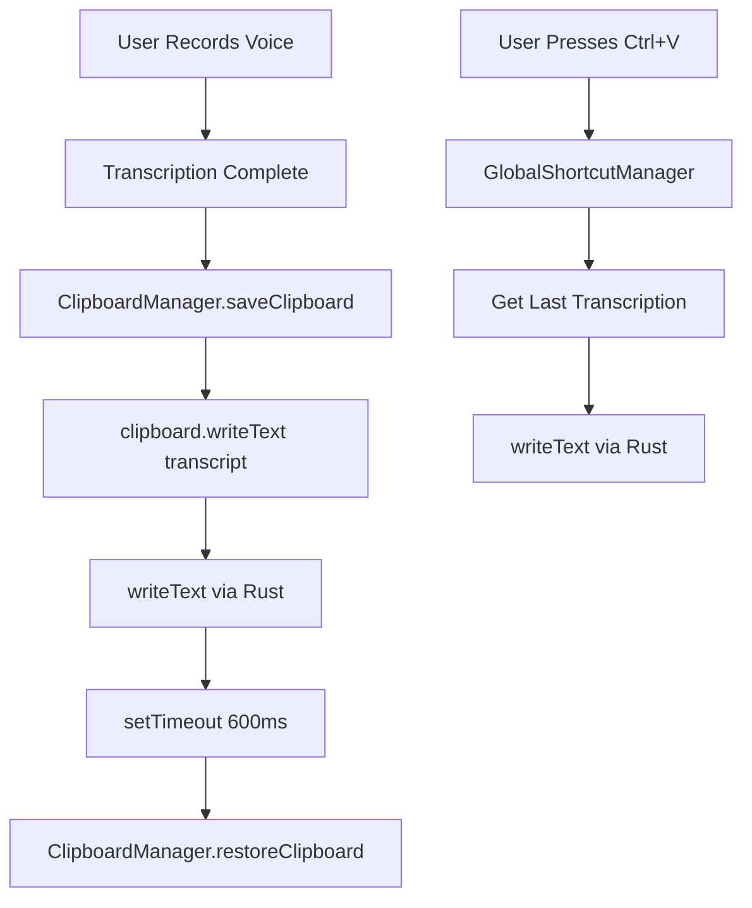

# Design: Clipboard Preservation

## 1. Architecture Overview

### 1.1 High-Level Architecture



### 1.2 Component Structure

**New Components:**
- **ClipboardManager** - Handles save/restore clipboard operations
- **GlobalShortcutManager** - Registers and handles Ctrl+V hotkey
- **LastTranscriptionStore** - Manages last transcription state

**Modified Components:**
- **tipc.ts** - Update createRecording to use ClipboardManager
- **keyboard.ts** - Integrate GlobalShortcutManager for Ctrl+V
- **types.ts** - Add preserveClipboard config option

## 2. Data Models

### 2.1 Configuration Schema

```typescript
// whispo/src/shared/types.ts

export type Config = {
  shortcut?: "hold-ctrl" | "ctrl-slash"
  hideDockIcon?: boolean
  
  sttProviderId?: STT_PROVIDER_ID
  
  openaiApiKey?: string
  openaiBaseUrl?: string
  
  groqApiKey?: string
  groqBaseUrl?: string
  
  geminiApiKey?: string
  geminiBaseUrl?: string
  
  transcriptPostProcessingEnabled?: boolean
  transcriptPostProcessingProviderId?: CHAT_PROVIDER_ID
  transcriptPostProcessingPrompt?: string
  
  // NEW: Clipboard preservation option
  preserveClipboard?: boolean  // default: true
}
```

### 2.2 Last Transcription State

```typescript
// whispo/src/main/state.ts (extend existing)

export const state = {
  isRecording: false,
  lastTranscription: string | null  // NEW: Store last transcription
}
```

### 2.3 Clipboard Data Structure

```typescript
// Internal structure for saved clipboard
interface SavedClipboard {
  text: string
  timestamp: number
}
```

## 3. Implementation Details

### 3.1 Technology Stack

**Existing:**
- Electron clipboard API
- electron.globalShortcut for hotkeys
- whispo-rs for text insertion

**No new dependencies required**

### 3.2 Key Algorithms

#### Algorithm 1: Clipboard Save and Restore

```typescript
class ClipboardManager {
  private savedClipboard: string | null = null
  private restoreTimeout: NodeJS.Timeout | null = null
  
  saveClipboard(): void {
    const { clipboard } = require('electron')
    this.savedClipboard = clipboard.readText()
  }
  
  restoreClipboard(): void {
    if (this.savedClipboard !== null) {
      const { clipboard } = require('electron')
      clipboard.writeText(this.savedClipboard)
      this.savedClipboard = null
    }
  }
  
  scheduleRestore(delayMs: number = 600): void {
    if (this.restoreTimeout) {
      clearTimeout(this.restoreTimeout)
    }
    
    this.restoreTimeout = setTimeout(() => {
      this.restoreClipboard()
      this.restoreTimeout = null
    }, delayMs)
  }
  
  cancelRestore(): void {
    if (this.restoreTimeout) {
      clearTimeout(this.restoreTimeout)
      this.restoreTimeout = null
    }
  }
}
```

#### Algorithm 2: Global Hotkey Registration

```typescript
class GlobalShortcutManager {
  private registeredShortcuts: Set<string> = new Set()
  
  registerPasteLastTranscription(): boolean {
    const { globalShortcut } = require('electron')
    const shortcut = 'Control+V'
    
    // Check if already registered
    if (this.registeredShortcuts.has(shortcut)) {
      return true
    }
    
    // Register
    const success = globalShortcut.register(shortcut, () => {
      this.handlePasteLastTranscription()
    })
    
    if (success) {
      this.registeredShortcuts.add(shortcut)
    }
    
    return success
  }
  
  private handlePasteLastTranscription(): void {
    const { state } = require('./state')
    const { writeText } = require('./keyboard')
    
    if (!state.lastTranscription) {
      // Show notification: No transcription available
      return
    }
    
    // Paste last transcription without affecting clipboard
    writeText(state.lastTranscription)
  }
  
  unregisterAll(): void {
    const { globalShortcut } = require('electron')
    this.registeredShortcuts.forEach(shortcut => {
      globalShortcut.unregister(shortcut)
    })
    this.registeredShortcuts.clear()
  }
}
```

#### Algorithm 3: Modified Transcription Flow

```typescript
// whispo/src/main/tipc.ts - createRecording procedure

async createRecording({ input }) {
  const config = configStore.get()
  
  // ... existing transcription logic ...
  
  const transcript = await postProcessTranscript(json.text)
  
  // Save to history (existing)
  const history = getRecordingHistory()
  const item: RecordingHistoryItem = {
    id: Date.now().toString(),
    createdAt: Date.now(),
    duration: input.duration,
    transcript,
  }
  history.push(item)
  saveRecordingsHitory(history)
  
  // Save .webm file (existing)
  fs.writeFileSync(
    path.join(recordingsFolder, `${item.id}.webm`),
    Buffer.from(input.recording),
  )
  
  // Update last transcription in state
  state.lastTranscription = transcript
  
  // NEW: Clipboard preservation logic
  if (config.preserveClipboard !== false) {  // default true
    clipboardManager.saveClipboard()
  }
  
  // Copy to clipboard temporarily (for paste)
  clipboard.writeText(transcript)
  
  // Paste automatically if accessibility granted
  if (isAccessibilityGranted()) {
    await writeText(transcript)
  }
  
  // NEW: Schedule clipboard restore
  if (config.preserveClipboard !== false) {
    clipboardManager.scheduleRestore(600)  // 600ms
  }
  
  // Hide panel (existing)
  const panel = WINDOWS.get("panel")
  if (panel) {
    panel.hide()
  }
}
```

### 3.3 Error Handling

#### Error 1: Clipboard Access Denied
```typescript
try {
  const savedClipboard = clipboard.readText()
} catch (error) {
  console.error('Clipboard access denied:', error)
  // Continue without preservation
  return null
}
```

#### Error 2: No Last Transcription
```typescript
if (!state.lastTranscription) {
  dialog.showMessageBox({
    type: 'info',
    title: 'No Transcription',
    message: 'No transcription available to paste.',
  })
  return
}
```

#### Error 3: Hotkey Registration Failed
```typescript
const success = globalShortcut.register('Control+V', handler)
if (!success) {
  console.error('Failed to register Ctrl+V hotkey - may be in use by another app')
  // Fallback: show notification to user
}
```

### 3.4 File Structure

```
whispo/src/main/
├── clipboard-manager.ts      (NEW)
├── global-shortcut.ts         (NEW)
├── state.ts                   (MODIFY - add lastTranscription)
├── tipc.ts                    (MODIFY - integrate clipboard preservation)
├── keyboard.ts                (MODIFY - register Ctrl+V on startup)
└── index.ts                   (MODIFY - initialize managers)

whispo/src/shared/
└── types.ts                   (MODIFY - add preserveClipboard config)

whispo/src/renderer/src/pages/
└── settings-general.tsx       (MODIFY - add UI toggle for preserveClipboard)
```

## 4. Security Considerations

### 4.1 Clipboard Security
- Read clipboard only when necessary (during transcription)
- Clear saved clipboard after restore (prevent memory leaks)
- No clipboard content logged or stored persistently

### 4.2 Global Shortcut Conflicts
- Ctrl+V may conflict with other applications
- Electron global shortcuts take precedence if registered first
- Provide user notification if registration fails
- Future: Allow customizable hotkey in settings

### 4.3 Accessibility Permissions
- No change to existing permission requirements
- Same accessibility check as current implementation

## 5. Testing Strategy

### 5.1 Unit Tests

**Test: ClipboardManager**
```typescript
describe('ClipboardManager', () => {
  test('should save and restore clipboard', () => {
    const manager = new ClipboardManager()
    clipboard.writeText('original content')
    
    manager.saveClipboard()
    clipboard.writeText('new content')
    manager.restoreClipboard()
    
    expect(clipboard.readText()).toBe('original content')
  })
  
  test('should schedule restore with delay', async () => {
    const manager = new ClipboardManager()
    clipboard.writeText('original')
    
    manager.saveClipboard()
    clipboard.writeText('temporary')
    manager.scheduleRestore(100)
    
    // Before delay
    expect(clipboard.readText()).toBe('temporary')
    
    // After delay
    await new Promise(resolve => setTimeout(resolve, 150))
    expect(clipboard.readText()).toBe('original')
  })
})
```

**Test: GlobalShortcutManager**
```typescript
describe('GlobalShortcutManager', () => {
  test('should register Ctrl+V hotkey', () => {
    const manager = new GlobalShortcutManager()
    const success = manager.registerPasteLastTranscription()
    expect(success).toBe(true)
  })
  
  test('should paste last transcription when triggered', () => {
    state.lastTranscription = 'test transcription'
    const manager = new GlobalShortcutManager()
    manager.handlePasteLastTranscription()
    
    // Verify writeText was called with correct text
    expect(writeText).toHaveBeenCalledWith('test transcription')
  })
})
```

### 5.2 Integration Tests

**Test: Full Transcription Flow**
```typescript
test('should preserve clipboard during transcription', async () => {
  // Setup
  clipboard.writeText('user copied text')
  configStore.save({ preserveClipboard: true })
  
  // Trigger transcription
  await tipcClient.createRecording({
    recording: audioBuffer,
    duration: 3000
  })
  
  // Wait for restore delay
  await new Promise(resolve => setTimeout(resolve, 700))
  
  // Verify clipboard restored
  expect(clipboard.readText()).toBe('user copied text')
})
```

**Test: Ctrl+V Paste**
```typescript
test('should paste last transcription with Ctrl+V', async () => {
  // Complete a transcription
  await tipcClient.createRecording({
    recording: audioBuffer,
    duration: 3000
  })
  
  // Trigger Ctrl+V
  globalShortcut.emit('Control+V')
  
  // Verify last transcription was pasted
  expect(state.lastTranscription).toBeDefined()
})
```

### 5.3 Manual Testing Checklist

- [ ] Copy text with Cmd+C
- [ ] Record voice and verify auto-insertion
- [ ] Wait 1 second and press Cmd+V
- [ ] Verify original text is pasted (not transcription)
- [ ] Press Ctrl+V in different app
- [ ] Verify transcription is pasted
- [ ] Toggle preserveClipboard setting
- [ ] Verify behavior changes accordingly
- [ ] Restart app and press Ctrl+V
- [ ] Verify last transcription persists

## 6. Deployment

### 6.1 Migration Path

**Step 1: Add new config field with default**
```typescript
const config = configStore.get()
if (config.preserveClipboard === undefined) {
  config.preserveClipboard = true  // Enable by default
  configStore.save(config)
}
```

**Step 2: Initialize managers on app startup**
```typescript
// whispo/src/main/index.ts
import { clipboardManager } from './clipboard-manager'
import { globalShortcutManager } from './global-shortcut'

app.whenReady().then(() => {
  // ... existing initialization ...
  
  // NEW: Register global shortcuts
  globalShortcutManager.registerPasteLastTranscription()
})

app.on('will-quit', () => {
  // NEW: Cleanup
  globalShortcutManager.unregisterAll()
})
```

### 6.2 Rollback Strategy

If issues arise:
1. Set `preserveClipboard: false` in default config
2. Users can disable via settings
3. Feature is backward compatible (graceful degradation)

### 6.3 Version Compatibility

- Backward compatible: Old configs without `preserveClipboard` default to `true`
- No data migration required
- Existing history.json format unchanged

## 7. Performance Considerations

### 7.1 Clipboard Operations
- clipboard.readText(): ~1-5ms
- clipboard.writeText(): ~1-5ms
- Total overhead: ~10ms (negligible)

### 7.2 Memory Usage
- savedClipboard string: ~1KB average
- state.lastTranscription: ~1KB average
- Total increase: ~2KB (negligible)

### 7.3 Hotkey Response
- Global shortcut handler: <10ms
- writeText (Rust): ~50-100ms
- Total: <150ms (acceptable)

## 8. UI/UX Design

### 8.1 Settings UI Addition

Location: `whispo/src/renderer/src/pages/settings-general.tsx`

```tsx
<ControlGroup title="Clipboard">
  <Control label="Preserve Clipboard" className="px-3">
    <Switch
      defaultChecked={configQuery.data.preserveClipboard ?? true}
      onCheckedChange={(value) => {
        saveConfig({
          preserveClipboard: value,
        })
      }}
    />
  </Control>
  
  <div className="px-3 text-sm text-muted-foreground">
    When enabled, your clipboard (Cmd+V) will be preserved after transcription.
    Use Ctrl+V to paste the last transcription.
  </div>
</ControlGroup>
```

### 8.2 Notification Messages

**When Ctrl+V pressed with no transcription:**
```typescript
dialog.showMessageBox({
  type: 'info',
  title: 'No Transcription Available',
  message: 'Record a voice transcription first, then use Ctrl+V to paste it.',
})
```

**When hotkey registration fails:**
```typescript
dialog.showMessageBox({
  type: 'warning',
  title: 'Hotkey Registration Failed',
  message: 'Could not register Ctrl+V hotkey. It may be in use by another application.',
})
```

## 9. Implementation Phases

### Phase 1: Core Infrastructure (Foundation)
1. Create ClipboardManager class
2. Create GlobalShortcutManager class
3. Update state.ts with lastTranscription
4. Update types.ts with preserveClipboard config
5. Unit tests for managers

### Phase 2: Integration (Transcription Flow)
1. Modify tipc.ts createRecording
2. Integrate clipboard save/restore logic
3. Update lastTranscription state on each transcription
4. Integration tests

### Phase 3: Hotkey Implementation
1. Register Ctrl+V in keyboard.ts or index.ts
2. Implement paste last transcription handler
3. Add error handling and notifications
4. Manual testing

### Phase 4: UI and Polish
1. Add settings toggle for preserveClipboard
2. Add help text and tooltips
3. Test UI changes
4. Update documentation

## 10. Success Criteria

- [ ] Clipboard preserved 100% of time when preserveClipboard=true
- [ ] Ctrl+V pastes last transcription without clipboard modification
- [ ] Auto-insertion continues to work as before
- [ ] Settings UI functional and intuitive
- [ ] No performance degradation
- [ ] All tests passing
- [ ] Documentation updated
